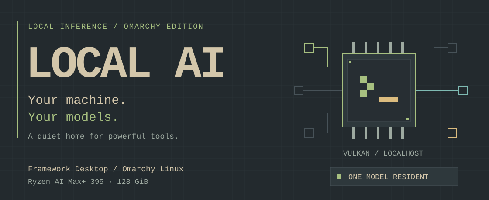
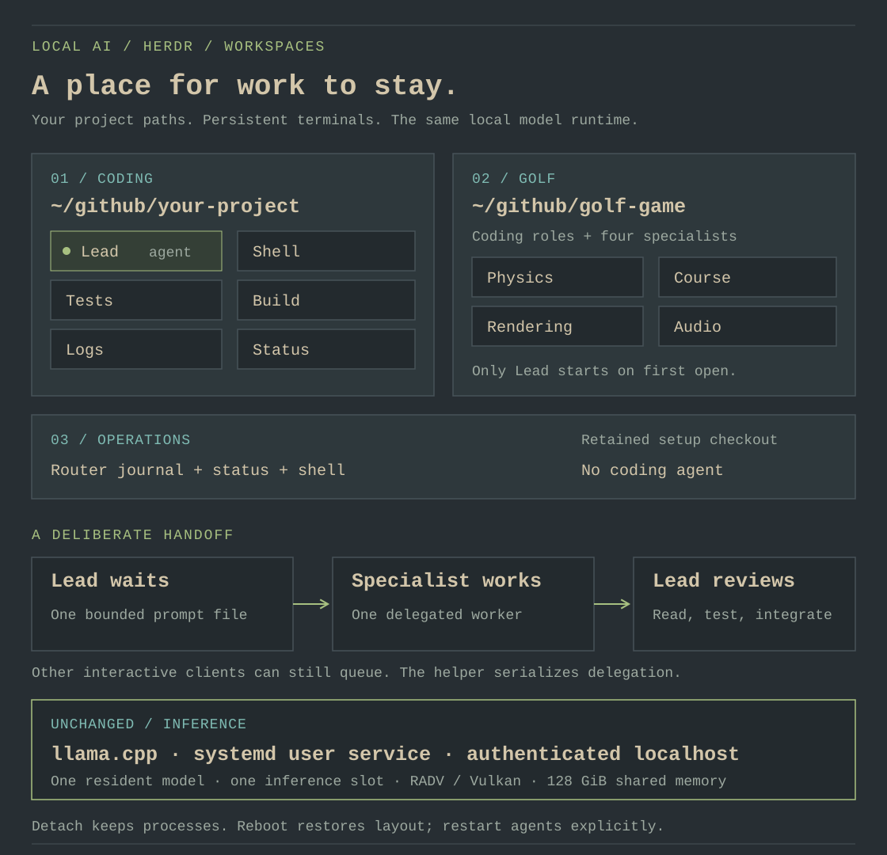

# Local AI for Omarchy

**Your Framework Desktop. Your models. A terminal away.**

A local coding workspace for a freshly installed [Omarchy](https://omarchy.org/)
system on the **Framework Desktop, Ryzen AI Max+ 395, 128 GiB**. Open a compact
keyboard-driven menu, keep an everyday model warm, and give each project a
persistent [Herdr](https://herdr.dev/) workspace. Leave your agent, build, and
logs in place; return to them from your desktop or over SSH.

[Get running](#make-yourself-at-home) · [Meet the models](#a-small-model-team) ·
[Herdr workflows](docs/herdr.md) · [Workstation guide](docs/omarchy.md) · [Full reference](docs/reference.md)

| At your keyboard | On your machine | Under your control |
|---|---|---|
| Herdr project workspaces and a pinned OMP agent | One local model at a time, accelerated by RADV / Vulkan | Plain configuration, reviewed downloads, a systemd user service |

The experience follows Omarchy's terminal, theme, and personal-configuration
conventions. The Strix Halo memory and inference settings remain the same.
[See how the runtime fits together.](docs/reference.md#llamacpp-router-and-per-model-presets)

## Make yourself at home

Open an Omarchy terminal with <kbd>Super</kbd> + <kbd>Return</kbd> and update the system:

```bash
omarchy update
```

Reboot if requested, then clone and inspect this repository. Keep the checkout:
the installed command points back to it. Omarchy's updater handles its
snapshots and migrations. [Update guide](https://omarchy.org/manual/updates/).

```bash
mkdir -p ~/github
git clone https://github.com/johnymontana/local-ai-setup.git ~/github/local-ai-setup
cd ~/github/local-ai-setup
git rev-parse HEAD
less install.sh
less setup-qwen38-pi.sh
./install.sh
```

Run as your ordinary desktop user; the installer asks for `sudo` only for
system changes. It checks for pending updates, installs the runtime packages,
everyday model, pinned agent and Herdr, enables the router's user service, and
adds **Local AI**, **Local AI Logs**, and **Local AI Workspaces** to app search.
If it requests a reboot, reboot and run `./install.sh`
again. Downloads resume. For repeatable deployments, use a
[reviewed commit](docs/reference.md#reproducible-downloads-and-installs).

> [!TIP]
> **Start with Everyday.** The installer sets up the baseline; add Coder and
> Senior when a task calls for them. Keep this checkout in its permanent home.

After installation, open a new terminal:

```bash
local-ai status
local-ai smoke everyday
cd ~/github/your-project
local-ai workspace
```

Use `local-ai` to open the menu, or search for **Local AI** in Omarchy's app
launcher. `status` reads state; `smoke` intentionally loads a model and generates
a response. [The workstation guide](docs/omarchy.md) covers setup, desktop
integration, updates, backups, and recovery.

`workspace` opens the current project with a lead agent and dedicated terminal
roles. Reopening reuses the workspace. `local-ai-agent` remains available for
a single terminal session. Set `HERDR_ENABLED=0` when running `./install.sh` to
skip Herdr, or add it later with `local-ai herdr`.


*The real plain-terminal menu in an isolated pre-install demo, rendered with an
Everforest-inspired palette. [Capture details and text version](docs/assets/README.md).
Your live menu follows your selected terminal theme.*

## A place for work to stay



*An illustrated workspace map in the documentation's Everforest palette.
Herdr itself follows your active Omarchy terminal colors.*

```bash
local-ai workspace open ~/github/your-project
local-ai workspace open ~/github/golf-game --profile golf
local-ai workspace list
local-ai workspace attach ~/github/your-project
```

**Coding** makes room for Lead, Shell, Tests, Build, Logs, and Status. **Golf**
adds Physics, Course, Rendering, and Audio roles, ready for explicit tasks.
**Operations** opens the local router journal, status, and a shell without
starting a coding agent. Only Lead starts automatically in a new coding or golf
workspace; extra panes do not mean extra resident models.

The [Herdr guide](docs/herdr.md) turns those roles into working build/test
commands, serialized specialist delegation, a golf development loop, and
persistent SSH access. Menu shortcuts **w** and **o** open project and
operations workspaces; **h** installs the pinned Herdr layer.

## A small model team


| Model | Best place to start | Locked download |
|---|---|---:|
| **Everyday** · Qwen 3.8 27B | Implementation, tests, shell work, and vision | ~18.5 GiB |
| **Coder** · Qwen3-Coder-Next | Repository exploration, tools, and debugging | ~45.1 GiB |
| **Senior** · Qwen3.5-122B-A10B | Planning, difficult bugs, and review | ~69.5 GiB |

The installer starts with Everyday. Allow **24 GiB free** for its default Q4
artifacts and the 5 GiB reserve. All three tiers need about **138 GiB free**;
using Everyday Q8 raises that to about **149 GiB**. Every artifact is pinned by
revision, size, and SHA-256 in [models.lock](models.lock). Senior uses an optional
community Unsloth quant.

Add a specialist when needed:

```bash
local-ai model coder
local-ai plan
local-ai apply
local-ai smoke coder
cd ~/github/your-project
omp-coder
```

Use `senior` in the same workflow for the larger reviewer. `omp-everyday`,
`omp-coder`, and `omp-senior` select a phase explicitly; launchers exist for
complete installed tiers. The default sticky routing keeps one model warm and
one request in flight, leaving room for the desktop. Omarchy's own `omp` and
`pi` commands stay available; use this project's launchers for its pinned stack.

## Same hardware, considered defaults

Keep the BIOS UMA framebuffer at its small/default **512 MiB** and **IOMMU
enabled**. Start with stock GTT. Vulkan offload, per-model context, MTP,
load modes, and the single-resident-model limit retain the existing Framework
Desktop tuning. The optional **115 GiB GTT** setting is for measured needs;
Senior can use mixed CPU/GPU loading at the stock limit.

> [!NOTE]
> These are configuration defaults. Run the
> [on-machine checks](docs/omarchy.md#verify-on-the-workstation) after installation
> and driver updates to verify Vulkan offload and useful desktop headroom.

## Keep it yours

Configuration lives in `~/.config/local-ai`, models in `~/llm/models`, and the
router runs as your user. The menu follows your terminal's colors and uses
Omarchy's palette when available. Personal settings and desktop integration
follow [Omarchy's dotfile conventions](https://omarchy.org/manual/dotfiles/).

Inference stays local. Coding agents can still read files, run commands, and
use the network with your account's permissions; read the
[security boundaries](docs/reference.md#security-boundaries) before using
untrusted repositories.

| Next stop | What you’ll find |
|---|---|
| [Workstation guide](docs/omarchy.md) | The install path, daily workflow, updates, and recovery |
| [Herdr workflows](docs/herdr.md) | Persistent projects, golf roles, explicit builds, delegation, and SSH |
| [Full reference](docs/reference.md) | Model routing, tuning, commands, remote access, and security |
| [Contributor checks](docs/reference.md#contributor-checks) | Portable tests and opt-in hardware verification |
| [Performance implementation record](docs/performance-dx-plan.md) | Design rationale and the layers of evidence |

*Visuals take their cues from [Omarchy’s Everforest theme](https://omarchy.org/manual/themes/).
This is an independent local-AI setup project.*
