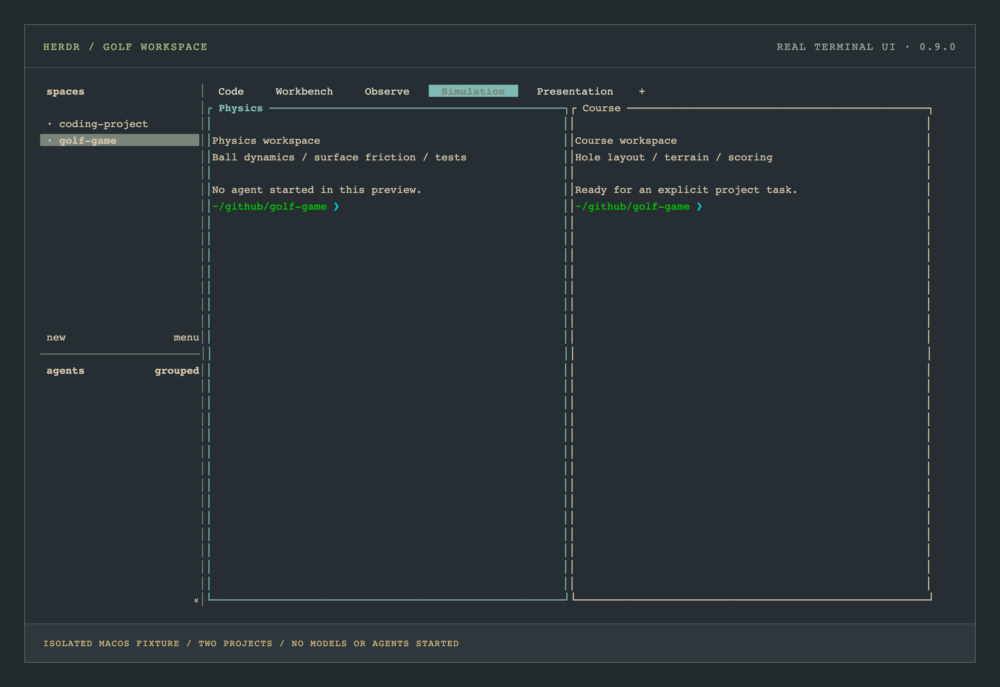

# Herdr workspaces, local models

[Start here](../README.md) · [Omarchy workstation guide](omarchy.md) · [Full reference](reference.md)

**Leave the workspace. Keep the work.** A project gets its own lead agent,
build terminal, tests, and logs. Herdr owns those terminals; the existing
systemd user service owns llama.cpp. Your Framework Desktop keeps the same
Vulkan backend, memory limits, and single-resident-model policy.


*An illustrated map of this project's profiles, using the documentation's
Everforest palette. Live Herdr colors follow your selected Omarchy terminal.*

[First workspace](#open-your-first-workspace) · [Profiles](#choose-a-profile) ·
[Golf workflow](#a-golf-development-workspace) · [Delegation](#give-one-specialist-a-bounded-task) ·
[SSH](#return-from-another-device) · [Configuration](#configuration-and-ownership) ·
[Recovery](#updates-and-recovery)

## Open your first workspace

`./install.sh` includes Herdr. To add it to an existing local-AI setup:

```bash
local-ai herdr
local-ai desktop
local-ai status
local-ai smoke everyday
cd ~/github/your-project
local-ai workspace
```

The first `workspace open` starts a private, named Herdr server called
`local-ai`, creates the project's role panes, and attaches the terminal UI.
The coding profile starts Lead through `local-ai-agent`; that wrapper reads
the current local API credential when the agent starts. Opening a project does
not install packages or hold the installer's lifecycle lock while you work.

`local-ai workspace`, `local-ai workspace open`, and
`local-ai workspace open "$PWD"` open the current directory. You can also use
`local-ai workspace /absolute/project/path`. Projects are keyed by canonical
path and profile, so two checkouts named `game` remain separate. Reopening
the same project/profile reuses it without launching another Lead or rerunning
a build. You can keep coding and operations views for the same path. When a
path has multiple profiles, pass `--profile` to `attach`, `run`, `agent`,
`delegate`, or `read` to select one unambiguously.

```bash
local-ai workspace open ~/github/your-project --no-attach
local-ai workspace list
local-ai workspace status ~/github/your-project
local-ai workspace attach ~/github/your-project
```

`--no-attach` prepares the workspace without opening the UI; a new coding or
golf workspace still starts Lead. Add `--no-agent` when you want only the
layout: it also suppresses the initial journal/status commands. Menu **w** opens
a coding project, **o** opens operations in the retained
setup checkout, and **h** installs Herdr.

Herdr's default detach key is **Ctrl+B, then Q**. Its help panel shows the
active keybindings. Detaching or losing an SSH connection keeps the server's
live terminals running. See the upstream
[session-state guide](https://herdr.dev/docs/session-state/) for the distinction
between keeping a process alive and restoring a layout after a restart.

## Choose a profile

| Profile | Role IDs | Starts on first open |
|---|---|---|
| `coding` | `lead`, `shell`, `tests`, `build`, `logs`, `status` | Selected agent in Lead, router journal, and a status snapshot |
| `golf` | Coding roles plus `physics`, `course`, `rendering`, `audio` | Same initial commands as coding; specialist roles wait for an explicit task |
| `ops` | `logs`, `status`, `shell` | Router journal and status; no coding agent |

```bash
local-ai workspace open ~/github/your-project --profile coding
local-ai workspace open ~/github/golf-game --profile golf
local-ai workspace open ~/github/local-ai-setup --profile ops
```

The profile describes terminal roles, not extra model instances. With
`MODELS_MAX=1` and router parallelism fixed at one, model requests share the
same inference capacity. Independent interactive agents can queue requests;
switching between Everyday, Coder, and Senior also swaps model residency.
Keep one active lead and bring in a specialist for a specific phase.

Roles are paired into tabs: **Code** (Lead/Shell), **Workbench** (Tests/Build),
and **Observe** (Logs/Status). Golf adds **Simulation** (Physics/Course) and
**Presentation** (Rendering/Audio). Status prints a snapshot; rerun the status
command when you need a fresh view.

Opening **Local AI Workspaces** from app search uses the operations profile in
the retained checkout. It is a convenient place to inspect the router while
another workspace runs an agent. It does not start or restart llama.cpp.

## Give build and test output their own place

The setup does not inspect a repository and automatically execute its scripts.
Supply the command you already use, as separate arguments after `--`:

```bash
local-ai workspace run tests ~/github/your-project -- npm test
local-ai workspace run build ~/github/your-project -- npm run build
local-ai workspace read tests ~/github/your-project --lines 80
local-ai workspace read build ~/github/your-project --lines 80
```

Those npm commands are examples for a project that defines those scripts;
substitute its documented test/build commands. Commands run in the selected
project's directory. Shell syntax is literal unless you explicitly choose a
shell, such as `-- bash -lc 'npm run lint && npm test'`.

`run` confirms command submission, not successful completion. Use `read` for
recent pane output and `status` to inspect the workspace. The helper refuses
to send a command when it cannot confirm an idle foreground shell; inspect a
busy pane and use another role when its current task should keep running.

## A golf development workspace



*Native Herdr captured in an isolated macOS fixture with `--no-agent`. The
pane text is explicit sample shell output; no model, coding agent, or game
engine is running. This previews the interface, not Framework Desktop
validation. [Capture source and text version](assets/README.md#native-herdr-preview).*

Start with a trusted golf-game checkout and the commands from its own README:

```bash
local-ai workspace open ~/github/golf-game --profile golf
```

Lead coordinates the feature and integrates changes. The extra roles provide
a place for ball dynamics, course systems, rendering, and audio tasks. They
all work in the same checkout. Give simultaneous editors distinct files or
use separate Git worktree directories as separate workspaces when work must
be isolated.

For a TypeScript game that defines `dev`, `test`, and `build` npm scripts, one
concrete loop is:

```bash
local-ai workspace run build ~/github/golf-game -- npm run dev
local-ai workspace run tests ~/github/golf-game -- npm test
local-ai workspace read tests ~/github/golf-game --lines 100
```

Keep the preview running in Build. Ask Lead to implement one feature, such as
consistent ball roll across fairway and rough, and use Physics for a focused
review of that calculation. Once the preview exits, run the production build
in the same role with `-- npm run build`. For an Unreal, Godot, or native C++
project, supply its actual editor/build/test commands; the profile makes no
engine assumptions and does not launch an editor automatically.

You can explicitly open an interactive specialist:

```bash
local-ai workspace agent physics ~/github/golf-game --tier everyday
```

That starts an additional agent process. For a task with a clear deliverable,
the synchronous delegation path below makes the lead/worker handoff easier
to control on one inference slot.

## Give one specialist a bounded task

Install an optional tier once, then activate its provider:

```bash
local-ai model coder
local-ai plan
local-ai apply
local-ai smoke coder
```

Write a prompt file with the question, relevant files, allowed edits, and the
expected result. Here is a read-only physics review you can adapt to the
project's real paths:

```bash
cat > /tmp/golf-physics-review.txt <<'EOF'
Review the ball-roll and surface-friction implementation in this checkout.
Do not edit files. Find timestep-dependent behavior and missing tests around
transitions between fairway, rough, and the putting green. Return concrete
file references and a short proposed test plan. Stop after this review.
EOF

local-ai workspace delegate physics ~/github/golf-game \
  --tier coder --prompt-file /tmp/golf-physics-review.txt --timeout 1800
local-ai workspace read physics ~/github/golf-game --lines 120
```

`delegate` waits synchronously for the worker. Only one call through this
helper may be active across the setup; a concurrent delegation is rejected.
The calling lead should wait for the result
before requesting more inference. This lock covers delegated work only;
other interactive agents and API clients can still submit requests. Keep
those clients quiet during a model-heavy review if you want predictable
latency.

A timeout or blocked worker needs inspection. Read its pane and resolve the
specific problem before submitting another task; do not blindly replay the
prompt. A worker's idle/blocked signal is coordination state, not evidence
that its answer is correct. Lead reviews the output and runs relevant tests
before integrating changes.

Use `--tier selected` for the configured agent, `everyday`, `coder`, or `senior`
for an installed OMP tier, and `pi` for the installed manual fallback.
Downloading a tier alone is insufficient: its provider and launcher must be
activated. Missing tiers fail with an actionable error rather than silently
using a cloud provider. The installed `local-ai-herdr` skill teaches OMP and
pi this project's role and delegation conventions.

Prompt files must be nonempty regular UTF-8 files, at most 128 KiB, without
NULs; symlinked prompt paths are rejected. `--timeout` is in seconds and accepts
1–86400 (default 1800 for delegation). `read --lines` accepts 1–10000.

## Return from another device

Set up and test the existing [LAN SSH access](reference.md#lan-only-remote-access)
first. Then connect to the workspace helper on the Framework Desktop:

```bash
ssh -t user@hostname.local '~/.local/bin/local-ai-workspace open ~/github/golf-game'
```

The single quotes keep the paths for the remote shell to expand. For a project
path containing spaces, use a quoted absolute remote path inside the command.
The helper uses the desktop's private Herdr binary, config, and named session;
the client machine needs SSH and a terminal. Detach and reconnect to the same
project to continue with the same live processes.

Herdr also has upstream
[multi-machine features](https://herdr.dev/docs/connecting-machines/). This
setup's supported remote path is SSH to `local-ai-workspace`. Native machine
discovery may expect a globally discoverable `herdr` executable; this private
installation does not automatically configure the combined multi-machine UI.
The older `ai-session` tmux helper remains available for existing workflows.

## Configuration and ownership

The project pins [Herdr v0.9.0](https://github.com/herdrdev/herdr/releases/tag/v0.9.0)
and verifies the Linux x86_64 release's exact size and SHA-256 against
[`herdr.lock`](../herdr.lock). A private install keeps your existing `herdr`
command and Omarchy-managed packages under their current ownership.

| Default location | Purpose |
|---|---|
| `~/.local/share/local-ai/herdr/bin/herdr` | Verified executable and adjacent install receipt |
| `~/.config/local-ai/herdr/config.toml` | This setup's Herdr settings |
| `~/.config/local-ai/herdr/workspaces.json` | Private project/profile and role registry |
| `~/.config/local-ai/herdr/server.log` | Diagnostic output from the named server |
| `~/.config/herdr/sessions/local-ai/` | Named session snapshots and server state |
| `~/.local/bin/local-ai-herdr` | Raw CLI wrapper scoped to session `local-ai` |
| `~/.local/bin/local-ai-workspace` | Project/role orchestration helper |
| `~/.local/bin/local-ai-pi` | Authenticated private pi launcher for `--tier pi` |
| `~/.omp/agent/extensions/herdr-omp-agent-state.ts` | Official OMP state-reporting hook |
| `~/.pi/agent/extensions/herdr-agent-state.ts` | Official pi state-reporting hook |
| `~/.omp/agent/skills/local-ai-herdr/SKILL.md` | Original local coordination skill; also installed for pi |

`XDG_DATA_HOME` changes the private package root. `XDG_CONFIG_HOME` changes
Herdr's session root; setting `HERDR_CONFIG_PATH` selects a config file, not a
different named-session root. The installed wrappers set `HERDR_CONFIG_PATH`
to this setup's config and select `--session local-ai`. To relocate the managed
config directory, set `HERDR_CONFIG_DIR` when running `herdr-config` and
regenerate the helpers from the retained checkout.

`OMP_AGENT_DIR` and `PI_AGENT_DIR` can select custom agent configuration roots;
they must be separate directories. Run the agent setup and `herdr-config`
with the same roots so providers, official hooks, skills, and wrapper exports
agree. `--tier pi` uses `local-ai-pi`, which selects the private pi executable,
its configured agent directory, and the current local API credential.

The generated config chooses `[theme] name = "terminal"`. Herdr then uses
the host terminal's ANSI palette, so an Omarchy theme change applies without
replacing terminal settings. See the upstream
[configuration guide](https://herdr.dev/docs/configuration/#theme).

Official hooks are vendored unchanged with their license and digest receipts.
Custom hooks, skills, launchers, and symlinked destinations are preserved.
When a custom config occupies the managed destination, `herdr-config` writes
a sibling `.local-ai-setup.example` for an explicit merge. Do not delete a
personal config just to silence the warning; compare the example and keep
the settings you intend to own.

Herdr's socket, pane output, and agent tools run with your account's
permissions. They are not a sandbox. Credentials remain in the local-AI
credential file and are loaded by agent launchers; avoid placing them in
pane commands, project files, or prompt files. Session/history backups can
contain private project information.

## Updates and recovery

```bash
local-ai herdr-config        # refresh managed config, helpers, hooks, and skill
local-ai herdr               # install a missing pinned runtime; preserve an existing one
local-ai herdr-upgrade       # explicitly replace with the reviewed locked release
```

Review changes to the release lock before upgrading. Ordinary setup does not
fetch a moving latest binary or replace a user-owned executable. An upgrade
does not promise live server handoff; finish or preserve important work before
stopping an existing server to move it to the new runtime.

Detach keeps processes alive. A reboot or server restart ends them. Herdr
can restore layout, but this setup disables native agent restoration with
`[session] resume_agents_on_restore = false`: upstream's native resume command
would invoke bare `omp`/`pi` rather than this project's authenticated launchers.
After reopening the layout, start the roles you need explicitly:

```bash
local-ai workspace open ~/github/golf-game --profile golf --no-agent
local-ai workspace agent lead ~/github/golf-game --tier selected
```

Restart build/test commands explicitly too. A restored terminal screen is
not a running build or a resumed conversation.

| Symptom | Next check |
|---|---|
| Herdr or its helper is missing | Run `local-ai herdr`; refresh app entries with `local-ai desktop` |
| Checkout moved | Run `./local-ai herdr-config` and `./local-ai desktop` from the new path |
| Agent cannot authenticate | Check `local-ai status`, then `local-ai smoke everyday`; restart the agent through its managed launcher |
| Specialist will not start | Install the tier, then run `plan`, `apply`, and its `smoke` check |
| Delegation stops or times out | Read the worker pane and inspect `workspace status`; resolve its current state before retrying |
| Layout returns with idle shells | Expected after a server restart; explicitly start agents and project commands |
| Config or hook was preserved | Compare the example/receipt and merge your custom configuration deliberately |

The portable suites verify orchestration with a fake Herdr server. On the
Framework Desktop, also check real agent detection, a complete delegation,
detach/reattach, and reboot recovery. Those checks complement the existing
[Vulkan and inference verification](omarchy.md#verify-on-the-workstation).
