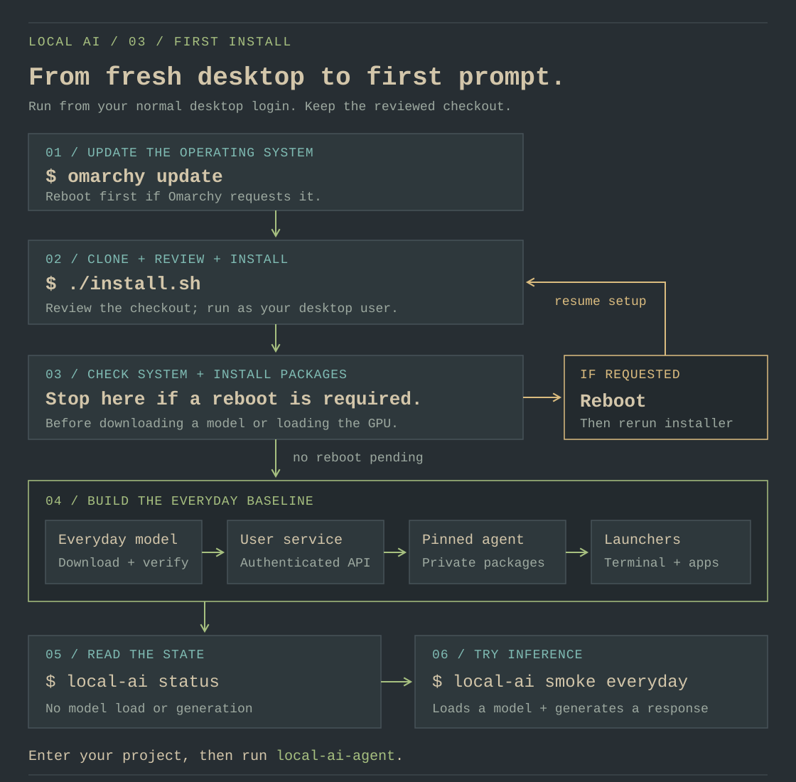
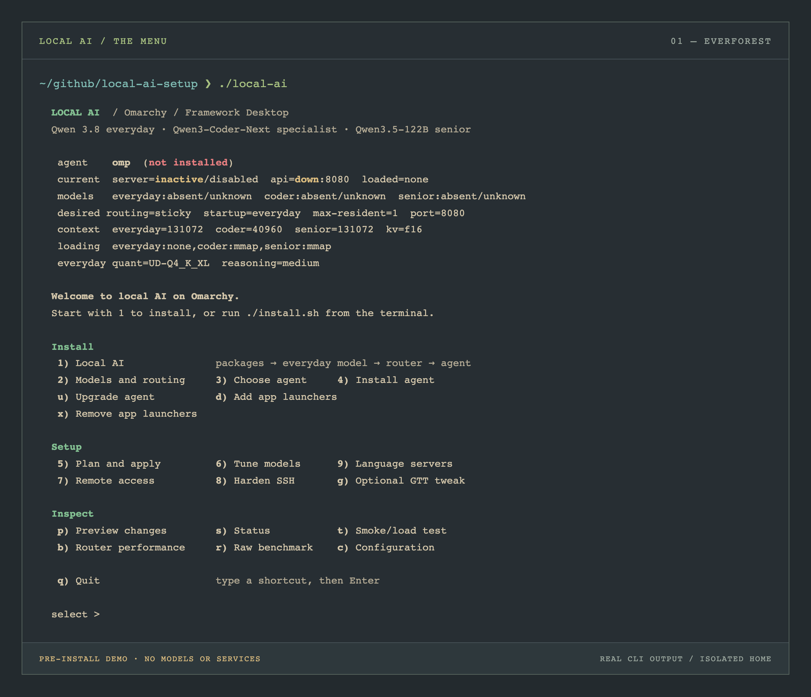
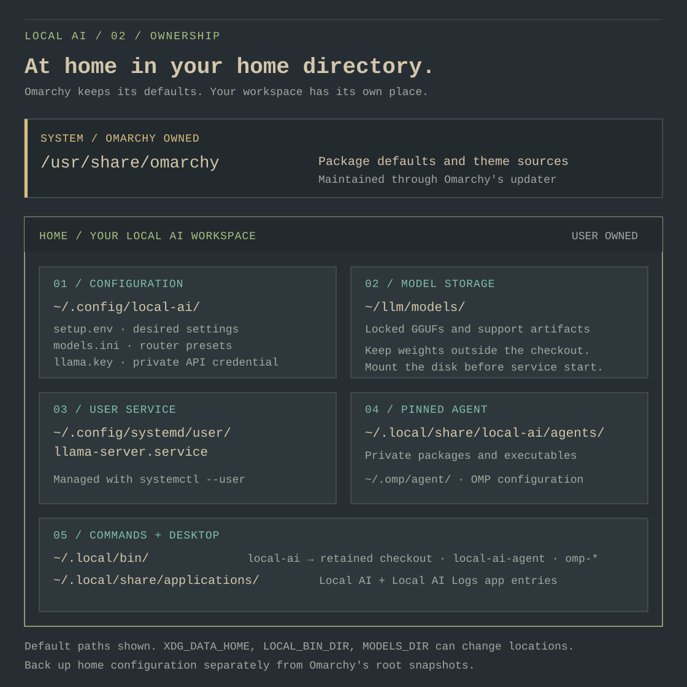

# An Omarchy workstation, with local AI

[Start here](../README.md) · [Full reference](reference.md)

**The workstation field guide** · Install once. Work from your terminal. Keep
the desktop yours.

This guide starts after a fresh Omarchy installation on the Framework Desktop
with a Ryzen AI Max+ 395 and 128 GiB. Use your normal desktop login throughout.
Keep your selected Omarchy theme, terminal, editor, shell, and update channel.

[Install](#first-install) · [Daily use](#open-the-menu-choose-a-task) ·
[Your files](#personal-files-and-desktop-integration) ·
[Updates](#updates-that-belong-to-omarchy) · [Recovery](#backups-and-recovery) ·
[Verify](#verify-on-the-workstation)

## First install



*Start with the OS update. The installer pauses for a required reboot; rerun it
from the same checkout afterward.*

1. Open your terminal with **Super + Return**. Run `omarchy update` and reboot
   if requested. Clone the repository into a permanent directory, review it,
   and run `./install.sh` as shown in the
   [README](../README.md#make-yourself-at-home). Use your desktop session so
   `systemctl --user` can manage the router.
2. The installer checks the workstation and rejects known pending updates
   before installing required packages. If a kernel, driver, or TTM change
   needs a reboot, it stops before downloading or loading a model. Reboot,
   return to the checkout, and run `./install.sh` again.
3. It downloads and verifies the locked Everyday artifacts, activates the
   authenticated router, installs the pinned agent, and adds the local command
   and desktop launchers. The first model load can take time.
4. Open a new terminal, run `local-ai status`, then `local-ai smoke everyday`.
   Enter a trusted project and run `local-ai-agent`.

`./install.sh` delegates to the repeatable `all` workflow; it does not install
Coder or Senior. Models need about 24 GiB of free space for the default Everyday
baseline. Choose a larger disk or set `MODELS_DIR` before downloading if needed:

```bash
./local-ai save-config MODELS_DIR=/absolute/path/on/your/model-disk
./install.sh
```

Use an ordinary directory on a filesystem accessible to your user service.
Avoid storing weights inside a Git checkout. The service uses the saved
absolute path and needs the disk mounted before it starts.

> [!TIP]
> Keep the checkout somewhere permanent. The installed `local-ai` command and
> desktop entries return to that reviewed source; they are not a separate copy
> of the application.

## Open the menu, choose a task

`local-ai` opens the keyboard-driven menu. The menu uses `gum` when available
and has a numbered terminal fallback (`LOCAL_AI_MENU=plain local-ai` forces
that view; `NO_COLOR=1` or `TERM=dumb` also selects it). It picks up the active
terminal colors,
with Omarchy's current palette supplying accents when available. This keeps
the experience at home with the selected
[Omarchy theme](https://omarchy.org/manual/themes/).



*The plain menu before installation, captured from an isolated demo and rendered
in Everforest colors. Your selected terminal theme supplies the live appearance.
[Capture details and text version](assets/README.md#terminal-screenshots).*

Search for **Local AI** in the app launcher to open the same menu, or **Local
AI Logs** to follow router logs. Omarchy's configured terminal launches these
entries; switching terminal preferences does not require changing this
project's theme or agent settings. The
[terminal guide](https://omarchy.org/manual/terminal/) describes that preference.

Useful terminal commands:

```bash
local-ai                    # menu
local-ai status             # read state without loading a model
local-ai model-catalog      # installed tiers and download progress
local-ai logs               # follow the router journal; Ctrl-C exits
local-ai plan               # preview desired configuration
local-ai apply              # activate the reviewed configuration
```

For coding, enter the repository you want the agent to work on, then run
`local-ai-agent`. It selects this project's configured agent and loads local
API credentials directly. `omp-everyday`, `omp-coder`, and `omp-senior` select
an installed tier explicitly. Omarchy's own `omp` and `pi` commands may be
managed by its updater; they are independent of these pinned launchers.

Keep sticky routing until a particular task needs a larger model. Download
an optional tier, inspect `plan`, run `apply`, and use `smoke` before relying on
it. See [the model team](reference.md#the-model-team).

> [!TIP]
> Use `status` for a quiet check and `logs` to watch the router. Use `smoke`
> when you deliberately want to load a model and verify a real response.

## Personal files and desktop integration

Omarchy reserves `/usr/share/omarchy` for its package-owned defaults and places
personal overrides in `~/.config`. This project follows that boundary; its
configuration and launchers are user-owned. See
[Omarchy's dotfile guide](https://omarchy.org/manual/dotfiles/).



*A retained checkout provides the tools; your home directory holds the working
configuration, model data, and desktop integration.*

| Location | Purpose |
|---|---|
| Your retained checkout | Reviewed setup source, lockfile, and menu |
| `~/.config/local-ai/setup.env` | Private desired settings |
| `~/.config/local-ai/models.ini` | Generated router presets |
| `~/.config/local-ai/llama.key` | Private API credential |
| `~/llm/models` | Default locked model storage |
| `~/.config/systemd/user/llama-server.service` | Router service for your user |
| `~/.local/bin/local-ai` | Command pointing to the retained checkout |
| `~/.local/bin/local-ai-agent`, `omp-*` | Launchers for this project's agent and tiers |
| `~/.local/share/applications/local-ai.desktop` | Local AI menu entry |
| `~/.local/share/applications/local-ai-logs.desktop` | Local AI Logs entry |
| `~/.local/share/local-ai/agents/` | Private pinned agent packages and executables |
| `~/.omp/agent/` | OMP providers and role configuration |
| `~/.pi/agent/` | Optional pi configuration |

`XDG_DATA_HOME` is respected for desktop entries and private agent packages;
`LOCAL_BIN_DIR` can override the command directory.

The stack adds its marked shell integration to personal shell files, preserves
custom agent configuration, and uses the systemd user service for startup. It
leaves Omarchy's menu, keybindings, terminal theme, tmux, and package defaults
under their existing ownership. If a custom OMP configuration blocks `apply`,
use the [migration and merge procedure](reference.md#upgrading-a-previous-single-model-install).

You can add your own shortcut or menu row using the configuration editor in
your installed Omarchy version. Use the command `local-ai` in a terminal;
consult the current [dotfile guide](https://omarchy.org/manual/dotfiles/) for
the supported extension format. Omarchy's configuration formats have changed
between releases, so do not paste an older Hyprland binding into a newer one.

To refresh integration after moving the checkout:

```bash
cd /new/path/to/local-ai-setup
./local-ai desktop
```

To remove just this project's app entries and installed management command:

```bash
local-ai desktop-remove
```

The model data and service have their own lifecycle. You can keep managing
them with `./local-ai` from the checkout after removing desktop integration.
Stop the router with `systemctl --user disable --now llama-server.service`
when you want it to stay off; run `./local-ai apply` to activate it again.

## Updates that belong to Omarchy

**Update the desktop → reboot if requested → check local AI → resume work.**

Use `omarchy update` or Omarchy's update menu for operating-system updates.
This preserves its snapshot and migration workflow. Current releases block
direct `pacman -Syu` and `yay -Syu` upgrades; keep the configured channel and
repositories. [Official update guide](https://omarchy.org/manual/updates/).

After an Omarchy update and any requested reboot, install or repair local-AI
dependencies with:

```bash
local-ai install
```

This command checks the existing package databases for pending upgrades and
stops if it finds any. It then installs required packages with
`pacman -S --needed`; it does not refresh package databases or update the OS. Running the
native updater first keeps the package set coherent.

When a reboot is requested, reboot before GPU work. After updating, verify the
running kernel and RADV, then reactivate and exercise the router:

```bash
local-ai check
local-ai plan
local-ai apply
local-ai status
local-ai smoke everyday
```

An OS update can change llama.cpp, Mesa, and the kernel together. The setup
checks required llama.cpp capabilities before activation. If your current
Omarchy channel lacks them, stop and review the available Omarchy release;
keep its repositories coherent instead of replacing individual driver or
runtime packages from a different channel. Prior performance records may no
longer be comparable after an update.

Agent versions are pinned separately. `agent-upgrade omp` or
`agent-upgrade pi` explicitly replaces this project's private agent with the
configured pinned version. Review a version change before changing
`OMP_VERSION` or `PI_VERSION`; the OMP version must match its generated config
schema. This does not upgrade Omarchy's own agent packages.

## Backups and recovery

> [!IMPORTANT]
> An OS snapshot and a home-directory backup cover different files. Keep a
> separate backup of your projects, private settings, credentials, and agent
> configuration.

Omarchy snapshots restore the root filesystem, while `/home` and `~/.config`
remain as they are. They do not back up models, API credentials, projects, or
agent configuration in your home directory. Snapshot boot and restoration
also depend on the installed bootloader; see the
[official snapshot guide](https://omarchy.org/manual/system-snapshots/).

Back up your repositories, private local-AI settings, and agent configuration
separately. Keep a record of the reviewed repository commit. Large locked GGUF
files can be downloaded again; back them up too if download time or bandwidth
matters. Treat copies of `llama.key` as credentials.

`plan` previews changes; `apply` stages and activates the router and routing
together. A failed activation restores prior managed files and service state.
Custom files are preserved for explicit merging. This transaction rollback is
separate from an OS snapshot.

After restoring an OS snapshot, check the runtime against the still-present
home configuration before starting work:

```bash
local-ai check
local-ai plan
local-ai apply
local-ai status
local-ai smoke everyday
```

If the older runtime cannot support the presets, restore a compatible reviewed
checkout/configuration or complete the Omarchy update. For a deliberate artifact
audit, use `local-ai model-verify`; it rereads every selected model file.
See the [reference](reference.md#verification-and-troubleshooting) for download,
authentication, service, and memory failures. Optional GTT rollback is covered
[separately](reference.md#optional-gtt-expansion).

## Verify on the workstation

**The final check happens on your Framework Desktop.**

Portable tests use mocks. They do not establish Vulkan offload, real model
quality, desktop launcher behavior, or memory headroom on your machine.

After installation, confirm that app search opens Local AI in the configured
terminal, the menu is legible in your chosen theme, and a fresh shell can run
`local-ai-agent`. Then check the actual service and GPU:

```bash
local-ai check
vulkaninfo --summary
local-ai status --json | jq .
local-ai smoke everyday
```

Run `smoke coder` and `smoke senior` for optional tiers you installed. For the
opt-in hardware suite, use the retained checkout:

```bash
RUN_LOCAL_AI_E2E=1 bash tests/run.sh all
```

Run the [production performance check](reference.md#llamacpp-router-and-per-model-presets)
when you want to measure cold-load and warm behavior. It deliberately swaps
model residency, takes time, and can stall other clients. Keep the desktop and
your normal applications running when judging useful memory headroom.
