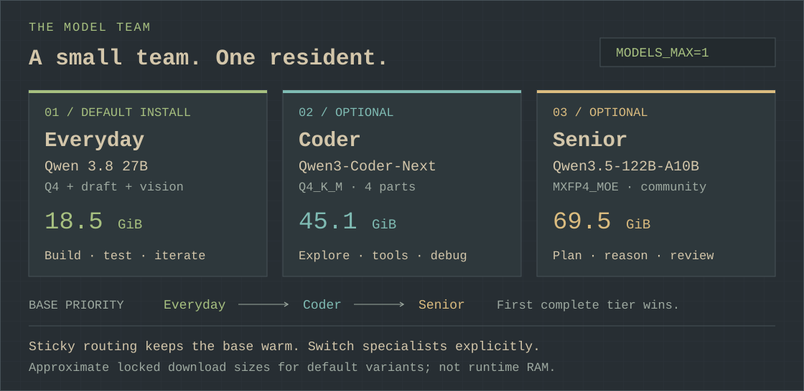
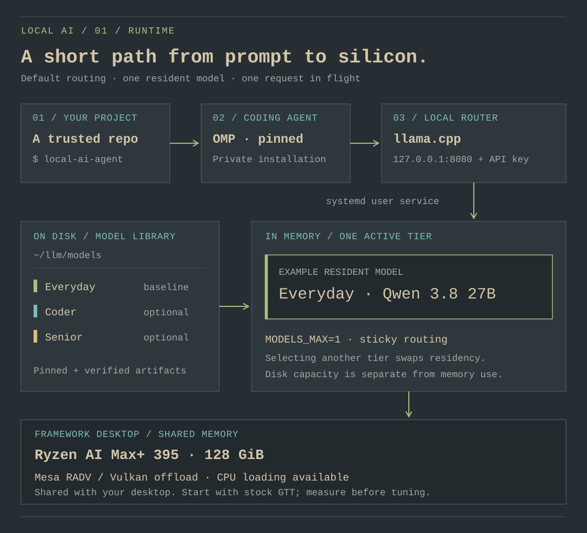
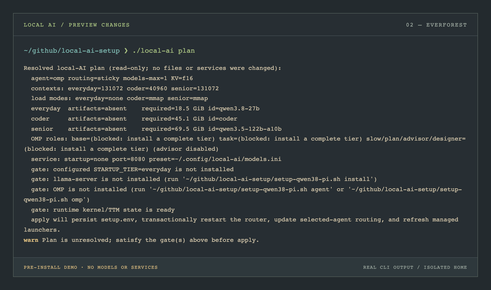

# Local AI reference

[Start here](../README.md) · [Omarchy workstation guide](omarchy.md)

**The workbench** · Models, tuning, commands, and recovery in one place.

This reference covers the pinned models, Framework Desktop tuning, commands,
and recovery procedures. Commands below run from the retained repository with
`./local-ai`; after `./install.sh`, the installed `local-ai` command also works
from any directory. The original `setup-qwen38-pi.sh` engine remains supported.

| Find your way | Go to |
|---|---|
| Choose a model or a role | [Model team](#the-model-team) · [OMP routing](#omp-role-mapping) |
| Understand the machine and runtime | [Hardware defaults](#requirements-and-hardware-defaults) · [Router and presets](#llamacpp-router-and-per-model-presets) |
| Install a reproducible stack | [Locked downloads](#reproducible-downloads-and-installs) · [OMP](#omp-primary-agent) · [pi](#pi-manual-fallback) |
| Find an action | [Command index](#commands) · [Upgrade an existing install](#upgrading-a-previous-single-model-install) |
| Diagnose or tune | [Verification and troubleshooting](#verification-and-troubleshooting) · [Optional GTT](#optional-gtt-expansion) |
| Work from another device | [LAN access](#lan-only-remote-access) · [Persistent sessions](#device-setup-and-persistent-sessions) |
| Inspect or contribute | [Security boundaries](#security-boundaries) · [Contributor checks](#contributor-checks) · [Sources](#sources) |

## The model team



*Everyday is the installed baseline. Add specialists when a task benefits from
them; the default sticky routing profile keeps one model warm.*

The friendly tier names used by setup commands and launchers are `everyday`,
`coder`, and `senior`. The API/router IDs are `qwen3.8-27b`, `coder`, and
`qwen3.5-122b-a10b`; they remain independent of quant filenames and split
shards. The two reasoning IDs retain their Qwen family names so OMP applies the
right thinking protocol. The officially non-thinking Coder-Next deliberately
uses the neutral ID `coder` so OMP does not infer a reasoning interface for it.

| Tier | Router ID | Locked artifact | Download | Default job |
|---|---|---|---:|---|
| `everyday` | `qwen3.8-27b` | [Qwen 3.8 27B](https://huggingface.co/Qwen/Qwen3.8-27B), Unsloth `UD-Q4_K_XL`, plus MTP draft and F16 vision projection | ~18.5 GiB | Normal implementation loop, tests, shell work, quick tasks, commits, and vision |
| `coder` | `coder` | [Qwen3-Coder-Next](https://huggingface.co/Qwen/Qwen3-Coder-Next), official four-part `Q4_K_M` GGUF | ~45.1 GiB | Repository navigation, tool-heavy changes, debugging, and longer coding tasks |
| `senior` | `qwen3.5-122b-a10b` | [Qwen3.5-122B-A10B](https://huggingface.co/Qwen/Qwen3.5-122B-A10B), optional community [Unsloth `MXFP4_MOE` GGUF](https://huggingface.co/unsloth/Qwen3.5-122B-A10B-GGUF) in three parts | ~69.5 GiB | Architecture, planning, difficult bugs, design tradeoffs, security, and code review |

The senior entry is intentionally labeled as a community quant: the source
model is official Qwen, while the GGUF artifact pinned by this project is the
Unsloth conversion. Treat it as optional and verify its behavior for your
workload.

The intended loop is:

1. `everyday` implements the first pass.
2. `coder` handles repository/tool/debugging work when that specialization is
   useful.
3. `senior` plans or reviews hard changes.
4. `everyday` applies the review and runs the verification loop.

Using the 122B model for every token would waste memory and model-swap time.
The router therefore defaults to `MODELS_MAX=1`: all models may live on disk,
but only one model process is resident at a time. OMP also limits local task
concurrency and in-flight llama.cpp requests to one so concurrent subagents do
not fight the router.

### OMP role mapping

Routing is controlled by `ROUTING_PROFILE`; the default is `sticky`. Define
`base` as the first complete tier in everyday → coder → senior order,
`specialist` as coder when complete (otherwise base), and `architect` as senior
when complete (otherwise base). `apply` refuses to write broken OMP routing when
no tier is complete.

| OMP role | `sticky` (default) | `balanced` | `quality` |
|---|---|---|---|
| `default`, `vision`, `smol`, `commit`, `tiny`, `title` | base | base | base |
| `task` | base | specialist | specialist |
| `slow`, `plan`, `advisor`, `designer` | base | base | architect |

Sticky routing keeps one model warm throughout an implementation loop. An
isolated automatic specialist or architect call normally costs two swaps—one
to enter that role and another to return to the base model—so enable balanced
or quality only when the expected quality gain is worth that latency. With the
recommended sticky profile, use `omp-coder` and `omp-senior` explicitly at
phase boundaries, then return with `omp-everyday`.

The generated OMP advisor is disabled by default. Turn it on only for a hard
session: reviewing every turn with the senior model would force extra swaps and
make ordinary work much slower. For a deterministic one-off review or design
session, launch `omp-senior` explicitly. The generated `omp-everyday`,
`omp-coder`, and `omp-senior` commands force their named router ID. A launcher
is created only while that complete tier is installed.

After installing or removing an optional tier, run `plan`, inspect it, and then
run `apply`. OMP promotes a role only when the tier's complete locked artifact
set is present.

## Requirements and hardware defaults

> [!NOTE]
> Target hardware: Framework Desktop, Ryzen AI Max+ 395, 128 GiB,
> Vulkan/RADV, and one resident model. Start with stock GTT and measure
> with your normal desktop applications running before changing memory limits.

- Framework Desktop, Ryzen AI Max+ 395, 128 GiB configuration.
- A fresh Omarchy Linux installation on its supported update channel, with
  an active desktop login and systemd user session. The existing RDNA 3.5
  kernel floor remains 6.18.4; `check` verifies the running kernel.
- At least 24 GiB free for the everyday Q4 baseline (18.5 GiB of locked
  artifacts plus the default 5 GiB safety reserve). All three tiers have about
  133 GiB of Q4 or 144 GiB of Q8 payload and therefore need at least about
  138 GiB or 149 GiB free with that reserve.
- BIOS **iGPU Memory Allocation / UMA Frame Buffer Size left at its small
  default (512 MiB)**. Linux maps model memory dynamically through GTT; a large
  fixed framebuffer merely removes memory from the OS.
- **IOMMU left enabled.** This project does not add `amd_iommu=off` or disable
  the platform's security, virtualization, and device-isolation feature.

Start with the stock GTT limit and benchmark first. The everyday and coder
tiers are designed to work without the optional 115 GiB GTT setting. The
senior weights alone are about 69.5 GiB, so they cannot fully offload inside the
stock approximately 64 GiB GPU-addressable limit. llama.cpp can auto-fit/mix
GPU and CPU loading without the tweak; full offload requires a larger limit
plus KV/runtime headroom.

Update through Omarchy first, and reboot if requested:

```bash
omarchy update
```

Then the package step installs the stack from the configured signed package
repositories, refusing known pending upgrades:

```bash
./local-ai install
```

It installs `llama-cpp`, `ggml-cpu`, `ggml-vulkan`, `vulkan-radeon`,
`vulkan-icd-loader`, `vulkan-tools`, `curl`, `jq`, `nodejs`, `npm`, `bun`, and
`pciutils`.
The package step does not refresh databases or upgrade the OS. Keep the
repositories and release channel supplied by Omarchy. Its update
workflow includes snapshots and migrations; direct `pacman -Syu` and
`yay -Syu` skip that workflow and are blocked by current Omarchy releases.
See the [official update guide](https://omarchy.org/manual/updates/).

`ggml-cpu` is required even for Vulkan inference; llama.cpp uses it as its base
backend. The script also verifies that RADV and the GPU are visible when the
relevant tools are installed.

## Reproducible downloads and installs

[`models.lock`](../models.lock) is the artifact source of truth. Every row
records the tier, variant, router ID, model directory, Hugging Face repository,
immutable 40-character revision, remote path, byte count, SHA-256 digest, and
artifact kind. This includes every split GGUF shard, the everyday MTP draft,
and the vision projection.

Downloads:

- use HTTPS with TLS 1.2 or newer and HTTPS-only redirects;
- resolve an immutable Hugging Face commit instead of a moving branch;
- support partial-file resume and show aggregate partial-byte progress in
  `model-catalog`;
- verify both exact byte length and SHA-256 before renaming a `.part` file;
- refuse to overwrite an existing mismatched artifact;
- retain a failed `.part` file for inspection;
- preserve `DISK_RESERVE_GIB` of free space before starting a managed download;
- optionally download independent split shards concurrently, with
  `DOWNLOAD_JOBS` validated to a small bounded value.

Successful full verification writes a private receipt bound to the locked
digest, path, size, and current file identity. Routine apply, service,
benchmark, and performance paths can reuse a still-valid receipt instead of
rereading tens of GiB on every run; replacing or modifying an artifact
invalidates it. Read-only plan/status/catalog views use type and locked-size
checks so they stay instant, while apply cryptographically verifies every tier
before loading it. `model-verify` deliberately ignores the fast path and
recomputes every selected SHA-256.

Verify installed files at any time:

```bash
./local-ai model-verify
./local-ai model-verify everyday
./local-ai model-verify coder
./local-ai model-verify senior
```

`model-remove <tier>` requires the router to be stopped, then deletes that
tier's exact manifest-owned artifact set across all locked variants after
confirmation. For `everyday`, that intentionally includes both managed Q4/Q8
files plus shared projection/draft files. It unlinks a managed-path symlink
rather than following it to its target, and refuses to remove the configured
startup tier until another installed tier (or `none`) has been saved and
applied.

`model-prune` previews and confirms cleanup of stale managed quant files and
partial downloads while preserving the selected installed variants. Both have
an explicit `--yes` form for reviewed automation.

Tool installers are pinned too. New installations use
`@earendil-works/pi-coding-agent@0.84.4` through npm and
`@oh-my-pi/pi-coding-agent@18.0.10` through Bun, with dependency lifecycle
scripts disabled. Bun itself comes from the configured signed package
repositories. The setup does not execute mutable remote installer scripts. Override `PI_VERSION`
or `OMP_VERSION` only when you have intentionally reviewed a newer release.

Pinned executables live in `~/.local/share/local-ai/agents/bin`; npm uses the
private `agents` prefix and Bun uses `agents/bun`. Omarchy's own `omp` and `pi`
launchers and packages remain untouched. The project launchers select this
private runtime, so use `local-ai-agent` or `omp-everyday` for local coding.

An existing private agent is preserved by ordinary installation. OMP routing
is refused when that private OMP version differs from the pinned schema
version; run `./local-ai agent-upgrade omp` for an explicit replacement.
Replace a mismatched private pi with `./local-ai agent-upgrade pi`.

Pin the setup repository itself as well: record the 40-character commit you
reviewed (`git rev-parse HEAD`) and deploy that commit or a reviewed release,
not an unreviewed moving branch. A reproducible checkout looks like:

```bash
git fetch --tags origin
git switch --detach <reviewed-40-character-commit>
git status --short          # expect no unexpected local changes
```

## llama.cpp router and per-model presets



*One local API serves the installed tiers. Each tier keeps its own context,
load mode, and sampling settings; the router permits one resident model.*

`apply` generates and transactionally activates three local router files (the
lower-level `service` command remains available for focused repair):

```text
~/.config/local-ai/models.ini
~/.local/bin/llama-qwen38-server
~/.config/systemd/user/llama-server.service
```

The launcher contains only router-wide settings:

```bash
llama-server \
  --host 127.0.0.1 \
  --port 8080 \
  --api-key-file ~/.config/local-ai/llama.key \
  --models-preset ~/.config/local-ai/models.ini \
  --models-max 1 \
  --models-autoload
```

Model-specific settings belong in generated `models.ini`, not as global
launcher flags. All installed tiers share Jinja templates, flash attention,
one inference slot, a 256-token minimum chunk size for attempting KV-cache
reuse by shifting, and a 60-second stop timeout. `MODELS_MAX=1` is enforced on
this 128 GiB target; the setup does not generate a persistent multi-resident
large-model service. Everyday and coder request full Vulkan offload. Senior leaves layer placement to
llama.cpp auto-fit so it can run with mixed GPU/CPU loading under the stock GTT
limit.

| Preset | Context | Load mode | Reasoning | Speculation | Sampling / notes |
|---|---:|---|---|---|---|
| `qwen3.8-27b` | 131,072 | `none` | on, configurable `medium` default, preserved | Separate locked MTP draft, depth 4 | temp 1.0, top-p .95, top-k 20; vision projection |
| `coder` | 40,960 | `mmap` | off | none | temp 1.0, top-p .95, top-k 40; context shifting disabled |
| `qwen3.5-122b-a10b` | 131,072 | `mmap` | binary on/off; on by default, no effort levels | none | temp .6, top-p .95, top-k 20; GPU/CPU auto-fit |

The load mode is configured independently for each tier and accepts only
`none`, `mmap`, `mlock`, `mmap+mlock`, or `dio`; there is no `auto` value.
`STARTUP_TIER` marks exactly one complete preset for startup loading, or `none`
for a cold router. Readiness waits for that selected model to be genuinely
usable rather than treating a listening-but-loading API as ready.

`KV_CACHE_PROFILE=f16` keeps the baseline full-precision K/V cache. `q8`
selects quantized K/V caches to reduce memory pressure, at a possible quality
and performance tradeoff. Every context is capped at the models' 262,144-token
native limit, and the everyday MTP draft depth is constrained to 1–8.

The everyday MTP draft is a separate pinned GGUF. It is not assumed to be
embedded in the main quant. `bench` is a raw `llama-bench` pp512/tg128 baseline;
it does not exercise the speculative path or configured production context.
Use `perf` for an authenticated cold-load plus warm generation check through
the real production preset. It refuses to run when saved desired settings do
not exactly match the active preset, and records the quant/artifact-set digest
so results from Q4 and Q8 are never treated as comparable. `perf` restores
prior model residency on success, failure, or interruption; `--keep` is the
explicit request to leave its target tier loaded. A run deliberately unloads
and swaps model residency, so other local clients can stall until restoration.
By default it sends two 4,096-word generation requests with a 30-minute timeout
for each request, in addition to the cold-load wait; use it as a deliberate
long-running measurement, not a non-disruptive health check. The direct raw
`bench` command requires a stopped router, while
the interactive manager records whether the service was running and restores
that service state after its raw-benchmark action. Everyday and coder request
full offload; senior uses llama.cpp's fitter with a 4 GiB free-device-memory
margin and reports the resulting mixed GPU/CPU layer placement.

Tune supported values through saved configuration, then regenerate/restart the
service:

```bash
./local-ai save-config \
  CTX=131072 CODER_CTX=40960 SENIOR_CTX=131072 \
  REASONING_EFFORT=medium DRAFT_N=4 MODELS_MAX=1 \
  ROUTING_PROFILE=sticky STARTUP_TIER=everyday \
  LOAD_MODE_EVERYDAY=none LOAD_MODE_CODER=mmap LOAD_MODE_SENIOR=mmap \
  KV_CACHE_PROFILE=f16 DISK_RESERVE_GIB=5 DOWNLOAD_JOBS=2
./local-ai plan
./local-ai apply
```



*A pre-install `plan`, captured from an isolated demo. Missing tiers and
dependencies appear as gates before activation.
[Capture details and text version](assets/README.md#terminal-screenshots).*

> [!TIP]
> Make changes with `save-config`, inspect them with `plan`, then activate with
> `apply`. The plan is read-only; activation verifies the locked artifacts and
> updates the router and agent routing together.

Configuration precedence is explicit environment variable, then
`~/.config/local-ai/setup.env`, then the built-in default. The saved file is
mode 0600. The setup refuses symlinked `setup.env` and `llama.key` paths rather
than following them. `QUANT` accepts `UD-Q4_K_XL` or `Q8_0` for the everyday tier;
`apply` refuses to switch to a quant until its complete locked artifact set is
present, so use `model everyday` after changing `QUANT`. `MODELS_MAX=1` is a
hard safety boundary for this 128 GiB target; larger values are rejected.

| Setting | Default | Accepted values / purpose |
|---|---|---|
| `AGENT` | `omp` | `omp` or the manual `pi` fallback |
| `QUANT` | `UD-Q4_K_XL` | Everyday `UD-Q4_K_XL` or `Q8_0`; optional tiers stay pinned |
| `CTX`, `CODER_CTX`, `SENIOR_CTX` | 131072 / 40960 / 131072 | 32768–262144 / 32768–262144 / 65536–262144; OMP lowers its output ceiling when needed to retain 4096 prompt/tool tokens |
| `MODELS_DIR` | `~/llm/models` | Absolute storage path for locked GGUF artifacts |
| `REASONING_EFFORT` | `medium` | Qwen 3.8 `low`, `medium`, or `xhigh` |
| `DRAFT_N` | `4` | Everyday MTP draft depth, 1–8 |
| `MODELS_MAX` | `1` | Fixed at one on this 128 GiB target |
| `ROUTING_PROFILE` | `sticky` | `sticky`, `balanced`, or `quality` |
| `STARTUP_TIER` | `everyday` | `everyday`, `coder`, `senior`, or `none` |
| `LOAD_MODE_EVERYDAY` | `none` | One of the five per-tier load modes above |
| `LOAD_MODE_CODER`, `LOAD_MODE_SENIOR` | `mmap` | One of the five per-tier load modes above |
| `KV_CACHE_PROFILE` | `f16` | `f16` or memory-saving `q8` |
| `DISK_RESERVE_GIB` | `5` | Preserve 1–128 GiB after downloads |
| `DOWNLOAD_JOBS` | `2` | 1–4 concurrent locked artifacts; use 1 for sequential downloads |
| `PORT` | `8080` | Loopback API port, 1–65535 |
| `GTT_GIB` | `115` | Optional `kernel-tweaks` target, 64–115 GiB |
| `PI_VERSION`, `OMP_VERSION` | `0.84.4` / `18.0.10` | Exact pinned `x.y.z` agent releases used by install/upgrade commands |

`SERVICE_READY_TIMEOUT` (10–3600 seconds, default 600) and
`PERF_PROMPT_WORDS` (512–32768, default 4096) are validated environment-only
operational controls. They are intentionally not written by `save-config` or
listed as persisted values; `show-config` labels its output as effective
configuration because explicit environment values override saved values and
defaults.

The user service binds only to loopback, reads a random 256-bit API key from a
0600 file, and applies systemd protections including `NoNewPrivileges`,
`ProtectSystem=strict`, `ProtectHome=read-only`, protected kernel settings and
modules, restricted namespaces/SUID, a read-only model tree, and a narrow Mesa
shader-cache directory. Preset, launcher, and unit updates are staged and
validated together; a failed restart/readiness check restores the prior files.

## OMP: primary agent

[oh-my-pi (OMP)](https://github.com/can1357/oh-my-pi) provides the primary
coding workflow, with LSP integration, debugger support, subagents, edit
checks, and repair paths. [pi](https://pi.dev) is the optional smaller fallback.

Install OMP and generate its routing:

```bash
./local-ai omp
./local-ai plan
./local-ai apply
./local-ai omp-lsp        # optional language servers
```

`./local-ai omp` installs a missing private binary and preserves one already
installed there. If its reported version differs from configured
`OMP_VERSION`, replace it explicitly with `./local-ai agent-upgrade omp`.
Launch it from your project with `local-ai-agent` or `omp-everyday`; bare `omp`
can select Omarchy's independently managed runtime.

The managed files are:

```text
~/.omp/agent/models.yml
~/.omp/agent/config.yml
~/.local/bin/omp-everyday
~/.local/bin/omp-coder
~/.local/bin/omp-senior
```

`models.yml` points only completely installed tiers at the authenticated
OpenAI-compatible API. It declares Qwen 3.8's exact effort choices,
Coder-Next as non-thinking, and the senior model's binary thinking behavior.
`config.yml` contains role routing, single-request concurrency, memory disabled,
and the advisor default. It deliberately does not emit the old
`supersedeReads: false` or `dropUseless: false` overrides, leaving OMP's
cache-aware pruning defaults active so old tool output can be bounded without
needlessly destroying the stable prompt prefix. It also disables OMP's
duplicate implicit, keyless llama.cpp provider. The installer preserves
unmarked user shell content, adds PATH and `PI_NO_TITLE` only when absent, and
appends its marked key export last so the managed value takes precedence:

```bash
export PATH="$HOME/.local/bin:$PATH"
export LLAMA_API_KEY=$(<"$HOME/.config/local-ai/llama.key")
export PI_NO_TITLE=1
```

Open a new shell after installation. `PI_NO_TITLE=1` avoids an extra title
request competing for the single model slot. Bash is always updated; zsh is
updated when it is the active shell. `ai-session` loads the key and saved port
directly because non-interactive SSH sessions may not source either file.

OMP reads `AGENTS.md` project instructions. Document the repository's build,
test, lint, generated-file, and architecture conventions there; this usually
improves local-agent reliability more than another sampling tweak.

## pi: manual fallback

Install the pinned fallback with:

```bash
./local-ai pi
```

In a new shell, run `~/.local/share/local-ai/agents/bin/pi`, use `/llama` to
load `qwen3.8-27b`, `coder`, or `qwen3.5-122b-a10b`, and use `/model` to select
it for the session. Add models through this setup so the revision and SHA-256
remain locked. Bare `pi` can select Omarchy's independently managed runtime.
To use the project launcher instead, select pi as the saved agent below.

The installer writes a starter `~/.pi/agent/settings.json` only when one does
not exist. It disables telemetry/analytics and enables compaction. Existing pi
configuration is preserved.

Select the fallback for `agent`, `all`, and `ai-session` without removing OMP:

```bash
./local-ai save-config AGENT=pi
./local-ai agent
```

Switch back and regenerate the selected launcher with:

```bash
./local-ai save-config AGENT=omp
./local-ai agent
```

## Commands

**Review and activate:** `status` → `plan` → `apply` → `smoke everyday`.
Open `./local-ai` when you prefer a menu; use the commands below for direct
terminal control.

| Command | Effect |
|---|---|
| `./install.sh` | Install the everyday baseline, then add the local command and desktop entries |
| `./local-ai` / `./local-ai menu` / `./manage.sh` | Interactive control panel over the commands below |
| `./local-ai all` | Repeatable everyday baseline plus desktop integration; stops for a required reboot and does not fetch optional tiers |
| `check` | Check Omarchy, hardware, kernel, memory, packages, RADV, and current GTT |
| `install` | Check for pending upgrades and install required packages; update with Omarchy first |
| `desktop` / `desktop-remove` | Install or remove the managed local command and desktop launchers |
| `model [everyday]` | Download the locked everyday variant (backward-compatible default) |
| `model coder` / `model senior` | Download one optional tier |
| `model all` | Confirm, then download every tier |
| `model-catalog` | Show sizes, installed/partial/`.part` state, and routing profile |
| `model-verify [tier]` | Recompute size and SHA-256 for installed artifacts |
| `model-remove <tier> [--yes]` | Confirm, then remove only that tier's managed files while the router is stopped |
| `model-prune [--yes]` | With the router stopped, confirm cleanup of partial downloads and unselected managed quant artifacts |
| `plan` | Read-only preview of resolved service and OMP routing changes |
| `apply` | Apply the planned router and OMP configuration transactionally |
| `service` | Lower-level repair: regenerate presets/launcher/unit and restart the router |
| `routing [--force]` | Lower-level repair: install/update OMP providers, roles, and launchers |
| `agent` / `omp` / `pi` | Install the selected, primary, or fallback agent |
| `agent-upgrade [pi\|omp]` | Explicitly replace an installed agent with its pinned configured release |
| `omp-lsp` | Optionally install common language servers |
| `logs` | Follow the router journal; `Ctrl-C` exits |
| `status [--json]` | Read-only service, API, model, configuration, and reboot state; never loads a model |
| `smoke [tier]` | Intentionally load a tier and make an authenticated generation request |
| `bench [tier]` | `llama-bench` pp512/tg128 baseline for one tier |
| `perf [tier] [--keep]` | Production-preset cold-load and warm API check; restore prior state unless `--keep` |
| `perf-history [tier\|all]` | Show up to 20 recent records with their comparison identity fields |
| `save-config K=V ...` | Validate and persist supported tunables |
| `show-config` | Print effective configuration (environment overrides saved values, then defaults) |
| `kernel-tweaks` | Confirm and opt into a larger GTT allocation |
| `remote` / `ssh-harden` | Configure LAN access, then change SSH to key-only |

Running `./local-ai` without arguments opens the menu. `./local-ai help` or
`./local-ai --help` prints engine usage. Running the underlying
`setup-qwen38-pi.sh` without arguments still prints help. Installation requires
`./install.sh` or the explicit `all` command. Commands reject unknown options
and extra positional arguments before performing their action.

## Upgrading a previous single-model install

These steps apply to an existing local-AI installation on an Omarchy host.
They do not convert a plain Arch installation to Omarchy. For a freshly
installed OS, use the [workstation guide](omarchy.md), and restore personal
files from your own backup as needed.

The migration path is intentionally conservative:

1. Pull/review this repository, including `models.lock`.
2. Run `omarchy update`, reboot if requested, then run `./local-ai install`
   for dependencies. If `status` reports `system.rebootRequired: true`, reboot before relying on the
   newly installed kernel/driver or changed TTM policy.
3. Run `./local-ai model everyday`. An existing artifact is reused
   only if its byte length and SHA-256 match the lock. The new setup also
   downloads the separately locked MTP draft if missing.
4. Run `./local-ai agent` so the selected agent exists before the
   plan preflight. The default is pinned OMP in its private directory; if an
   older private OMP is already installed, use `./local-ai agent-upgrade omp`
   explicitly.
5. Run `./local-ai plan`, inspect the resolved quant, startup tier,
   service files, and OMP routing, then run `./local-ai apply`.
6. Run `./local-ai status`, followed by the intentionally mutating
   `./local-ai smoke everyday`.
7. Run `./local-ai desktop` to add or refresh the command and app launchers.

If the previous generated setup left `export OMPX_PARSER_ACTIVE=1` in
`~/.bashrc` or `~/.zshrc`, the OMP installer removes that exact obsolete line.
Current OMP uses native llama.cpp/Qwen chat-template handling.
An older saved `REASONING_EFFORT=none` is also migrated to `medium` with a
warning so it cannot block every command; use OMP's per-request **Off** control
when you want Qwen 3.8 thinking disabled.
Older persisted `MODELS_MAX=2` or `3` is repaired to the enforced safe value
`1`. Explicit values above one are also rejected so a one-run override cannot
silently become a persistent unsafe systemd launcher.

OMP's `models.yml` and `config.yml` are treated as one atomic routing pair to
avoid selectors that point at a provider that was not installed:

- Files already marked `# Managed by local-ai-setup` are updated in place.
- A recognized older generated, single-model OMP file is migrated and backed
  up as `.pre-multimodel`.
- If either file is unrecognized/custom, `plan` reports an unresolved gate and
  `apply` exits `1` before changing desired or live state. The lower-level
  `routing` command preserves both active files and all launchers, writes both
  candidates as `.local-ai-setup.example` for manual merging, and returns `2`
  to distinguish that preservation result from a completed update.
- `routing --force` replaces the pair only on explicit request and first saves
  timestamped `.bak.<timestamp>` copies of existing files.

Existing Omarchy pi/OMP executables remain untouched; private executables
are replaced only by an explicit `agent-upgrade`. Existing saved
`AGENT=pi` configuration also remains selected; OMP is the default only when
no saved or explicit choice exists. Use `agent-upgrade pi` or
`agent-upgrade omp` for an explicit pinned replacement; OMP routing is refreshed
only after its private installed version matches the supported schema.

## Verification and troubleshooting

Pick the check that matches the question:

| Question | Check |
|---|---|
| What is installed, partial, or active? | `model-catalog`, `status` |
| Do the model files match the lock? | `model-verify` |
| Can this tier generate through the authenticated API? | `smoke <tier>` |
| How fast are the raw model kernels? | `bench <tier>` with the router stopped |
| How does the deployed preset load and generate? | `perf <tier>` during a deliberate measurement window |
| What is the router doing now? | `logs` or the user journal |

Available diagnostic commands:

```bash
./local-ai model-catalog
./local-ai model-verify
./local-ai status
./local-ai status --json | jq .
./local-ai smoke everyday
./local-ai bench everyday
./local-ai perf everyday
journalctl --user -fu llama-server.service
```

`status` queries the catalog with autoload disabled and reports API state as
`authenticated`, `insecure`, `unauthorized`, `down`, or `error`. It succeeds
when it can report a stopped service and reserves nonzero exit status for an
invalid local configuration or an inability to produce a valid report. Its
version-1 JSON contains `service`, `loadedModel`, one entry per tier in
`models`, the effective `config`, and `system.rebootRequired`; additional keys
may be added compatibly.

`smoke` first confirms that an unauthenticated protected request is rejected,
then uses the key for `/v1/models` and `/v1/chat/completions`. The key is fed to
curl over stdin rather than exposed in process arguments. Its chat timeout is
ten minutes because swapping a large model can take time. A 401 from an agent
normally means the current shell did not load `LLAMA_API_KEY`.

`bench` measures raw model kernels and refuses to run while the router service
is active; the interactive manager safely stops and restores it around that
action. `perf` measures the deployed API path, including the configured
context, KV cache, and everyday MTP, and restores the model residency it found
even if measurement fails. It temporarily unloads/swaps models, so other
clients may stall. Its default two 4,096-word requests can each run for up to
30 minutes. Use `perf --keep` only when you explicitly want the measured tier
to remain loaded. `perf-history` shows recent records rather than claiming all
rows are comparable; compare only rows whose artifact, runtime/kernel/GTT,
routing, load, KV, context, MTP, prompt, and reasoning identity fields match.

Common failures:

- **`no CPU backend found`:** run `omarchy update`, reboot if requested,
  then run `./local-ai install` for matching llama.cpp/ggml packages and
  `./local-ai apply` to reactivate.
- **Incomplete or corrupt download:** inspect its `model-catalog` state. A
  short `.part` resumes; a complete/oversized but invalid `.part` is retained
  for explicit inspection or `model-prune`. Do not bypass the checksum.
- **Optional role still uses everyday:** finish its download, then run
  `plan` and `apply`; also confirm the selected routing profile is not sticky.
- **Out of memory:** reduce the affected tier's context first. Benchmark the
  stock allocation before considering `kernel-tweaks`; do not disable IOMMU.
- **Tool calls printed as text:** update packages with `omarchy update`
  and use `agent-upgrade omp` for the pinned agent; confirm the Qwen-bearing
  router ID and generated chat-template compatibility, and inspect the selected
  model's tool-call format.
- **Slow turns after a long session:** keep single-request concurrency, prompt
  cache reuse, OMP's cache-aware `supersedeReads`/`dropUseless` pruning, and
  `PI_NO_TITLE=1`; avoid restarting the router between related turns.
- **Vulkan device missing:** verify `vulkan-radeon` rather than AMDVLK is in
  use with `vulkaninfo --summary`, then reboot after a first driver install.

## Optional GTT expansion

> [!IMPORTANT]
> This is an optional, measured tuning step. The Everyday baseline does not
> require it, and a larger GPU-addressable limit still needs room for the OS,
> desktop, KV cache, and runtime allocations.

Do not run this during the baseline install. If the senior model or Q8 plus a
large context cannot fully offload after measurement:

```bash
./local-ai kernel-tweaks
```

After confirmation, the command writes `options ttm pages_limit=30146560`
for the default 115 GiB target in `/etc/modprobe.d/ttm.conf`, then runs
`sudo limine-mkinitcpio` to rebuild Omarchy's boot images. It requires that
Limine helper before changing files. The memory arithmetic is unchanged;
using Omarchy's boot tooling ensures the setting reaches the boot image.

The limit is GPU-addressable capacity rather than an eager reservation, but
115 GiB still leaves little worst-case headroom on a 128 GiB machine. The
command preserves richer custom TTM files unless `KERNEL_TWEAKS_FORCE=1` is
explicit, saves existing-file backups, migrates only recognized legacy
`99-strix-halo-llm.conf` content, and never disables IOMMU. A failed or
interrupted boot-image rebuild restores the prior policy and attempts the
rebuild again; keep any recovery paths printed if that rollback also fails.
Reboot after success, then run `./local-ai check` before loading models.

To return to stock GTT, stop the router and inspect the generated policy:

```bash
systemctl --user stop llama-server.service
sudo cat /etc/modprobe.d/ttm.conf
sudoedit /etc/modprobe.d/ttm.conf
```

Remove only the `options ttm pages_limit=...` line added by this workflow. If
the operation replaced a previous custom policy, restore the desired original
from the backup path printed by `kernel-tweaks` instead. Preserve unrelated
settings; do not clear an entire merged file. Then rebuild the Omarchy boot
images:

```bash
sudo limine-mkinitcpio
```

Reboot through Omarchy only after that succeeds, run `./local-ai check`, then
`./local-ai apply` and `./local-ai smoke everyday`. If rebuilding fails, retain
the failure output and repair the boot images before rebooting. Keep the BIOS
UMA setting at its small/default 512 MiB value.

## LAN-only remote access

Remote access is optional and should be configured only after local inference
and the agent work correctly:

```bash
./local-ai remote
```

It installs OpenSSH, mosh, tmux, Avahi, and UFW; creates an `ai-session`
attach-or-create helper; and configures:

- SSH for your user only, with no root login, agent forwarding, or X11;
- preservation of the effective password/keyboard-interactive policy, including
  hardening from configuration files this project does not own;
- mDNS as `<hostname>.local`;
- UFW default-deny incoming and routed traffic, including IPv6;
- LAN-subnet-only, rate-limited SSH on TCP 22;
- LAN-subnet-only mosh on UDP 60000-61000 and mDNS on UDP 5353;
- fail2ban for repeated SSH failures during the bootstrap window.

The script auto-detects the IPv4 LAN prefix. Override it when necessary:

```bash
LAN_CIDR=192.168.1.0/24 ./local-ai remote
```

Overrides must be narrowed RFC1918 or IPv4 link-local prefixes; public ranges
and overbroad prefixes such as `/0` are rejected before UFW is changed.

The firewall is a prerequisite: declining it, failing LAN detection, or finding
any globally sourced pre-existing inbound allow/limit rule stops before this run
enables SSH. If
firewalld is already active, the script stops because it cannot prove an
equivalent default-deny and rate-limited policy. Audit firewalld yourself, or
disable it explicitly and rerun so the generated UFW policy can be verified.
The llama.cpp API remains on `127.0.0.1`; it is never exposed to the LAN.

### Device setup and persistent sessions

From a laptop on the same LAN:

```bash
ssh-copy-id user@hostname.local
ssh -t user@hostname.local ai-session ~/github/my-project
mosh user@hostname.local -- ai-session ~/github/my-project
```

`ssh-copy-id` and the first password connection require password or another
already permitted login method. Because `remote` deliberately preserves an
existing key-only policy, install a new key locally or through an existing
trusted session when passwords are already disabled.

For iPhone/iPad, Blink Shell has strong mosh support; Termius also works.
Generate a key in the client, connect during the bootstrap window, and append
its public key to `~/.ssh/authorized_keys`.

`ai-session <project-dir>` creates or attaches to a tmux session and starts the
saved agent (OMP by default). Its readable session name includes a short digest
of the full canonical project path, so repositories with the same directory
name cannot share the wrong pane. Detach with your tmux prefix, then `d`; the
task keeps running. Omarchy customizes tmux bindings, so read the effective
prefix with `tmux show-option -gv prefix` instead of assuming tmux's stock
`Ctrl-b` binding. See the [Omarchy terminal guide](https://omarchy.org/manual/terminal/).
`ai-session` without arguments lists sessions. `pi-session` remains a
compatibility alias.

Once every device has a tested key:

```bash
./local-ai ssh-harden
```

The command refuses to proceed without a valid authorized key, validates the
full sshd configuration before reload, and verifies effective password,
keyboard-interactive, public-key, and AuthenticationMethods behavior. A failed
write/reload restores the prior drop-in. Test from a second session before
closing the first. Compare the host-key fingerprint printed by `remote` on
first connection because mDNS names can be spoofed.

Never port-forward SSH or llama.cpp from the router. For access away from
home, use a carefully configured WireGuard/Tailscale-style mesh VPN and retain
the local firewall policy. A direct client can reach llama.cpp without opening
it to the LAN through an SSH tunnel:

```bash
ssh -L 8080:127.0.0.1:8080 user@hostname.local
```

The tunnel does not bypass API authentication. On a trusted client, copy the
key over SSH into a private file, then point an OpenAI-compatible client at
`http://127.0.0.1:8080/v1` and have it read the bearer token from
`LLAMA_API_KEY`:

```bash
install -d -m 700 "$HOME/.config/local-ai"
scp user@hostname.local:.config/local-ai/llama.key \
  "$HOME/.config/local-ai/llama.key"
chmod 600 "$HOME/.config/local-ai/llama.key"
export LLAMA_API_KEY="$(<"$HOME/.config/local-ai/llama.key")"
```

Do not paste the literal token into command arguments or shell history. Treat
the copied file as a credential: anyone who has it can use the model API while
the tunnel is open.

## Security boundaries

OMP and pi are coding agents, not sandboxes. Repository text, comments, build
output, and generated files can contain prompt injection. The agent's shell and
file tools run with the permissions of its process.

For meaningful isolation:

- use a dedicated, sudo-less operating-system account whose home contains only
  the repositories it should access;
- run only trusted builds and dependencies;
- use a container or VM for an untrusted repository, mounting only the needed
  workspace;
- keep the local API key and agent environment out of project files;
- inspect changes and run the project's tests before accepting them.

The localhost API key protects the model endpoint from unrelated browser pages
and local processes that do not have the key. It does not sandbox an authorized
agent or make arbitrary repositories safe.

## Contributor checks

See the [Omarchy workstation guide](omarchy.md#verify-on-the-workstation) for
the desktop and post-update acceptance steps. Portable checks do not validate
a real Omarchy installation or claim physical Framework Desktop results.

The [performance and developer-experience plan](performance-dx-plan.md)
maps each reviewed finding to an implementation and acceptance layer.

The default test path is hermetic: it uses byte-sized model fixtures and mock
executables, and must not contact the network, invoke sudo, alter real systemd
units, or load a GGUF.

Linux checks use Bash, GNU awk/coreutils, jq, curl, Python 3, and util-linux;
CI also runs ShellCheck. The offline fixtures isolate OS identity and agent
lookups from the host, including Omarchy's lazy tool launchers. Hardware tests
use the real workstation environment.

```bash
bash tests/self-test.sh       # compatibility entry point
bash tests/run.sh syntax      # parse every repository shell file
bash tests/run.sh offline     # unit + integration + offline end-to-end
```

Unit tests exercise side-effect-free helpers, configuration boundaries, and
manager ordering/restoration rules; integration tests exercise generated files
and rollback behavior in temporary homes; offline end-to-end tests drive
complete CLI workflows through mocks.

Hardware-only checks belong under `tests/hardware/` and run only with
`RUN_LOCAL_AI_E2E=1 bash tests/run.sh all`; add `RUN_LOCAL_AI_PERF_E2E=1` to
include the longer production performance pass for every installed tier. The
hardware suite verifies authenticated service status plus real smoke
generation, and optionally records the real production perf path and checks
that authentication is restored afterward; detailed Vulkan offload, memory,
and MTP-rate interpretation remains an operator benchmark task.

Pull-request CI runs the offline target on Ubuntu and never downloads model
artifacts.

## Sources

Omarchy:

- [Update lifecycle](https://omarchy.org/manual/updates/)
- [User dotfiles and configuration ownership](https://omarchy.org/manual/dotfiles/)
- [Themes](https://omarchy.org/manual/themes/)
- [Terminal](https://omarchy.org/manual/terminal/)
- [System snapshots](https://omarchy.org/manual/system-snapshots/)

Models:

- Qwen 3.8 27B: [official model card](https://huggingface.co/Qwen/Qwen3.8-27B),
  [locked Unsloth GGUF repository](https://huggingface.co/unsloth/Qwen3.8-27B-GGUF)
- Qwen3-Coder-Next: [official model card](https://huggingface.co/Qwen/Qwen3-Coder-Next),
  [official GGUF repository](https://huggingface.co/Qwen/Qwen3-Coder-Next-GGUF)
- Qwen3.5-122B-A10B: [official model card](https://huggingface.co/Qwen/Qwen3.5-122B-A10B),
  [locked community GGUF repository](https://huggingface.co/unsloth/Qwen3.5-122B-A10B-GGUF)

Runtime and hardware:

- [llama.cpp server documentation](https://github.com/ggml-org/llama.cpp/blob/master/tools/server/README.md)
- [llama.cpp MTP support](https://github.com/ggml-org/llama.cpp/pull/22673)
- [AMD's Qwen 3.8 Ryzen AI Max guide](https://www.amd.com/en/blogs/2026/run-qwen-3-8-27b-on-amd-ryzen-ai-max-and-radeon-graphics-cards-day-0.html)
- [AMD ROCm RDNA 3.5 system optimization](https://rocmdocs.amd.com/en/latest/reference/system-optimization/rdna3-5.html)
- [`amd-ttm` documentation](https://github.com/superm1/amd-debug-tools/blob/master/docs/amd-ttm.md),
  [Arch `amd-debug-tools` package](https://archlinux.org/packages/extra/any/amd-debug-tools/)
- [Linux amdgpu module parameters](https://docs.kernel.org/gpu/amdgpu/module-parameters.html)
- [Framework Desktop local-AI guide](https://frame.work/blog/using-a-framework-desktop-for-local-ai)
- [Arch Linux llama-cpp package](https://archlinux.org/packages/extra/x86_64/llama-cpp/)

Agents:

- [OMP repository](https://github.com/can1357/oh-my-pi),
  [models documentation](https://github.com/can1357/oh-my-pi/blob/main/docs/models.md),
  [providers documentation](https://github.com/can1357/oh-my-pi/blob/main/docs/providers.md)
- [pi llama.cpp guide](https://pi.dev/docs/latest/llama-cpp)

Remote access:

- [Arch Wiki: OpenSSH](https://wiki.archlinux.org/title/OpenSSH)
- [Arch Wiki: UFW](https://wiki.archlinux.org/title/Uncomplicated_Firewall)
- [Arch Wiki: Avahi](https://wiki.archlinux.org/title/Avahi)
- [mosh](https://mosh.org) and [tmux](https://github.com/tmux/tmux/wiki)
