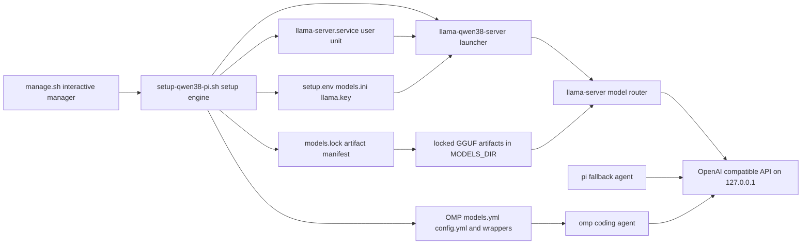

The repository owns a **per-user local inference deployment**, not a general remote model platform. Its runtime path is deliberately narrow: a coding agent calls an authenticated llama.cpp router on `127.0.0.1`; the router selects from complete, pinned model presets and keeps at most one model resident. `omp` is the primary task-routed agent, while `pi` is a manual fallback.



*Control and request flow: the manager delegates all mutations to the setup engine; generated artifacts configure the user-service router, while agents authenticate to its loopback API.*

## Components and control surfaces

### Two entry points, one implementation policy

- `./manage.sh` is an interactive control panel. It locates and invokes `setup-qwen38-pi.sh` for every action rather than duplicating provisioning logic. Its status display consumes `status --json` and independently checks that protected chat rejects a keyless request and accepts the local key.
- `./setup-qwen38-pi.sh` is the scriptable engine. It provides explicit lifecycle commands such as `model`, `plan`, `apply`, `service`, `routing`, `status`, `smoke`, `bench`, and `perf`; invoking it without an action only shows help. `plan` and `status` are observational. In particular, `status` uses `/v1/models?autoload=0` and does not load a model or generate text.
- `lib/local-ai-common.sh` is the side-effect-free shared layer used by both entry points. It centralizes safe configuration lookup, portable file metadata/identity helpers, semantic-version parsing, strict API-key validation, and authenticated curl invocation. The curl helper supplies the bearer token through curl configuration on standard input, keeping it out of argv and ordinary process listings.

Configuration is resolved as **explicit environment variable → saved `setup.env` → built-in default**. The engine accepts only a fixed set of persisted keys, validates their ranges/enums, and atomically writes the private saved file. Environment-only controls such as `SERVICE_READY_TIMEOUT` are intentionally not persisted.

### Desired state versus generated runtime state

`plan` is the review boundary and `apply` is the coordinated commit boundary. A successful `apply` first reruns preflight, snapshots desired-state, OMP, launcher, preset, and unit files; writes `setup.env`; refreshes applicable OMP routing and the selected-agent launcher; then regenerates/restarts the router. If an earlier phase fails, it restores the snapshots and does not proceed to change the router. The lower-level `service` and `routing` commands remain available for focused repair, but ordinary changes should follow `save-config`, `plan`, then `apply`.

The engine also serializes mutating lifecycle work with a per-user private operation lock. That prevents independently launched download, maintenance, routing, and apply operations from racing shared configuration, artifacts, or the router.

## Persistent locations and ownership

Paths can be overridden by the documented environment variables, but these are the defaults and the ownership model that a contributor must preserve.

| Location | State and owner | Safe change boundary |
|---|---|---|
| `models.lock` in the checkout | Repository-owned source of truth for model artifacts | Review/change it with the setup code; rows define tier, variant, router ID, model directory, immutable revision, remote path, bytes, digest, and kind. |
| `~/llm/models` (`MODELS_DIR`) | User-owned storage populated with manifest-owned GGUF files | The engine reads complete selected rows from this tree and verifies them before serving. Keep unrelated files out of managed paths; model removal/pruning targets manifest-owned paths. |
| `~/.config/local-ai/setup.env` | Engine-managed desired configuration, mode `0600` | A symlink or non-regular path is rejected. Do not hand-edit while an operation is in progress; use `save-config`. |
| `~/.config/local-ai/models.ini` | Generated llama.cpp per-model preset | Managed only as part of the preset/launcher/unit trio. Put model-specific options here through supported configuration, not in the global launcher. |
| `~/.config/local-ai/llama.key` | Local bearer credential, mode `0600` | Generated atomically if absent and validated as a regular, non-symlink file. Treat it as a secret even though the API is loopback-only. |
| `~/.config/local-ai/verified-models` | Engine verification receipts | Receipts bind a locked digest/size to file identity, avoiding repeated full hashing; replacement or modification invalidates the fast path. |
| `~/.local/bin/llama-qwen38-server` | Generated router-wide launcher | It owns host, port, key-file, preset, autoload, and residency arguments. It must not accumulate model-specific flags. |
| `~/.config/systemd/user/llama-server.service` | Generated systemd user service | The engine updates it only when the whole managed trio is absent or recognized as managed. Custom, mixed, or symlinked files are preserved and block normal replacement. |
| `~/.omp/agent/models.yml` and `~/.omp/agent/config.yml` | Generated OMP provider catalog and role mapping | They are an atomic pair. A custom half preserves both files and yields reviewable `.local-ai-setup.example` candidates; `routing --force` explicitly backs up and replaces them. |
| `~/.local/bin/local-ai-agent` and `~/.local/bin/omp-*` | Generated selected-agent and tier-forcing wrappers | Existing unmarked/user-owned launchers are preserved. Tier wrappers are generated only for complete tiers and export the key and loopback URLs in the launching shell. |

The config directory is made mode `0700`. Generated service inputs use recognizable managed markers; this is an ownership check, not merely a comment. The service transaction stages and syntax-checks the launcher, optionally verifies a staged unit with `systemd-analyze --user verify`, backs up the prior trio, and rolls back files plus enabled/active unit state if installation, restart, or readiness fails.

## Model artifact contract and runtime tiers

`models.lock` separates remote artifact identity from executable shell code. Each pipe-delimited row locks a tier/variant and its router-facing identity to a Hugging Face repository, immutable 40-character revision, remote path, exact byte count, SHA-256 digest, and artifact kind. The `ALL` rows are required alongside the selected variant, so an installed tier means the entire selected set—not simply one GGUF—is present.

| Friendly tier | Router ID | Locked shape and runtime role |
|---|---|---|
| `everyday` | `qwen3.8-27b` | Qwen 3.8 27B with selected `UD-Q4_K_XL` default or `Q8_0`, plus required MTP draft and F16 vision projection. It is the normal implementation and vision tier, with reasoning and speculative MTP enabled. |
| `coder` | `coder` | Qwen3-Coder-Next split into four `Q4_K_M` GGUF shards. It is the repository, tool, and debugging specialist; its neutral ID prevents OMP from classifying the officially non-thinking model as a reasoning model. |
| `senior` | `qwen3.5-122b-a10b` | Qwen3.5-122B-A10B community MXFP4 MoE conversion split into three artifacts. It is the architecture/planning/review tier and uses binary reasoning behavior. |

Artifact download verifies size and SHA-256 before a `.part` becomes a completed file. Service generation cryptographically verifies complete installed tiers before exposing them, although it can reuse a valid identity-bound receipt; `model-verify` deliberately rehashes selected artifacts. Incomplete, wrong-sized, or unverified tiers do not appear in the generated preset or OMP catalog.

`MODELS_MAX=1` is a hard safety invariant for this 128 GiB target, not a performance suggestion: all tiers can reside on disk, but the generated router is limited to one resident model process. Exactly one complete `STARTUP_TIER` is marked `load-on-startup`, or `none` produces a cold router. The router can then autoload/swap aliases on authenticated requests. Everyday and coder request full GPU layer offload; senior intentionally leaves placement to llama.cpp auto-fit rather than forcing all layers into the stock GPU-addressable allocation.

## Generated router and API boundary

The launcher executes `llama-server` with `--host 127.0.0.1`, `--api-key-file`, `--models-preset`, `--models-max 1`, and `--models-autoload`. The default port is `8080`. The generated preset provides common Jinja, flash-attention, one parallel inference slot, KV-cache, cache-reuse, and stop-timeout values, then emits a section only for each complete tier. This clean division is intentional: router-wide flags belong in the launcher; tier behavior—context, loading mode, reasoning, sampling, MTP, vision projection, and startup designation—belongs in `models.ini`.

Loopback does **not** mean unauthenticated. The service creates a random 256-bit token when necessary and llama.cpp reads it from `llama.key`. Health/readiness validates both sides of the wall: a protected `/v1/chat/completions` request without a key must receive `401` or `403`, while an authenticated request must be accepted semantically. It then checks authenticated `/v1/models?autoload=0` against the generated installed aliases and, on Linux, confirms the managed systemd `MainPID` owns the listening port. A selected startup model must reach `loaded` or `sleeping`, not merely leave the HTTP service listening.

The user unit minimizes its write and privilege surface: `NoNewPrivileges=true`, strict system protection, read-only home/model access, a narrowly managed Mesa cache, private temporary storage, restricted namespaces/SUID behavior, protected kernel controls, and DRM-character-device access. It is still a user service running local inference; coding agents retain the permissions of the user who launches them.

## Agent integration and routing

OMP's generated provider uses `http://127.0.0.1:${PORT}/v1`, OpenAI completions, `LLAMA_API_KEY`, and an authorization header. Its catalog presents only complete tier IDs and matches their distinct thinking/image capabilities. The routing config disables OMP's implicit keyless llama.cpp provider, sets `maxConcurrency: 1` and `llamacpp: 1` in-flight request, disables the always-on advisor, and keeps agent memory off.

Role selection derives from installed artifacts: **base** is the first complete tier in `everyday → coder → senior` order; **specialist** is coder if complete or base; **architect** is senior if complete or base. `sticky` routes every role to base, `balanced` routes `task` to specialist, and `quality` additionally routes slow/plan/advisor/designer roles to architect. This avoids aliases that do not exist and makes model-swap cost explicit. `omp-everyday`, `omp-coder`, and `omp-senior` force a named router ID at a deliberate phase boundary.

`pi` has no generated role map: it remains a lightweight manual fallback that can select the router models explicitly. The `local-ai-agent` wrapper follows persisted `AGENT=omp|pi`, verifies and exports the key, and exports `LLAMA_BASE_URL` and `LLAMA_CPP_BASE_URL` for same-shell use. Agent installers pin exact releases and disable dependency lifecycle scripts; existing binaries are left untouched unless `agent-upgrade` is explicitly requested.

## Operational checks and failure interpretation

Use read-only discovery before mutating state:

```bash
./setup-qwen38-pi.sh status --json | jq .
./setup-qwen38-pi.sh plan
```

Then apply reviewed desired state and test an intentional load:

```bash
./setup-qwen38-pi.sh apply
./setup-qwen38-pi.sh smoke everyday
journalctl --user -fu llama-server.service
```

`status` distinguishes `authenticated`, `insecure`, `unauthorized`, `down`, and `error`; it probes the loopback port even if systemd says the unit is inactive so a conflicting insecure listener is visible. `smoke` is intentionally disruptive relative to `status`: it verifies the unauthenticated rejection, reads the catalog with the key, and sends a tier-specific chat completion that may trigger a model swap.

When changing this architecture, retain the focused regression boundaries in `tests/integration/generated-config-test.sh`: it verifies preset composition, one startup tier, launcher argument quoting, custom/symlink ownership preservation, service rollback, receipt invalidation, atomic OMP pair behavior, routing fallbacks, and token non-leakage through curl argv. `tests/unit/runtime-safety-test.sh` additionally exercises fail-closed router-removal state handling and context/output headroom. These tests are important because a syntactically valid generated file can still be unsafe if it overwrites user state, points a role at an absent tier, exposes a keyless API, or leaves a partial transaction active.

## Related pages

- [Configuration artifacts and safety](/openwiki/concepts/configuration-artifacts-and-safety.md) for generated-file and credential safety details.
- [Coding agents and role routing](/openwiki/integrations/coding-agents-and-role-routing.md) for OMP and pi behavior.
- [Router health and performance](/openwiki/operations/router-health-and-performance.md) for readiness, smoke, and measurement operations.
- [Model and desired-state lifecycle](/openwiki/workflows/model-and-desired-state-lifecycle.md) for download, plan/apply, removal, and recovery workflow.
