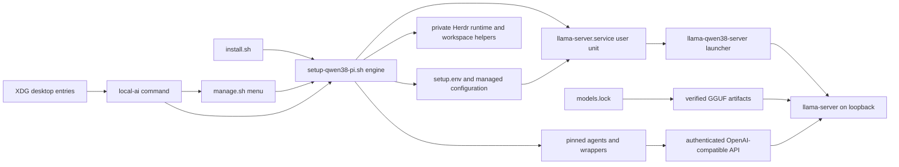

This is a **per-user local coding stack** for an Omarchy Linux Framework Desktop, not a hosted-model platform. A selected, pinned coding agent calls an authenticated OpenAI-compatible llama.cpp router bound to loopback. The router may expose several complete model tiers, but its generated configuration fixes residency to one model; OMP is the default selected agent and pi is an explicit alternative.



*Runtime flow: entry points converge on the setup engine; it creates the user-service inputs and optional workspace tools, while agent wrappers reach the router through its authenticated loopback API.*

## Entry points converge on one engine

`install.sh` accepts no operational arguments and `exec`s `setup-qwen38-pi.sh all`. The `all` bootstrap checks the workstation before persisting configuration, installs prerequisites, and stops before downloading models or loading the GPU if a reboot is required. On a ready host it installs the Everyday tier, generates/starts the service, installs the selected agent, optionally installs Herdr when `HERDR_ENABLED=1`, and installs desktop integration.

`local-ai` is the normal front door and deliberately resolves its repository from its own location. `menu` starts `manage.sh`; `logs` follows `llama-server.service` in the user journal; and other commands go to the engine. `workspace` uses a recognized generated `local-ai-workspace` helper when present, otherwise invokes the repository Python workspace tool (and requires Python). Desktop mode supports menu, logs, and workspace; it uses `omarchy-launch-tui` when available, otherwise `xdg-terminal-exec`, so graphical activation opens the same terminal-oriented implementation.

`manage.sh` is an interactive control panel, not an alternative lifecycle implementation: it reads status and delegates engine actions. The engine dispatcher is the scriptable boundary. Read-only commands—including `plan`, `status`, catalogs, configuration display, history, and checks—are dispatched directly; lifecycle and system mutations are wrapped in the operation lock. In particular, status reads the router catalog with `/v1/models?autoload=0`, so it does not generate output or autoload a model. `smoke` deliberately sends a chat request for a selected tier and can trigger a model swap.

Both shell entry points source `lib/local-ai-common.sh`. Its shared credential helpers accept only a nonempty regular, non-symlink key file whose token has the restricted safe format. Authenticated curl calls pass `Authorization: Bearer ...` through curl configuration on standard input rather than putting the secret in curl argv.

## Desired state, transactions, and ownership

The engine imports platform, agent, desktop, and Herdr libraries rather than taking ownership of Omarchy defaults:

- `lib/local-ai-platform.sh` identifies Omarchy from `os-release` plus installed entry points or version data without executing Omarchy tools. Package installation requires Linux x86_64 Omarchy and a normal user, rejects pending upgrades, validates the complete package set in configured repositories before sudo, and neither adds repositories nor falls back to AUR/source installation.
- `lib/local-ai-agents.sh` keeps pinned pi and OMP binaries separate from Omarchy's mutable launchers. On Omarchy their private root is `${XDG_DATA_HOME:-~/.local/share}/local-ai/agents`; an absent private binary remains uninstalled even if an Omarchy stub exists.
- `lib/local-ai-desktop.sh` owns only marker-bearing entries: `~/.local/bin/local-ai` and three XDG application entries for Local AI, Local AI Logs, and Local AI Workspaces. A custom or symlinked target blocks replacement; removal likewise removes only recognized managed files.
- `lib/local-ai-herdr.sh` owns an optional, pinned private Herdr runtime and generated workspace integration. It preserves a modified runtime, custom configuration, symlinked paths, and unrecognized hooks rather than replacing them.

Configuration precedence is explicit supported environment variable, then saved `setup.env`, then built-in default. The engine reads and writes only `CONFIG_KEYS`, rejects symlinked/non-regular `setup.env`, validates the resolved values, and atomically installs a mode-`0600` replacement in its parent directory. `SERVICE_READY_TIMEOUT` and similar operational controls are environment-only. Compatibility migration is narrow: an unexplicit saved `MODELS_MAX>1` becomes `1`, and saved `REASONING_EFFORT=none` becomes `medium`; explicitly supplied invalid values still fail validation.

`plan` is the review boundary. `apply` reruns that preflight, snapshots desired configuration, OMP's provider/role-map pair, agent and tier wrappers, and the service trio plus enabled/active state. It then persists configuration, refreshes applicable routing and selected-agent wrappers, and runs the service transaction. If routing or launcher creation fails, the router is not changed; a service failure restores the prior files and service state. Interrupted transactions follow the same restoration path, retaining backups if recovery is incomplete.

All dispatched mutations share one per-user lock. Its location is independent of configurable `MODELS_DIR`, because configuration, wrappers, the user service, and system operations remain shared even when artifact storage changes. The lock demands a private, user-owned runtime directory, records PID and process-start identity, rejects a live owner, and atomically reclaims stale locks without trusting PID reuse.

| Location | Owner and role | Safe change boundary |
|---|---|---|
| `models.lock` in the checkout | Repository artifact contract | Review identity, immutable revision, size, and digest with setup changes. |
| `~/llm/models` by default | User storage containing engine-managed artifact paths | The engine verifies, downloads, removes, or prunes managed artifacts; unrelated files are not desired state. |
| `~/.config/local-ai/setup.env` | Engine desired state | Change through `save-config`, inspect with `plan`, and commit with `apply`; do not turn it into a link or special file. |
| `~/.config/local-ai/models.ini`, `~/.local/bin/llama-qwen38-server`, and `~/.config/systemd/user/llama-server.service` | Generated service trio | Replacement requires all three to be absent or recognizable as managed; custom, mixed, symlinked, and non-regular paths are preserved and block replacement. |
| `~/.config/local-ai/llama.key` and `verified-models/` | Private credential and verification receipts | The service creates/reuses a regular `0600` key and validates it before use. |
| `~/.omp/agent/models.yml` and `config.yml` | OMP provider and role-map pair | Ownership of either half preserves both and writes examples; `routing --force` backs up then replaces both. |
| `~/.local/bin/local-ai-agent`, `omp-*`, and `local-ai-workspace` | Generated convenience launchers | Marker-bearing files can be refreshed; unmarked user launchers are preserved. |
| `${XDG_DATA_HOME:-~/.local/share}/local-ai/herdr` | Private pinned Herdr runtime | An explicit `herdr-upgrade` replaces only a recognized, verified managed runtime. |

## Artifacts and generated service

`models.lock` separates remote artifact identity from executable code. Each pipe-delimited record binds tier/variant and router ID to a model directory, repository, immutable revision, remote path, byte count, SHA-256, and kind. `ALL` rows are required supplemental artifacts: Everyday includes draft and projection files, while Coder and Senior are split main-file sets. Downloads are verified, and service generation verifies every complete candidate against the lock; identity-bound receipts can avoid repeated hashing only while the exact file identity persists. Partial, wrongly sized, or unverified tiers are excluded from the generated preset and OMP catalog.

Service installation first verifies llama-server capabilities and all serving artifacts. It refuses an incomplete selected Everyday quant or a configured unavailable startup tier. It stages `models.ini`, the launcher, and the user unit; checks shell syntax and, when available, `systemd-analyze --user verify`; snapshots the prior trio and systemd enabled/active state; then installs, reloads, enables, restarts, and checks readiness. Failure in installation, activation, authentication, catalog matching, or startup readiness rolls back the files and prior unit state.

The generated launcher runs `llama-server` on `127.0.0.1:${PORT}` (default `8080`) with `--api-key-file`, `--models-preset`, `--models-max 1`, and `--models-autoload`. Model-specific options stay in the preset. The user unit constrains the process with `NoNewPrivileges`, strict system protection, read-only home/model access, a dedicated cache, private temporary storage, namespace/SUID/kernel protections, and DRM character-device access.

`MODELS_MAX` is hard-fixed to `1` for the 128 GiB target. Exactly one available `STARTUP_TIER` gets `load-on-startup`; `none` leaves the router cold. The router can subsequently autoload/swap exposed aliases, so generated OMP config limits both task concurrency and llama.cpp in-flight requests to one.

Loopback is not sufficient authentication. The service creates a 256-bit random key when absent or validates the existing private key. Readiness requires an unauthenticated protected chat probe to return `401`/`403`, a keyed protected probe to be accepted, a keyed `autoload=0` catalog matching installed aliases, and—on Linux where observable—the managed unit `MainPID` owning the listener. When a startup tier is configured, its state must reach `loaded` or `sleeping`; a listening socket or `/health` alone is not a successful deployment.

## Agents, routing, and workspaces

The OMP provider generated in `models.yml` calls `http://127.0.0.1:${PORT}/v1` using OpenAI completions, `LLAMA_API_KEY`, and an authorization header; its implicit keyless llama.cpp provider is disabled. Only complete tiers are emitted. The base is the first complete tier in Everyday → Coder → Senior order. A complete Coder becomes specialist and a complete Senior becomes architect. `sticky` retains base for every role, `balanced` sends `task` to specialist, and `quality` additionally sends `slow`, `plan`, `advisor`, and `designer` to architect. Missing tiers therefore fall back to a complete base instead of producing invalid aliases.

`omp-everyday`, `omp-coder`, and `omp-senior` force an installed tier after validating/exporting the local key and loopback URLs; wrappers for incomplete tiers are withheld or removed. The selected `local-ai-agent` does the equivalent for configured `omp` or `pi`, but never overwrites an unmarked user-owned launcher. Normal installation leaves an existing agent binary untouched but rejects a version other than the configured pin; `agent-upgrade` is the explicit replacement path.

Herdr is an opt-in persistent-workspace layer, not part of router execution. Its runtime is downloaded from the exact locked release asset, size/digest checked, made executable, and version checked before promotion with a receipt; failed promotion restores the previous managed runtime. Generated helpers pass workspace roots/configuration between new terminals and explicitly unset inference credentials for the persistent server. Per-agent integration hooks and skills are written only when recognized as managed, avoiding a takeover of user extensions.

## Operating and changing the boundary

Start discovery and coordinated change with:

```bash
local-ai status
local-ai plan
local-ai apply
local-ai smoke everyday
journalctl --user -fu llama-server.service
```

`status` independently probes loopback as well as systemd, so an inactive unit cannot hide a conflicting listener. It classifies API observations as authenticated, insecure, unauthorized, down, or error. `smoke` is intentionally load-bearing: after checking the auth wall and catalog, it performs an authenticated chat completion for the chosen tier.

The focused integration coverage in `tests/integration/generated-config-test.sh` exercises generated presets/launchers, single-tier startup, custom and symlink ownership preservation, transaction rollback, verification receipt invalidation, and argument quoting. When changing this layer, retain these properties: managed state must not overwrite user state, routing must not select an absent tier, and a seemingly live loopback endpoint must not be mistaken for the authenticated managed router.

## Related pages

- [Configuration artifacts and safety](/openwiki/concepts/configuration-artifacts-and-safety.md)
- [Coding agents and role routing](/openwiki/integrations/coding-agents-and-role-routing.md)
- [Router health and performance](/openwiki/operations/router-health-and-performance.md)
- [Model and desired-state lifecycle](/openwiki/workflows/model-and-desired-state-lifecycle.md)
- [Persistent Herdr workspaces](/openwiki/workflows/persistent-herdr-workspaces.md)
- [Quickstart](/openwiki/quickstart.md)
