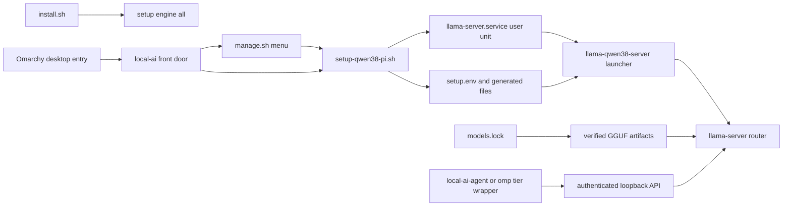

This project deploys a **per-user, local coding stack** for the Framework Desktop target, rather than a hosted model platform. The operational route is a selected coding agent to an authenticated OpenAI-compatible llama.cpp endpoint on loopback. Model artifacts may all be stored locally, but the generated router is constrained to one resident model; OMP is the default routed agent and pi is an explicit manual alternative.



*Runtime flow: repository and desktop entry points converge on the setup engine, which generates the user-service inputs; coding-agent wrappers then call the router's authenticated loopback API.*

## Entry points and control flow

`install.sh` is intentionally narrow: with no arguments it `exec`s the engine's `all` command. `all` verifies the workstation, saves configuration after that check, installs prerequisites, stops for a required reboot before attempting model/GPU work, then installs the Everyday artifacts, service, selected agent, and desktop integration.

The installed `local-ai` command is the daily front door and deliberately points back to the checkout. `local-ai menu` starts `manage.sh`; `local-ai logs` follows the user-service journal; ordinary subcommands are passed directly to `setup-qwen38-pi.sh`. Its `--desktop menu|logs` mode uses `omarchy-launch-tui` when available, otherwise `xdg-terminal-exec`, so a graphical launcher opens the same terminal-oriented interface rather than a second implementation.

`manage.sh` is a keyboard-first, interactive Omarchy-aware panel. It sources the common, platform, and agent helper libraries, displays engine `status --json`, and delegates mutations to the engine. The engine is the scriptable implementation boundary: its command dispatcher distinguishes read-only operations including `plan`, `status`, catalogs, configuration display, history, and checks from lifecycle commands protected by a per-user operation lock. In particular, `status` queries `/v1/models?autoload=0`; it does not generate output or autoload a model. `smoke`, by contrast, sends a selected-model chat request and can cause a swap.

The shared `lib/local-ai-common.sh` is side-effect-free so both manager and engine can use the same safe configuration reads, file metadata helpers, semantic-version parsing, and credential handling. A credential must be a nonempty regular, non-symlink file containing a restricted token format. Authenticated curl calls supply `Authorization: Bearer ...` through curl's stdin configuration, rather than curl argv.

## Setup engine, desired state, and concurrency

The engine imports focused libraries rather than making Omarchy package or desktop files its own:

- `lib/local-ai-platform.sh` detects a genuine Omarchy installation from `os-release` plus Omarchy entry points/version data without executing Omarchy tools. Package installation refuses pending system upgrades and uses the configured pacman repositories; it does not add repositories or fall back to a source build/AUR.
- `lib/local-ai-agents.sh` isolates pinned agent binaries from Omarchy's moving `pi`/`omp` launchers. On Omarchy, its private prefix is under `${XDG_DATA_HOME:-~/.local/share}/local-ai/agents`; an absent private binary is treated as uninstalled even if an Omarchy stub exists.
- `lib/local-ai-desktop.sh` owns only marked launchers and desktop entries. It generates `~/.local/bin/local-ai` plus `Local AI` and `Local AI Logs` entries under the user's XDG applications directory, preserves unmarked or symlinked paths, and can remove only its own marked entries.

Persisted configuration has a strict precedence: **an explicitly exported supported variable, then `setup.env`, then a built-in default**. Only the fixed `CONFIG_KEYS` set is read or written. The engine validates enumerations, paths, numeric ranges, and exact agent version syntax; it rejects a symlink or non-regular `setup.env`, stages the replacement in its parent, sets mode `0600`, and renames it atomically. Operational switches such as `SERVICE_READY_TIMEOUT` are intentionally environment-only. Saved legacy `MODELS_MAX>1` and `REASONING_EFFORT=none` have narrow migration paths when not explicitly supplied, while explicit invalid values fail validation.

`plan` is the review boundary and `apply` is the coordinated desired-state commit. `apply` reruns planning; snapshots saved configuration, OMP configuration, agent/tier wrappers, preset, launcher, unit, and prior service enabled/active state; then saves configuration, refreshes applicable routing and selected-agent wrapping, and generates/restarts the service. A routing or launcher failure restores files before the router phase. A service failure rolls the transaction back instead of leaving the new desired files partially committed.

Mutating commands run under one private, user-scoped operation lock. It is deliberately independent of `MODELS_DIR`, which is configurable: downloads, model maintenance, configuration, agent routing, service state, and system operations still share other mutable resources. The lock validates private ownership/mode, records PID plus a process-start cookie, and handles stale PID reuse before recovery.

## Artifacts and service ownership

`models.lock` is repository-owned data, separate from executable shell code. Every pipe-delimited row binds a tier and variant to a router ID, model directory, repository, immutable revision, remote path, exact byte count, SHA-256, and kind. A selected tier includes its `ALL` rows: Everyday has main quant plus MTP draft and vision projection; Coder is four main shards; Senior is three main shards. Downloads are verified before completion, and service generation verifies complete tiers against the lock (with identity-bound verification receipts as a fast path). A partial, wrong-sized, or unverified tier is excluded from the preset and OMP catalog.

| Location | Owner and role | Change boundary |
|---|---|---|
| `models.lock` in the checkout | Repository artifact contract | Change with review of artifact identity and setup behavior. |
| `~/llm/models` by default | User storage containing engine-managed manifest paths | The engine may download, verify, remove, or prune only managed artifacts; unrelated user files are not desired state. |
| `~/.config/local-ai/setup.env` | Engine-managed desired state | Use `save-config`, `plan`, and `apply`; do not replace it with a link or special file. |
| `~/.config/local-ai/models.ini`, `~/.local/bin/llama-qwen38-server`, and `~/.config/systemd/user/llama-server.service` | One generated router-service trio | The engine replaces the trio only when all are absent or recognizable as managed; custom, mixed, symlinked, or non-regular paths are preserved and block replacement. |
| `~/.config/local-ai/llama.key` and `verified-models/` | Private credential and integrity receipts | The engine creates/uses a regular `0600` key and validates it before an agent/service uses it. |
| `~/.omp/agent/models.yml` and `config.yml` | Generated OMP provider and role-map pair | Custom ownership of either half preserves both and writes reviewable examples; `routing --force` backs up then replaces the pair. |
| `~/.local/bin/local-ai-agent` and `omp-*` | Generated agent launchers | Managed files can be refreshed; unmarked user-owned launchers are preserved. Tier wrappers exist only for complete tiers. |

Service installation stages the preset, launcher, and unit, runs shell syntax validation and (when present) `systemd-analyze --user verify`, snapshots existing files, then enables and restarts the user unit. Failed installation, activation, or readiness restores the trio and its former enabled/active state. The generated unit is still a user process, but reduces its write/privilege surface with `NoNewPrivileges`, strict system protection, read-only home/model access, private temporary storage, namespace/SUID/kernel protections, a dedicated cache, and DRM character-device access.

## Router and API invariants

The generated launcher runs `llama-server` on `127.0.0.1:${PORT}` (default `8080`) with `--api-key-file`, `--models-preset`, `--models-max 1`, and `--models-autoload`. Router-wide host, credential, preset, and residency arguments belong in that launcher; common and tier-specific inference configuration is emitted in `models.ini` only for complete tiers.

`MODELS_MAX` is fixed at exactly `1` for the 128 GiB target. Thus one available configured `STARTUP_TIER` receives `load-on-startup`; `STARTUP_TIER=none` makes the router cold. The router may subsequently autoload/swap among exposed aliases on a request, but OMP also constrains task concurrency and llama.cpp in-flight requests to one so concurrent requests do not fight the single resident slot.

Loopback is not a trust boundary by itself. The service creates a 256-bit random key if absent, or validates the existing private key. Its readiness check requires a keyless protected chat request to return `401` or `403`, a keyed protected request to be semantically accepted, the keyed catalog with `autoload=0` to match installed aliases, and on Linux the managed systemd `MainPID` to own the listener. A configured startup model must reach `loaded` or `sleeping`; a listening port or `/health` alone is insufficient.

## Agents and role routing

The generated OMP provider calls `http://127.0.0.1:${PORT}/v1` using OpenAI completions, `LLAMA_API_KEY`, and an authorization header. It exposes only complete tiers and disables OMP's implicit keyless `llama.cpp` provider. Base selection is the first complete tier in **Everyday → Coder → Senior** order; a complete Coder becomes the specialist and a complete Senior becomes the architect. `sticky` keeps all roles on base, `balanced` sends `task` to specialist, and `quality` additionally sends slow, planning, advisor, and designer roles to architect. This makes absent tiers fall back safely rather than producing broken aliases.

`omp-everyday`, `omp-coder`, and `omp-senior` set the verified local key and loopback URLs before invoking OMP with a chosen model ID. They are deliberately withheld or removed when that tier is incomplete. `local-ai-agent` similarly chooses `omp` or `pi` from `AGENT`, verifies and exports the same credential/URLs, and never overwrites an unmarked launcher. Normal agent installation preserves an existing binary but rejects one that does not match the configured supported release; `agent-upgrade` is the explicit replacement path. On Omarchy, the project's pinned agent location is kept distinct from the distribution's launcher-managed commands.

## Operations and change checks

Use read-only discovery before a coordinated change:

```bash
local-ai status
local-ai plan
local-ai apply
local-ai smoke everyday
journalctl --user -fu llama-server.service
```

`status` probes the loopback port independently of systemd state: an inactive unit must not conceal a conflicting listener. It categorizes the API as `authenticated`, `insecure`, `unauthorized`, `down`, or `error` from keyless and keyed protected/catalog probes. `smoke` is intentionally load-bearing: after proving the auth wall and catalog it requests a completion for the selected tier.

When modifying this boundary, retain focused coverage in `tests/integration/generated-config-test.sh` for generated presets/launchers, one startup tier, custom and symlink ownership preservation, service rollback, verification receipts, atomic OMP pair behavior, routing fallbacks, and token non-leakage. The supporting unit suites exercise bootstrap sequencing, configuration validation, agent isolation, and runtime safety. These checks protect the architectural properties that syntax checks cannot: user state must not be overwritten, a role must not point at an absent tier, and an apparently healthy loopback service must not be unauthenticated or unrelated.

## Related pages

- [Configuration artifacts and safety](/openwiki/concepts/configuration-artifacts-and-safety.md)
- [Coding agents and role routing](/openwiki/integrations/coding-agents-and-role-routing.md)
- [Router health and performance](/openwiki/operations/router-health-and-performance.md)
- [System and LAN security](/openwiki/operations/system-and-lan-security.md)
- [Model and desired-state lifecycle](/openwiki/workflows/model-and-desired-state-lifecycle.md)
- [Quickstart](/openwiki/quickstart.md)
