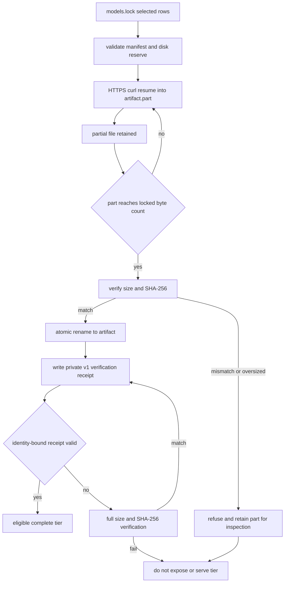

> **Invariant-oriented guide.** The setup engine is deliberately conservative: a value, artifact, or generated file is usable only after it satisfies the applicable validation and ownership checks. A refusal is normally a request for explicit operator action, not an invitation to overwrite, follow, or guess.

## Configuration is desired state, with explicit precedence

`setup-qwen38-pi.sh` is the authoritative resolver. It first records which supported keys were explicitly present in the process environment, reads only allowlisted keys from `setup.env`, and uses persisted values only where no explicit environment value exists. Defaults are applied afterwards. Therefore the effective order is:

1. explicit environment variable;
2. `SETUP_ENV` (by default `~/.config/local-ai/setup.env`);
3. built-in default.

The allowlist is `CONFIG_KEYS`; values outside it in the saved file are ignored. This makes `setup.env` a compact, engine-owned desired-state file rather than a shell script to source. `save-config K=V ...` validates the resolved configuration before persistence, stages the complete allowlisted set in the config directory, protects it as `0600`, and atomically renames it into place. The directory is protected as `0700` when service state is generated.

The engine will not read or replace a symlinked `setup.env`, nor accept a directory or other non-regular object at that path. It makes the same distinction when it reacquires the per-user lifecycle lock and merges current persisted state: this prevents a wait behind another mutation from losing a concurrent save, while preserving higher-precedence environment inputs.

### Validation boundaries that matter

Validation is not merely UI input checking; it protects values later embedded in generated shell and systemd artifacts.

| Area | Contract |
|---|---|
| Agent and routing | `AGENT` is `omp` or `pi`; `ROUTING_PROFILE` is `sticky`, `balanced`, or `quality`; `STARTUP_TIER` is a named tier or `none`. |
| Model selection and loading | Everyday `QUANT` is `UD-Q4_K_XL` or `Q8_0`; each tier load mode is one of `none`, `mmap`, `mlock`, `mmap+mlock`, or `dio`; KV cache is `f16` or `q8`. |
| Context and output headroom | Contexts are positive and no more than 262144. Everyday and coder require at least 32768 tokens; senior requires at least 65536, so their respective output ceilings still leave prompt/tool headroom. `DRAFT_N` is 1–8. |
| Resource bounds | `DOWNLOAD_JOBS` is 1–4, disk reserve is 1–128 GiB, and GTT is 64–115 GiB. The download-space check includes the remaining locked bytes **and** the reserve before `curl` can create a partial file. |
| Generated-path safety | `MODELS_DIR` must be absolute and cannot contain newline; combined model/home-derived generated paths reject quotes, `%`, `$`, backslashes, carriage returns, and newlines because they are systemd-significant. |
| Environment-only controls | `SERVICE_READY_TIMEOUT`, `PERF_PROMPT_WORDS`, `ALLOW_PENDING_REBOOT`, and `SERVICE_HEALTHCHECK` are validated operational controls but are not among the persisted keys. In particular, health checks can be disabled only as `SERVICE_HEALTHCHECK=0`, which the implementation labels as reserved for controlled tests. |

Legacy saved values receive narrow compatibility migration: a non-explicit saved `REASONING_EFFORT=none` becomes `medium`, and a saved numeric `MODELS_MAX>1` becomes `1`. An explicit invalid value still fails. This preserves operability of older desired state without creating a one-run loophole.

## The lock file defines the model artifact contract

`models.lock` is repository-owned, pipe-delimited data—not executable download logic. Its ten fields are:

```text
tier|variant|router_id|model_dir|repo|revision|remote_path|bytes|sha256|kind
```

Every row pins an immutable 40-hex revision, exact byte count, SHA-256 digest, and artifact kind (`main`, `draft`, or `mmproj`) in addition to the placement and router identity. The manifest validator rejects malformed field counts, duplicate destination basenames per tier, invalid identifiers, traversal/absolute remote paths, bad digest/revision shapes, unexpected tiers/kinds, and shapes other than the exact expected artifact sets.

The selected set for a tier is not always a single GGUF. `model_rows` includes the selected variant plus `ALL` rows, so the everyday tier requires its selected main quant **and** the MTP draft and vision projection. Coder requires four main shards and senior three. `tier_available` requires every selected row to be a regular, non-symlink file of the locked size; one missing shard makes the logical tier partial. Size establishes availability for catalog/routing decisions, then integrity verification establishes eligibility to serve.

### Artifact and receipt lifecycle



*Artifact state transitions: partial data is resumable but not usable; only a verified regular file and a valid receipt can take the cached path to service generation.*

The downloader refuses symlinks for both destination and `.part` paths, and refuses an existing non-regular destination. A complete existing artifact is reused only after full size/digest verification. A `.part` that already verifies is promoted locally, recovering a crash after the last byte before rename. A short `.part` is resumed over HTTPS only (`--proto '=https'`, redirects constrained to HTTPS, TLS 1.2 minimum); a complete-but-corrupt or oversized `.part` is retained and causes refusal rather than append or silent replacement. Post-download verification failure likewise retains evidence for inspection.

A successful full verification writes a private receipt under `~/.config/local-ai/verified-models` by default. Its `v1` record contains the exact path, expected size, expected digest, and file identity. Identity includes device, inode, byte size, mtime, and ctime (with sub-second timestamps where available), so a replacement or same-size rapid overwrite invalidates a receipt without rehashing every routine operation. Cached verification still requires a regular non-symlink file and matching size. `model-verify` intentionally bypasses the receipt fast path and fully hashes selected installed artifacts; service generation may use the valid cached path but will rehash and refuse artifacts whose receipt no longer matches.

## Availability, residency, and destructive operations

A partial tier is visible as partial in `model-catalog`, but it is not a routing/provider candidate. `cmd_service` verifies every size-complete tier against the lock before generating service state, excludes incomplete/wrong-size tiers, and fails if none are complete. It also refuses a selected-but-incomplete everyday quant rather than letting another tier conceal a `QUANT` selection change, and refuses an unavailable non-`none` startup tier.

`MODELS_MAX=1` is enforced—not advisory—for the 128 GiB target. Explicit values other than one fail validation; legacy persisted values above one are migrated to one and saved as one. The generated router launcher consequently uses `--models-max 1`, while generated OMP routing also limits its task concurrency and llama.cpp provider in-flight requests to one. This common limit protects memory and avoids concurrent requests fighting a router that can host one model at a time.

Removal/pruning is also fail-closed. Before managed model files change, the service must either be not installed or prove `inactive`/`failed` with `MainPID=0`; active, transitioning, absent/unqueryable, or unknown states refuse the operation. Multi-shard paths are first validated and atomically renamed into a quarantine namespace; signal or rename failure restores the staged prefix. Only after all moves does cleanup unlink them. If maintenance began with the router active, a lifecycle transaction restarts the prior router only if an artifact namespace fingerprint proves no artifact state changed; otherwise it remains stopped until plan/apply succeeds.

## Secrets and generated filesystem boundaries

The loopback API is treated as a credential boundary. During service generation, `llama.key` must be a regular non-symlink path. If absent/empty the engine generates 32 random bytes encoded as hex, validates its safe 32-or-more-character token form, stages it at `0600`, and atomically installs it; otherwise it restricts the existing regular key to `0600` and validates it. `local_ai_curl_authenticated` obtains the key only from such a file and sends the authorization header through curl configuration on standard input, rather than embedding the bearer token in argv.

The user service makes the model tree read-only and applies `UMask=0077`, `NoNewPrivileges=true`, strict system protection, read-only home protection, private temporary storage, restricted namespaces/SUID behavior, protected kernel controls, and DRM-only device access. The service installation additionally stages and syntax-checks its launcher, optionally validates a staged unit with `systemd-analyze --user verify`, and regards readiness as the commit point. On install, restart, API authentication/catalog, warm-tier readiness, or managed-listener ownership failure, it restores the prior preset, launcher, unit, enablement, and active state.

Generated files have ownership boundaries, not overwrite-by-path semantics:

- The service preset, router launcher, and user unit are a **trio**. Ordinary regeneration requires every existing member to be a regular, non-symlink recognized managed file (or a recognized legacy trio); any custom, symlinked, mixed, or non-regular member blocks replacement.
- OMP `models.yml` and `config.yml` are a **pair**. If either is custom or a symlink, ordinary `routing` preserves both pair members and launchers, writes both generated candidates as `.local-ai-setup.example`, and returns status 2. `routing --force` is the explicit replacement path and first writes timestamped backups. Pair and wrapper updates snapshot and restore the entire routing bundle on failure or signal.
- Tier wrappers and `local-ai-agent` replace only marker-recognized regular files. Unmarked or symlinked user launchers are preserved. Wrappers for unavailable tiers are removed only if they carry the managed marker, preventing a stale managed command from selecting an absent alias.
- Managed shell exports are replaced by marker identity, rather than blind line deletion. An unmarked user export is retained and the managed export is appended last. A dotfile symlink is resolved only with `realpath` to a regular non-symlink target; its mode is preserved, while dangling/unresolved/non-regular links refuse integration.

## Focused verification and safe change practice

The configuration unit test exercises supported enums/ranges, context lower and native upper bounds, fixed residency, bounded downloads, health-check values, and systemd-sensitive path rejection. The generated-config integration test is the core regression suite for this topic: it tests lock shape, partial catalog state, recovery/resume/refusal for `.part` files, download symlink rejection, config validation-before-persistence, preservation of non-regular config/key paths, service rollback, receipt fast-path invalidation, ownership boundaries, OMP pair transactions, and missing-tier fallback. Runtime-safety tests make removal and unload state queries fail closed and enforce prompt/output headroom.

When changing these mechanisms, keep the order of checks meaningful: validate configuration and ownership before persistence or mutation; validate space before network writes; verify content before promotion/exposure; and snapshot a coherent group before changing any member. Do not weaken a refusal into automatic cleanup or replacement merely to make an idempotent run appear successful.

## Related pages

- [Runtime Stack and Ownership Boundaries](/openwiki/architecture/runtime-stack.md)
- [System and LAN Security](/openwiki/operations/system-and-lan-security.md)
- [Verification Strategy](/openwiki/testing/verification-strategy.md)
- [Model and Desired-State Lifecycle](/openwiki/workflows/model-and-desired-state-lifecycle.md)
