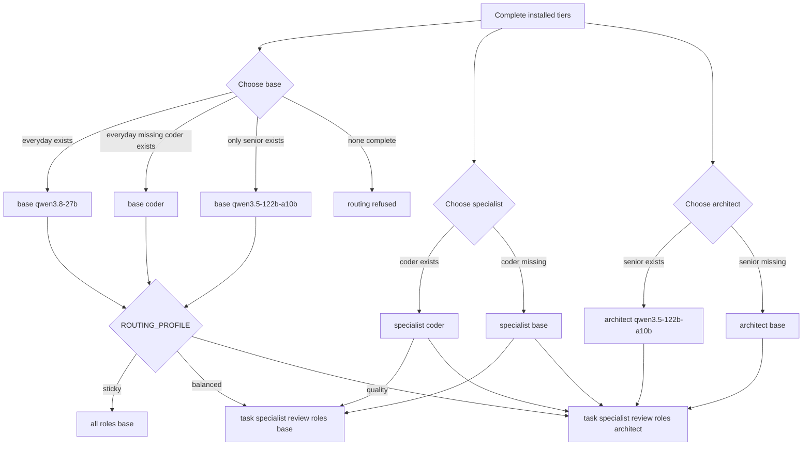

`omp` is the primary coding-agent integration: it receives a generated provider catalog and a role map for the local llama.cpp router. `pi` is deliberately simpler—a manually selected fallback and diagnostic client, not another routing implementation. Both use the same loopback router and bearer credential; neither changes the model-artifact lifecycle.

## Entry points and selection

`./setup-qwen38-pi.sh agent` dispatches from the resolved `AGENT` value (`omp` by default, or `pi`). A direct `omp` or `pi` installation validates/installs that tool but does **not** change persisted selection. To switch the persistent selection, save it and regenerate the selected launcher:

```bash
./setup-qwen38-pi.sh save-config AGENT=pi
./setup-qwen38-pi.sh agent
```

`manage.sh` makes that ordering explicit in its interactive agent chooser: validate/install the prospective agent, save `AGENT`, then invoke `agent` so generated integration reflects the saved choice. The manager also exposes the separate, deliberately confirmatory upgrade action.

The ordinary install contract is conservative and reproducible:

| Agent | Missing-binary install | Existing binary | Explicit replacement |
|---|---|---|---|
| `pi` | `npm install --global --prefix "$HOME/.local" --ignore-scripts "@earendil-works/pi-coding-agent@${PI_VERSION}"` | Left untouched; a version mismatch warns | `./setup-qwen38-pi.sh agent-upgrade pi` |
| `omp` | Bun installs `@oh-my-pi/pi-coding-agent@${OMP_VERSION}` into `LOCAL_BIN_DIR`, with `--ignore-scripts` | Left untouched, but a version mismatch prevents managed OMP routing | `./setup-qwen38-pi.sh agent-upgrade omp` |

The defaults are `PI_VERSION=0.84.4` and `OMP_VERSION=18.0.10`; both configuration values must be exact `x.y.z` releases. Installation and upgrade verify that the expected executable was created and reports the pinned version. In particular, routing uses an exact OMP schema/version gate rather than assuming a compatible-looking later release. A direct OMP install is still useful before downloading a model: it installs shell and selected-agent integration but warns that routing needs a complete tier.

### pi: manual fallback

`pi` has no generated role map. In a new shell, start `pi`, use `/llama` to load `qwen3.8-27b`, `coder`, or `qwen3.5-122b-a10b`, then use `/model` to select the session model. Models should be added through this repository, not pi’s downloader, so the selected artifacts remain locked and verified.

On first use the installer atomically creates `~/.pi/agent/settings.json` at mode `0600`, disabling install telemetry and analytics and enabling compaction with a 24,000-token recent window. An existing regular file is retained unchanged; symlinked, dangling, or other non-regular paths are also preserved rather than followed or replaced.

## Credentials, shell state, and launchers

The agents reach the router at `http://127.0.0.1:${PORT}`. The router remains a credential boundary even on loopback: generated wrappers read and validate the key file, export `LLAMA_API_KEY`, `LLAMA_BASE_URL`, and `LLAMA_CPP_BASE_URL`, set `PI_NO_TITLE=1`, and `exec` the requested agent. `PI_NO_TITLE=1` avoids a title request competing for the sole router slot.

`local-ai-agent` is the general wrapper and is generated for the current `AGENT`; `omp-everyday`, `omp-coder`, and `omp-senior` additionally pin OMP’s `--model` to a specific available router ID. Tier wrappers are created only for complete tiers; a managed wrapper for a tier that later becomes unavailable is removed so it cannot force a 404. All generated wrappers are staged, mode `0700`, and atomically renamed. A generic unmarked or symlinked user launcher is not replaced.

Installers add `PATH` and managed exports to `~/.bashrc`, plus `~/.zshrc` when zsh is the active shell. Managed `LLAMA_API_KEY` and pi’s `LLAMA_BASE_URL` exports are identified by a marker, rewritten by marker identity, and appended last. This replaces stale generated values without deleting unmarked user exports; the last managed export wins for this setup. A dotfile symlink is accepted only when `realpath` resolves it to a regular non-symlink target, whose mode is preserved. The OMP path also removes the exact obsolete `export OMPX_PARSER_ACTIVE=1` line because current integration uses llama.cpp/Qwen chat-template support.

For remote, non-interactive workflows, `ai-session` independently reads the saved port and local key before launching tmux because shells may not source their rc files. It selects explicit `AGENT` first, then saved `setup.env`, then `omp`; its session name combines the project basename with a canonical-path digest to prevent same-named repositories sharing a pane.

## OMP provider catalog

`routing` generates `~/.omp/agent/models.yml` from **complete** tiers only. Its `llamacpp` provider is explicit rather than relying on discovery defaults:

```yaml
baseUrl: http://127.0.0.1:${PORT}/v1
api: openai-completions
apiKey: LLAMA_API_KEY
authHeader: true
discovery:
  type: llama.cpp
```

`config.yml` disables OMP’s implicit `llama.cpp` provider, which would otherwise be a duplicate keyless path and produce stray authorization failures. It also fixes task concurrency and the named provider’s in-flight requests at one, matching the router’s one-resident-model constraint; turns the always-on advisor off; and disables agent memory. The generated config intentionally does not set `supersedeReads: false` or `dropUseless: false`, leaving OMP’s cache-aware pruning defaults enabled.

Metadata tracks actual interface differences, not just display names:

- `qwen3.8-27b` is reasoning-capable, accepts `low`, `medium`, and `xhigh`, uses configured `REASONING_EFFORT` as the default, and accepts text and images.
- `coder` is explicitly non-reasoning, text-only, and tagged with `tokenizer: qwen3`. Its neutral ID prevents OMP’s Qwen-name inference from misclassifying this official non-thinking model.
- `qwen3.5-122b-a10b` has binary thinking represented by the single `low` surface; `supportsReasoningEffort: false` prevents an unsupported effort payload.

## Role selection and missing-tier fallbacks

The role resolver never selects an alias whose complete locked artifact set is absent. It computes **base** as the first complete tier in `everyday → coder → senior` order, **specialist** as `coder` when complete (else base), and **architect** as `senior` when complete (else base). No complete tier is a hard routing failure.



*Routing resolution: base selection is ordered by complete tiers, then profiles selectively promote task and review roles while missing specialist or architect tiers fall back to base.*

The fixed base roles are `default`, `vision`, `smol`, `commit`, `tiny`, and `title`. The profile controls the remaining roles:

| Profile | `task` | `slow`, `plan`, `advisor`, `designer` | Operational intent |
|---|---|---|---|
| `sticky` | base | base | Default. Keeps the implementation model warm. |
| `balanced` | specialist | base | Uses coder for tasks when available. |
| `quality` | specialist | architect | Adds senior review/planning where installed. |

An isolated promoted call can require a swap into that tier and another back to base, so profile choice is a latency/residency decision, not merely a quality preference. Under `sticky`, use `omp-coder` or `omp-senior` deliberately at a phase boundary, then return with `omp-everyday`. The advisor role is mapped like other review roles under `quality`, but its automatic advisor feature remains disabled until the operator enables it.

## Pair ownership and transactional failure behavior

`models.yml` and `config.yml` are one logical OMP routing pair. Before normal routing changes, the engine considers either file custom if it is a symlink or lacks the managed marker (recognized legacy generated files are migratable). If **either** half is custom, ordinary `routing` changes neither active config nor tier launchers, writes both proposed files beside them as `.local-ai-setup.example`, and returns status `2`. `plan` and `apply` surface this as an unresolved gate rather than partially configuring a provider/role relationship.

Use `./setup-qwen38-pi.sh routing --force` only after reviewing those candidate files. It creates timestamped backups of custom halves before replacement. Both normal and forced routing snapshot the pair and all three tier wrappers. A failed second rename or an interrupt restores the prior pair; a failure while updating wrappers restores the entire routing bundle. If recovery itself cannot complete, the transaction directory is retained for manual recovery rather than silently claiming success.

This ownership rule also matters after selecting pi: `apply` does not create OMP routing solely for pi, but if a managed OMP pair already exists it refreshes it, preventing stale managed selectors after tier removal.

## Recommended operation and tests

After downloading or removing a tier, resolve the prospective mapping before committing it:

```bash
./setup-qwen38-pi.sh save-config ROUTING_PROFILE=quality
./setup-qwen38-pi.sh plan
./setup-qwen38-pi.sh apply
```

`plan` shows base, task, and review selectors and fails unresolved preflight—such as no complete tier, an incompatible installed OMP version, or a preserved custom pair—before `apply` mutates desired or router state. Use `routing` for focused repair and `routing --force` only to take ownership of a custom pair.

Focused regression coverage is intentionally behavioral. `tests/unit/manager-test.sh` checks chooser ordering and the explicit upgrade path. `tests/unit/user-config-preservation-test.sh` verifies pi starter privacy and that existing/symlinked settings are untouched. `tests/integration/generated-config-test.sh` checks managed export replacement without stale precedence, provider auth and capability metadata, all three routing profiles, missing-tier fallback, custom-pair gating, user launcher preservation, and rollback of pair and wrapper updates on failure or signal.

## Related pages

- [Runtime Stack and Ownership Boundaries](/openwiki/architecture/runtime-stack.md)
- [Configuration, Artifacts, and Safety Invariants](/openwiki/concepts/configuration-artifacts-and-safety.md)
- [Router Health and Performance](/openwiki/operations/router-health-and-performance.md)
- [Model and Desired-State Lifecycle](/openwiki/workflows/model-and-desired-state-lifecycle.md)
