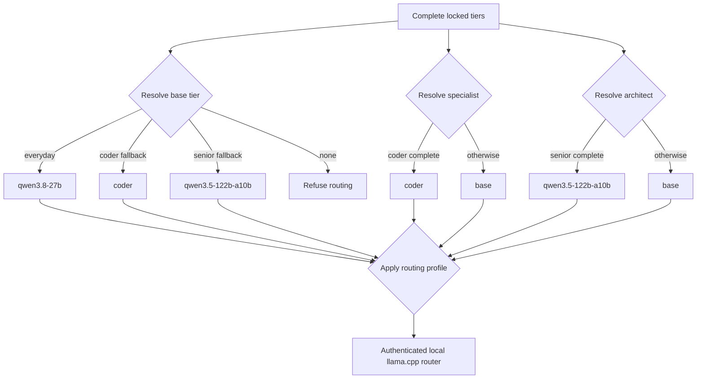

`omp` is the primary coding-agent integration: it receives a generated provider catalog and role map for the local llama.cpp router. `pi` is deliberately simpler—a manually selected fallback and diagnostic client, not a second routing implementation. Both target the same loopback router and bearer credential; neither owns model downloads or changes the locked-artifact lifecycle.

## Entry points, selection, and private runtimes

`./setup-qwen38-pi.sh agent` dispatches from the resolved `AGENT` value (`omp` by default, or `pi`). Running `pi` or `omp` directly installs or validates that agent and its shell/launcher integration, but does not persist a selection. To switch the persisted selection, save it and then regenerate the selected integration:

```bash
./setup-qwen38-pi.sh save-config AGENT=pi
./setup-qwen38-pi.sh agent
```

The interactive manager follows the same ordering: it validates or installs the prospective agent, saves `AGENT`, then runs `agent`. `agent-upgrade [pi|omp]` is intentionally separate: it replaces the target agent with the configured pinned version and refreshes only the integration appropriate to the currently selected agent.

Agent lookup and placement have an important Omarchy boundary. On Omarchy, the project uses `${XDG_DATA_HOME:-$HOME/.local/share}/local-ai/agents` (with `bin` and Bun global directories below it), rather than `~/.local/bin`, because Omarchy can provide moving mise launcher stubs there. A private executable is the only installed agent recognized on Omarchy; lookup is read-only and never runs those stubs, even for `--version`. Outside Omarchy, agents use the normal local prefix/bin location, with PATH lookup as a fallback.

The ordinary install contract is conservative and reproducible:

| Agent | Missing-binary install | Existing binary | Explicit replacement |
|---|---|---|---|
| `pi` | `npm install --global --prefix "$prefix" --ignore-scripts "@earendil-works/pi-coding-agent@${PI_VERSION}"` | Left untouched; a mismatch warns | `./setup-qwen38-pi.sh agent-upgrade pi` |
| `omp` | Bun installs `@oh-my-pi/pi-coding-agent@${OMP_VERSION}` into the agent bin/global directories with `--ignore-scripts` | Left untouched; a mismatch stops normal OMP setup | `./setup-qwen38-pi.sh agent-upgrade omp` |

The defaults are `PI_VERSION=0.84.4` and `OMP_VERSION=18.0.10`. Both are configuration keys validated as exact semantic versions. New installs and upgrades verify that the expected executable exists and reports the selected version. The OMP configuration schema is additionally version-gated: when an OMP executable is installed, `routing` refuses to write v18 routing for a version other than `OMP_VERSION`. A direct OMP installation remains useful before downloading a model because it can establish the binary, shell integration, and selected-agent launcher, while warning that role routing needs a complete tier.

### pi: manual fallback

`pi` has no generated role map. Start it in a new shell, use `/llama` to load `qwen3.8-27b`, `coder`, or `qwen3.5-122b-a10b`, then use `/model` to select the session model. Add models through this repository rather than pi’s downloader so revisions, byte sizes, and SHA-256 verification remain governed by `models.lock`.

On first use, the installer atomically creates `~/.pi/agent/settings.json` at mode `0600`, disables install telemetry and analytics, and enables compaction with a 24,000-token recent window. An existing regular settings file is retained; a symlink, dangling path, or other non-regular path is deliberately not followed or replaced.

## Credentials, shell state, and launchers

The agents reach the router through `http://127.0.0.1:${PORT}`. Loopback is still an authentication boundary: generated launchers require a nonempty key file, validate the key’s restricted format, export `LLAMA_API_KEY`, `LLAMA_BASE_URL`, and `LLAMA_CPP_BASE_URL`, set `PI_NO_TITLE=1`, then `exec` the agent. Suppressing title requests avoids competing for the single router slot.

`local-ai-agent` is the general launcher for the selected `AGENT`. `omp-everyday`, `omp-coder`, and `omp-senior` invoke OMP with a corresponding `llamacpp/<router-id>` model selection. A tier launcher is created only when that tier’s complete artifact set is available; a managed launcher is removed when its tier later becomes unavailable, so it cannot force a known-missing router model. Launchers are staged, mode `0700`, and atomically renamed.

Normal generation replaces only a launcher carrying this setup’s marker. A user-owned or symlinked launcher is preserved. `routing --force` is the explicit ownership transfer: it copies an existing user launcher to a timestamped backup before installing the managed replacement. On Omarchy, launchers point to the private runtime and fail closed if it is missing; they never fall back to a distribution stub. Outside Omarchy, the generated launchers may use PATH only if the expected local executable is absent.

The installer adds the local bin directory to `~/.bashrc`, and to `~/.zshrc` when zsh is active. Managed `LLAMA_API_KEY` and pi `LLAMA_BASE_URL` exports are identified by a marker, removed by marker identity, and appended last. Thus stale generated values do not accumulate or win over the newest setup value, while unmarked user exports remain intact. A dotfile symlink is edited only through a `realpath`-resolved regular, non-symlink target; its mode is retained. OMP integration also removes the exact legacy `export OMPX_PARSER_ACTIVE=1` line, because the current path relies on llama.cpp/Qwen chat-template support rather than that external parser setting.

## OMP provider catalog and role resolution

`routing` generates `~/.omp/agent/models.yml` from complete tiers only. Its explicit `llamacpp` provider targets the authenticated OpenAI-compatible endpoint:

```yaml
baseUrl: http://127.0.0.1:${PORT}/v1
api: openai-completions
apiKey: LLAMA_API_KEY
authHeader: true
discovery:
  type: llama.cpp
```

`config.yml` disables OMP’s implicit `llama.cpp` provider, which would otherwise be a duplicate keyless route. It limits both task concurrency and the named provider’s in-flight requests to one, matching the one-resident-model router; it also disables the always-on advisor and agent-memory backend.

The catalog records interface differences rather than merely renaming models:

- `qwen3.8-27b` is reasoning-capable, supports `low`, `medium`, and `xhigh`, defaults to `REASONING_EFFORT`, and accepts text and images.
- `coder` is non-reasoning, text-only, and declares `tokenizer: qwen3`. Its neutral ID avoids name-based Qwen inference for this non-thinking model.
- `qwen3.5-122b-a10b` exposes binary thinking through the sole `low` level; `supportsReasoningEffort: false` prevents an unsupported effort payload.

The resolver never selects an absent alias. It selects **base** as the first complete tier in `everyday → coder → senior` order; **specialist** is complete `coder` or base; **architect** is complete `senior` or base. With no complete tier, routing fails before writing active files.



*Role selection uses only complete locked tiers, applies the selected profile, and sends OMP through the authenticated local router.*

The fixed base roles are `default`, `vision`, `smol`, `commit`, `tiny`, and `title`. The profile controls the remainder:

| Profile | `task` | `slow`, `plan`, `advisor`, `designer` | Operational intent |
|---|---|---|---|
| `sticky` | base | base | Default; keep the implementation model warm. |
| `balanced` | specialist | base | Use `coder` for tasks when available. |
| `quality` | specialist | architect | Use senior for review/planning when installed. |

A promoted isolated call can require a router model swap and a swap back, so profile choice is a latency/residency choice as well as a quality choice. Under `sticky`, use a tier-specific wrapper deliberately at a phase boundary. The `advisor` role is mapped under `quality`, but its automatic feature stays disabled until an operator enables it.

## Pair ownership and transactional updates

`models.yml` and `config.yml` are one logical routing pair. Before ordinary routing changes, either half is custom if it is a symlink or lacks the managed marker; recognizable legacy generated files are migratable. If either half is custom, `routing` changes neither active configuration nor tier launchers, writes both candidates beside the active files as `.local-ai-setup.example`, and returns status `2`. Review both candidates, or use `./setup-qwen38-pi.sh routing --force` to back up custom halves and take ownership.

Normal and forced updates snapshot the pair and all three tier launchers before installation. Pair installation stages both files and restores the prior pair if either rename fails; the larger bundle transaction also restores the pair and wrappers on a launcher failure or signal. If recovery cannot complete, the transaction directory remains as manual recovery evidence rather than being silently discarded.

`plan` reports the selected aliases and unresolved preflight gates without writing. `apply` reruns `plan` rather than trusting an earlier result, snapshots desired state, routing files, launchers, and service files, then saves configuration. It refreshes OMP routing when `AGENT=omp` **or** managed OMP routing already exists—even when pi is selected—so tier removal cannot leave stale managed OMP selectors. A routing or launcher failure restores the snapshot before the router service is changed.

## Optional LSP and remote sessions

`./setup-qwen38-pi.sh omp-lsp` is optional and Arch-specific. It installs `bash-language-server`, `typescript-language-server`, `python-lsp-server`, `gopls`, `rust-analyzer`, and `clang`; OMP auto-detects available servers for rename, refactoring, and diagnostics during edits. A package-install failure returns failure and leaves resolution/retry to the operator.

`remote` installs `/usr/local/bin/ai-session` as a managed root-owned mode-`0755` helper, migrating a recognized legacy helper but refusing a user-owned target. It retains `pi-session` as a compatibility symlink only when that name is absent or already points at `ai-session`.

For non-interactive SSH or mosh use, `ai-session` does not depend on rc-file exports. It chooses `AGENT` from the calling environment, then saved `~/.config/local-ai/setup.env`, then `omp`; invalid values fail. It reads the saved port, loads the local router key, and exports the router variables before creating a tmux session. The new pane reads the key file itself again, avoiding a secret in tmux’s command-line arguments and protecting against a tmux server whose environment predates setup. On Omarchy the helper requires the selected private agent runtime; elsewhere it invokes the selected command normally. The tmux name combines the project basename with a 12-character SHA-256 digest of its canonical path, preventing unrelated same-basename projects from attaching to the same session.

## Recommended operation and focused tests

After adding or removing a tier, review the prospective mapping and then commit it:

```bash
./setup-qwen38-pi.sh save-config ROUTING_PROFILE=quality
./setup-qwen38-pi.sh plan
./setup-qwen38-pi.sh apply
```

Use `routing` for focused OMP repair and `routing --force` only after reviewing candidate files and accepting ownership of a custom pair. Use `agent-upgrade`—not ordinary installation—when deliberately replacing an existing agent.

Focused regression coverage is behavioral. `tests/unit/agent-isolation-test.sh` proves the Omarchy private-prefix boundary, confirms launchers and remote sessions do not execute moving stubs, and verifies fail-closed behavior when the private runtime disappears. `tests/integration/generated-config-test.sh` covers zero-tier rejection, direct OMP setup before a model download, managed-export replacement, shell-symlink safety, session naming, routing metadata/profile fallbacks, custom-pair protection, and rollback. `tests/e2e/workflow-test.sh` verifies an applied managed routing set is refreshed after tier loss even when `AGENT=pi`.

## Related pages

- [Runtime Stack and Ownership Boundaries](/openwiki/architecture/runtime-stack.md)
- [Configuration, Artifacts, and Safety Invariants](/openwiki/concepts/configuration-artifacts-and-safety.md)
- [System and LAN Security](/openwiki/operations/system-and-lan-security.md)
- [Quickstart](/openwiki/quickstart.md)
- [Verification Strategy](/openwiki/testing/verification-strategy.md)
- [Model and Desired-State Lifecycle](/openwiki/workflows/model-and-desired-state-lifecycle.md)
