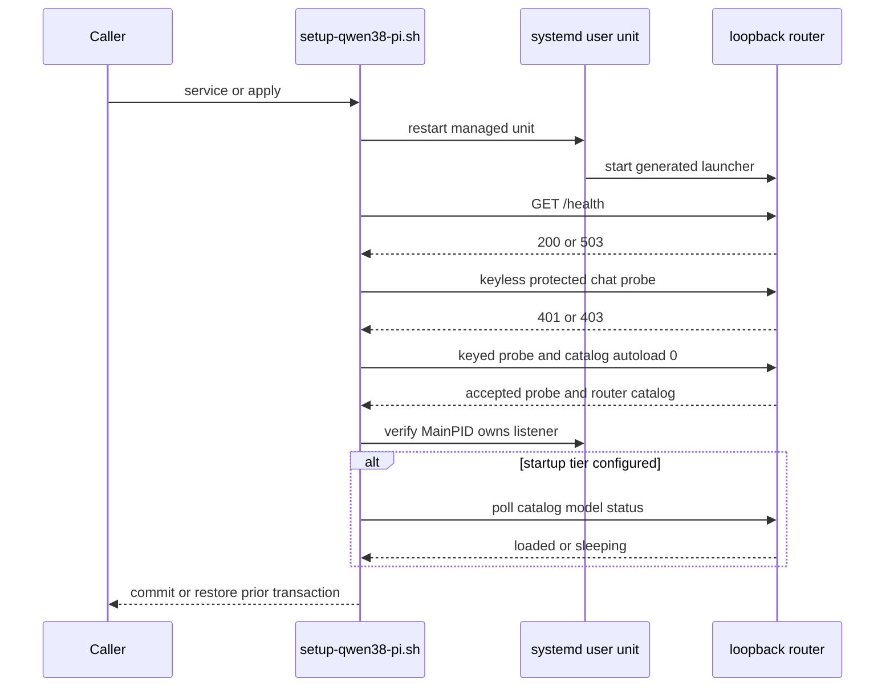
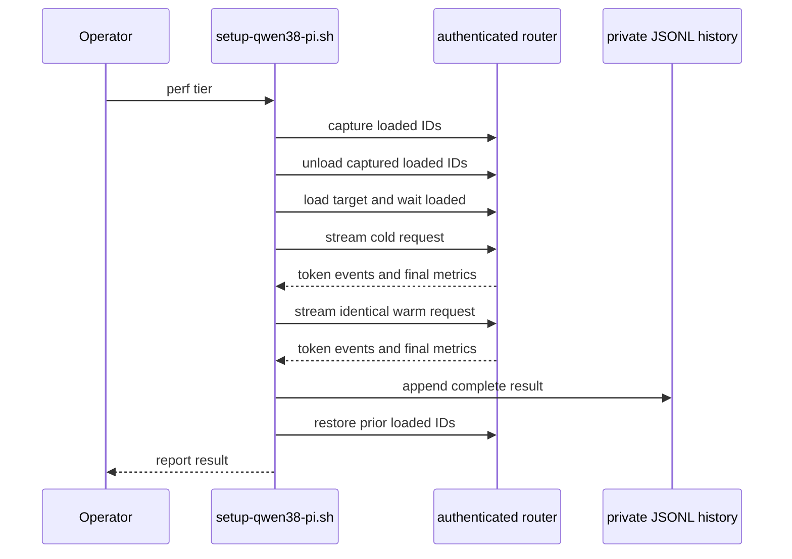

The router is ready only when the managed service, its authenticated control plane, and its expected model catalog agree. A listening port or `/health` response alone is not enough. Use `status` to observe without changing residency, `smoke` to intentionally prove a tier can generate, `perf` to run a disruptive deployed-API measurement with residency recovery, and `bench` for a separate raw `llama-bench` baseline.

The menu in `manage.sh` delegates these actions to the scriptable engine. `local-ai menu` opens that menu and `local-ai logs` follows the user-unit journal; its ordinary command fallback invokes the engine, while `workspace` and `--desktop` have their own front-door handling. For automation, call the engine directly:

```bash
./setup-qwen38-pi.sh status --json | jq .
./setup-qwen38-pi.sh smoke everyday
./setup-qwen38-pi.sh perf everyday
./setup-qwen38-pi.sh perf-history everyday
./setup-qwen38-pi.sh bench everyday --manage-service
```

The menu labels `smoke`, `perf`, and raw `bench` separately and warns before the latter two disruptive paths. The service listens on loopback, but loopback is still an authentication boundary: browser content can drive localhost APIs. The managed key is stored in `llama.key`; authenticated curl calls read the validated regular key file and pass the bearer header via curl configuration on standard input rather than process arguments.

## Readiness when applying or repairing the service

`service` is the lower-level operation used by `apply` to generate and activate the preset, launcher, and user unit. Before it mutates them, it requires a compatible `llama-server`, at least one complete tier whose locked artifacts verify, a valid configured startup tier, and a stable pre-existing unit state. It refuses to restart when a reboot is required unless the invocation explicitly supplies `ALLOW_PENDING_REBOOT=1`.

The service transaction stages and validates the generated files, backs up the active trio, reloads systemd, enables the unit, and explicitly restarts it. With the normal `SERVICE_HEALTHCHECK=1`, readiness then has layered evidence:

1. `/health` must eventually answer `200` or `503`; this establishes only that an HTTP endpoint is present.
2. An unauthenticated protected chat request for the deliberately invalid `__local_ai_auth_probe__` model must return `401` or `403`.
3. The same request with the local key must receive a semantically acceptable response, and authenticated `GET /v1/models?autoload=0` must have an object `.data` array containing string IDs and status objects.
4. Every complete installed tier must appear in that catalog. If `STARTUP_TIER` is named, its entry must become `loaded` or `sleeping` within `SERVICE_READY_TIMEOUT`; `STARTUP_TIER=none` skips warming but not control-plane identity verification.
5. Finally, the stable managed unit with a live `MainPID` must own the listener on Linux, preventing a same-key or unrelated process on the port from satisfying the earlier probes.

A timeout, failed startup model, failed activation, catalog mismatch, authentication failure, ownership mismatch, or signal fails the transaction. The handler restores the prior generated files and prior unit enablement/activity rather than leaving a partially applied service. `SERVICE_HEALTHCHECK=0` is reserved for controlled tests, not an operational readiness override.



*Service readiness verifies HTTP reachability, the authentication wall, router-shaped catalog, installed aliases, and managed listener ownership before committing.*

When a service is not ready, begin with:

```bash
./setup-qwen38-pi.sh status --json | jq .
systemctl --user status llama-server.service
journalctl --user -fu llama-server.service
./setup-qwen38-pi.sh plan
```

Resolve `system.rebootRequired: true` before activation in normal operation. `ALLOW_PENDING_REBOOT=1` is an explicit acknowledgement that the running kernel/TTM state is intentional, not proof of readiness.

### Diagnosis order

Treat the report as separate observations rather than a single green/red bit:

| Observation | Likely boundary to inspect | Safe next step |
|---|---|---|
| `service.state` is not `active` | User-unit startup or generated service inputs | Read `systemctl --user status llama-server.service` and `journalctl --user -fu llama-server.service`; use `plan` before applying a correction. |
| `service.api` is `down` | Nothing answers the protected loopback request | Check the unit and port configuration; do not assume an inactive unit proves the port is unused. |
| `service.api` is `insecure` | A reachable listener accepts a keyless protected request | Treat it as an unsafe/conflicting listener. Stop or correct it before relying on the managed router. |
| `service.api` is `unauthorized` | The endpoint rejects keyless access but the local credential cannot complete the probe | Check the regular, non-symlinked `llama.key` through the service workflow rather than placing a token in a command line. |
| `service.api` is `error` | Authentication or catalog response is not an acceptable router control plane | Inspect the journal and catalog/version compatibility; a reachable HTTP endpoint is not sufficient. |
| Artifact state is `partial` or `absent` | Locked files are incomplete or unavailable | Finish the relevant `model` operation; do not use runtime state as proof of artifact integrity. |

Use `smoke` only after the quiet status diagnosis is satisfactory and changing the selected model's residency is acceptable.

## Status: non-disruptive authenticated observation

`./setup-qwen38-pi.sh status [--json]` takes no tier. Its JSON output is schema version `1`; use `schemaVersion` as the compatibility gate and tolerate compatible added keys. It runs the protected probes and queries `GET /v1/models?autoload=0`, so it neither autoloads a model nor sends a selected-model generation request. `jq` is required to produce the report.

The status API result is independent of systemd state. It always probes the loopback port, so an inactive managed unit cannot conceal a conflicting listener:

| `service.api` | Interpretation |
|---|---|
| `authenticated` | Keyless protected chat was rejected, the local key was accepted semantically, and authenticated catalog output has the expected schema. |
| `insecure` | The protected endpoint did not reject the keyless request. Treat this as an unsafe listener, even if the managed unit is inactive. |
| `unauthorized` | The auth wall exists but the local key is absent, unsafe, or rejected. |
| `down` | The protected endpoint could not be reached. |
| `error` | An unexpected response or a catalog that does not identify the expected router was observed. |

`service.state` is only the systemd user-unit observation (`active`, `inactive`, `failed`, `activating`, `deactivating`, or `unknown`). Require `service.api == "authenticated"` and `service.authEnforced == true` for a green authenticated control plane; neither a unit state nor `authEnforced` alone establishes that.

### Reading model state

The report supplies one entry for each of `everyday`, `coder`, and `senior`, using IDs and artifacts selected by `models.lock`. `artifacts` describes local locked-file completeness: `installed`, `partial`, or `absent`. It is deliberately distinct from catalog-derived `runtime`, which is normalized to `loaded`, `loading`, `unloaded`, `sleeping`, `failed`, or `unknown`; router `downloading` becomes `loading`. A catalog that is otherwise credible but lacks a known ID is `unloaded`; without a credible catalog, it remains `unknown`.

`artifactProgress.doneBytes` and `totalBytes` account for regular completed files or `.part` files, capped at the locked artifact size. `progress` is a numeric router progress value when available, while `routerProgress` preserves the raw router value. `loadedModel` is the first model entry normalized to `loaded`, or `null`. Do not infer resident runtime state from artifact presence or from an active unit.

The rest of the top-level report labels the observation with effective configuration (`agent`, routing and startup profiles, `modelsMax`, contexts, KV profile, and load modes) and system reboot state. This is context for interpretation; it does not claim that generated service inputs currently match desired state.

## Smoke: intentional model-serving proof

Run `./setup-qwen38-pi.sh smoke [everyday|coder|senior]` after applying changes or verifying downloads when an intentional swap is acceptable. With no argument it picks the first complete tier in `everyday`, `coder`, `senior` order. A requested tier must be complete.

Smoke displays systemd status, requires the keyless protected-chat rejection, and calls authenticated `/v1/models`. It then sends a non-streaming authenticated chat request to the selected router ID with `Reply with exactly: READY` and `max_tokens:256`. The request has a 600-second timeout because a model load/swap may take minutes. Success means that either assistant `content` or `reasoning_content` is a non-empty string, allowing valid reasoning-only responses.

Unlike status, that selected-model request can autoload or swap residency. Prefer status for a quiet diagnosis; notify local users before a smoke check where a swap could interrupt work. The manager's **Smoke/load test** action invokes this command.

## Production API performance capture

`./setup-qwen38-pi.sh perf [tier] [--keep]` measures the active router configuration, not merely inference kernels. It requires `jq`, `curl`, and `sha256sum`; a complete integrity-verified target; an active `models.ini` byte-for-byte equal to the effective desired preset; a verified authenticated API wall; and a valid catalog. It refuses to start if any model is `loading` or `sleeping`: a sleeping process cannot be reconstructed exactly through the public router actions. It also requires conservative context headroom: `2 * PERF_PROMPT_WORDS + 1024` tokens must fit the target context.

After recording currently loaded IDs, `perf` unloads all of them to make the target load genuinely cold, loads the selected ID, and issues two identical streaming chat requests. The deterministic request repeats a code-review prompt for `PERF_PROMPT_WORDS` approximate words, requests at most 256 output tokens, and enables usage reporting. The first request is cold; the second exercises prompt-cache reuse. The manager warns that this temporarily swaps residency and that its default is two 4,096-word requests with a 30-minute timeout each.



*The perf operation forces a cold target load, captures cold and cache-warm API measurements, then restores the prior loaded residency unless a successful `--keep` run was requested.*

### Metrics, history, and comparisons

Cold-load time runs from the explicit load operation to observed `loaded`. TTFT is the local timestamp of the first non-empty content or reasoning SSE event—not curl header time—and ignores role-only or empty events. Each cold/warm record includes HTTP code, header-start and total duration, TTFT, prompt and completion token counts, reported generation rate, speculative draft and accepted counts/rate, and raw server timings. After the warm request, `perf` samples systemd `MemoryCurrent` and the first readable DRM `mem_info_gtt_used`; unavailable values are `null`.

A successful capture appends a private mode-`0600` JSONL record to `~/.config/local-ai/perf-history.jsonl` by default. Schema version `3` records target tier/ID/variant, locked artifact-set digest, routing/load/KV/context/MTP/reasoning identity, workload and cold/warm metrics, final runtime, resource snapshot, and llama-server/kernel/GTT identity. `perf-history [all|everyday|coder|senior]` renders the newest 20 matching rows and refuses a symlinked or invalid history file.

Compare results only when tier/ID, artifact digest, routing profile, load mode, KV profile, context, MTP depth, prompt words, reasoning effort, llama-server version, kernel release, and GTT pages limit all match. Otherwise, record a new baseline rather than a regression percentage.

### Restoration and failure semantics

Once pre-run state is captured, `perf` arms EXIT and terminal-signal handlers. Cleanup removes temporary SSE/timing files and, except after a completed `--keep` run, unloads models that were not initially loaded and reloads every captured prior ID. Signals are ignored during this recovery-critical section so a second signal cannot strand a half-restored router. A restoration failure makes the command fail even when measurement succeeded.

History is appended only after both requests and result construction succeed; a failed cold or warm request does not add a partial result. `--keep` takes effect only after a fully successful run, leaving the target resident; a failed `--keep` run still restores the captured state. Schedule perf as a maintenance operation rather than alongside latency-sensitive local work.

## Raw benchmark versus deployed performance

`bench [tier] [--manage-service]` is a distinct `llama-bench` kernel baseline. It verifies target artifacts, requires a fully stopped router, and runs `pp512` prompt processing plus `tg128` generation with the tier load mode. Everyday and coder request `--n-gpu-layers -1`; senior instead uses llama.cpp auto-fit with `--fit-target 4096 --verbose`. It does not exercise router API behavior or everyday MTP speculative decoding.

Without `--manage-service`, stop the router first. With it, `bench` captures whether the managed service was active, stops it, runs the benchmark, and restores the previous active service through the authenticated control-plane wait on normal exit, failure, or interruption. This preserves prior service activity, but it necessarily creates an outage. Use `perf` for cold load, authenticated streaming TTFT, cache reuse, and residency behavior; use `bench` for repeatable raw inference comparison.

## Verification boundaries

`bash tests/run.sh offline` runs syntax, unit, integration, and hermetic end-to-end tests without network, sudo, systemd, or model files. Focused tests cover status schema/no-autoload and hostile API states; service readiness and transactional rollback; smoke credential transport; perf prompt headroom, SSE-token TTFT, active-preset refusal, comparison identity, cleanup, restoration, and `--keep` behavior.

Hardware checks are deliberately opt-in:

```bash
RUN_LOCAL_AI_E2E=1 bash tests/run.sh all
```

On the target Omarchy workstation, they run `check`, `plan`, require active/authenticated/auth-enforced status with no reboot requirement and at least one installed tier, then smoke every installed tier and recheck authenticated status. Add `RUN_LOCAL_AI_PERF_E2E=1` only to permit a production perf run for each installed tier.

## Related pages

- [Runtime Stack and Ownership Boundaries](/openwiki/architecture/runtime-stack.md)
- [Configuration, Artifacts, and Safety Invariants](/openwiki/concepts/configuration-artifacts-and-safety.md)
- [System and LAN Security](/openwiki/operations/system-and-lan-security.md)
- [Quickstart](/openwiki/quickstart.md)
- [Verification Strategy](/openwiki/testing/verification-strategy.md)
- [Model and Desired-State Lifecycle](/openwiki/workflows/model-and-desired-state-lifecycle.md)
