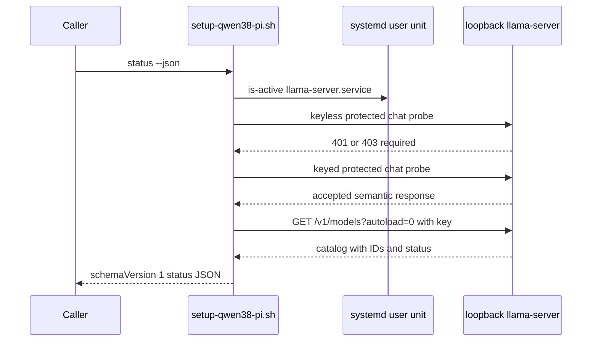
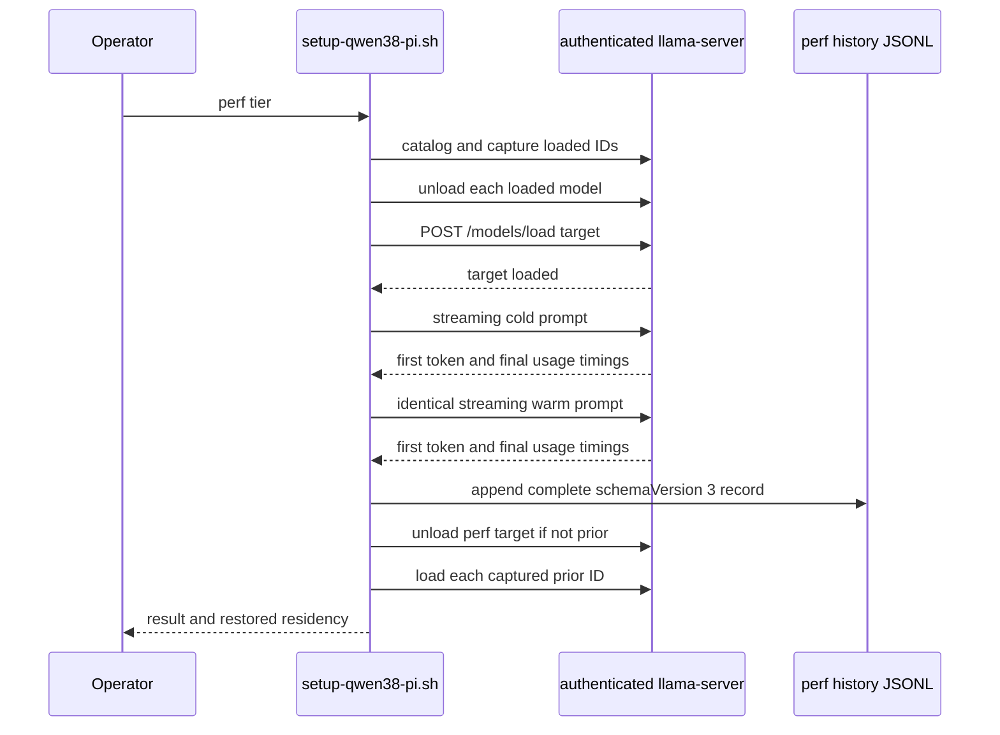

The router is healthy only when its control plane and its authentication boundary are both credible. `status` is the non-disruptive observation tool; `smoke` deliberately proves a named model can generate; `perf` deliberately manipulates residency to measure a cold load and production-like requests, then restores the prior loaded model. These are different operations and should not be substituted for one another.

Use the scriptable engine for automation and `manage.sh` for the equivalent interactive actions:

```bash
./setup-qwen38-pi.sh status --json | jq .
./setup-qwen38-pi.sh smoke everyday
./setup-qwen38-pi.sh perf everyday
./setup-qwen38-pi.sh perf-history everyday
```

The API is loopback (`127.0.0.1`) but protected by `llama.key`; do not treat a listening port as sufficient evidence of safe service. The authenticated curl helper reads the validated key file and feeds the bearer header through curl configuration on standard input rather than command arguments.

## Establishing authenticated readiness

### Read-only status contract

`./setup-qwen38-pi.sh status [--json]` accepts no tier argument and makes no persistent changes. Its JSON form has `schemaVersion: 1`, intended as the stable machine interface. It queries `/v1/models?autoload=0`, so inspecting state cannot autoload a model or issue a generation request. `jq` is required for this output.

A positive API conclusion is a three-part check:

1. A keyless POST to `/v1/chat/completions` for the deliberately invalid `__local_ai_auth_probe__` model must return `401` or `403`. Any successful/semantic response means `insecure`; no response means `down`.
2. The same protected probe with the local credential must be accepted semantically. A syntactically invalid model request may validly return `400`, `404`, `405`, `409`, or `422`; rejection with `401`/`403` means `unauthorized`.
3. An authenticated catalog request must return HTTP `200` and an object containing a `.data` array whose entries have string IDs and status objects. This distinguishes the expected router from an unrelated listener that happens to accept the key.

The managed systemd unit state and the loopback listener are intentionally independent observations. Status always probes the port—even if `llama-server.service` is `inactive` or `failed`—so a conflicting insecure listener is reported as `insecure`, not hidden as `down`.



*Authenticated status probing verifies the authentication wall and router-shaped catalog while using `autoload=0` to preserve residency.*

### Schema and how to read it

The top-level fields are:

| Field | Meaning and operational use |
|---|---|
| `schemaVersion` | Currently `1`; consumers should check it before relying on shape or values. |
| `service.state` | systemd user-unit state: `active`, `inactive`, `failed`, `activating`, `deactivating`, or `unknown`. This does not by itself establish port ownership or API safety. |
| `service.api` | `authenticated`, `insecure`, `unauthorized`, `down`, or `error`, derived from the probes above. |
| `service.port`, `service.authEnforced` | Effective port and whether the keyless protected probe was rejected. `authEnforced: true` alone is not enough; require `api: "authenticated"`. |
| `loadedModel` | ID of the first catalog model whose runtime is `loaded`, or `null`. With `MODELS_MAX=1`, a normal router has at most one resident model. |
| `models` | One entry each for `everyday`, `coder`, and `senior`: tier identity/label, disk artifact state, runtime state, router progress, and local artifact byte progress. |
| `config` | Effective agent, routing/startup profile, fixed `modelsMax`, contexts, KV cache profile, and per-tier load modes. This lets a caller label an observation with its active intent, but `perf` independently ensures that the generated preset matches desired state. |
| `system.rebootRequired` | Whether a kernel/TTM change or system condition requires a reboot before safe activation. |

`models[].artifacts` is a disk completeness result: `installed` means all selected locked artifacts exist as regular files at their expected sizes; `partial` means some tier artifact exists but the set is incomplete; `absent` means none is present. It is separate from `models[].runtime`, which is catalog-derived and is one of `loaded`, `loading`, `unloaded`, `sleeping`, `failed`, or `unknown`. A router catalog that lacks a known tier produces `unloaded` only when the API itself is authenticated/insecure and the catalog is otherwise credible; otherwise the state remains `unknown`.

`artifactProgress.doneBytes` and `totalBytes` show local completed or `.part` bytes, capped at the locked size. `progress` is a numeric router progress value when supplied; `routerProgress` retains the router's raw status progress object/value. Do not infer that an installed artifact is loaded, or that an `active` unit has a ready startup model.

### Service activation readiness

During service generation/restart, readiness is stronger than HTTP reachability. The engine waits for the managed systemd unit to own the listener, repeats the authenticated wall and catalog checks, and confirms every complete installed alias is present in the catalog. For a configured startup tier, the selected model must reach `loaded` or `sleeping`; `STARTUP_TIER=none` verifies the router identity/control plane without warming a model. A model that remains `loading`, reports `failed`, a timeout, a failing unit, or an authentication/catalog/ownership mismatch makes the service transaction fail and restores the prior generated preset, launcher, unit, and prior unit enablement/activity.

Start with this diagnostic sequence when status is not green:

```bash
./setup-qwen38-pi.sh status --json | jq .
systemctl --user status llama-server.service
journalctl --user -fu llama-server.service
./setup-qwen38-pi.sh plan
```

Interpretation priorities:

- `insecure` is a security incident or conflicting listener: stop/remediate the process on the port; do not send model prompts to it.
- `unauthorized` means the local key is missing, unsafe, stale, or not accepted by the listener. Repair/apply the managed service rather than bypassing authentication.
- `down` means no usable listener answered. Inspect the unit and logs; `inactive` can coexist with `insecure` if another process owns the port.
- `error` means an unexpected HTTP result or non-router catalog; treat it as not ready.
- `loading` is transitional, while `failed` is terminal until remediated. `sleeping` is not equivalent to loaded for performance restoration.
- A `rebootRequired: true` gate should be resolved before activation; `ALLOW_PENDING_REBOOT=1` is an explicit unsafe operational override, not normal readiness.

## Explicit smoke checks

Run `./setup-qwen38-pi.sh smoke [everyday|coder|senior]` after applying a router change, after download/verification, or when proving that an installed tier can actually serve. With no tier it selects the first available tier in `everyday`, `coder`, `senior` order. The selected tier must be complete; smoke does not turn a partial download into a runnable model.

Smoke prints the service status, requires the keyless protected chat rejection, fetches authenticated `/v1/models`, then posts a non-streaming request to the selected router ID: `Reply with exactly: READY`, `max_tokens:256`. Its request timeout is 600 seconds because a model swap can take minutes. Success requires non-empty `choices[0].message.content` **or** `reasoning_content`, so reasoning-only valid responses are accepted. Unlike status, the named chat can autoload/swap a model and therefore changes live residency.

For a minimally disruptive readiness observation, prefer `status`. For an intentional serve check, announce the expected swap to local users and run smoke:

```bash
./setup-qwen38-pi.sh smoke coder
```

The manager's **Smoke/load test** menu item delegates to the same command. The opt-in hardware suite first requires status JSON to report an active, authenticated, auth-enforced router and at least one installed tier, then smoke-tests every installed tier. It runs only with `RUN_LOCAL_AI_E2E=1` on the target Arch workstation.

## Production performance capture

`perf` measures the router configuration callers actually use, rather than just a kernel microbenchmark. It is intentionally disruptive: it unloads all currently loaded models, cold-loads the requested tier, sends two identical long streaming chat requests, and normally restores the exact prior loaded residency. The interactive manager warns that other local clients may stall; it uses the default `PERF_PROMPT_WORDS` (4096 unless overridden) and a 30-minute request deadline.

Before it changes model state, `./setup-qwen38-pi.sh perf [tier] [--keep]` requires:

- `jq`, `curl`, and `sha256sum`;
- a complete, integrity-verified target tier (a valid verification receipt may avoid rehashing);
- an active generated `models.ini` byte-for-byte matching the effective desired preset—run `plan` and `apply` after changing quant, context, load mode, KV, or startup settings;
- a verified authenticated API wall and valid router catalog;
- no currently `loading` model and no `sleeping` model; sleep is refused before mutation because the public router API cannot recreate that exact state; and
- enough conservative prompt/output headroom: two tokens per configured prompt word plus 1024 tokens must fit the selected context.



*The performance transaction captures only pre-existing loaded IDs, creates a genuinely cold load, records cold/warm request metrics, and restores those IDs unless a completed `--keep` run is requested.*

### What is measured and retained

The cold-load timer spans the explicit model load request to observed `loaded` state. The deterministic request is a repeated production-code-review prompt of `PERF_PROMPT_WORDS` approximate words, with `max_tokens:256`, streaming, and usage enabled. The second, identical request exercises prompt-cache reuse.

Time to first token (TTFT) is not curl header time. The engine records the local time of the first non-empty content or reasoning SSE event, ignoring role-only/empty deltas. For each cold/warm request it captures HTTP code, header-start and total seconds, event TTFT, prompt/completion token counts, generation tokens/s when the server reports it, speculative draft/accepted counts and acceptance rate, plus raw server timings. After the warm request it samples systemd `MemoryCurrent` and the first readable DRM `mem_info_gtt_used` value; unavailable values are `null` rather than fabricated.

A successful run appends one private (`0600`) JSON line to `~/.config/local-ai/perf-history.jsonl` by default. The schema-version-3 record includes target tier/ID/variant, artifact-set digest, routing/load/KV/context/MTP and reasoning settings, prompt size/tokens, cold load and request metrics, warm request metrics, final runtime, resource snapshot, and llama-server version/kernel/GTT-pages runtime identity. `perf-history [all|everyday|coder|senior]` renders the newest 20 matching rows and rejects a symlinked or invalid history file.

A prior result is comparable only when **all** of tier/ID, artifact digest, routing profile, load mode, KV profile, context, MTP depth, prompt words, reasoning effort, llama-server build, kernel release, and GTT page limit match. If any differs, treat the output as a new baseline rather than a regression percentage.

### Restoration and failure behavior

`perf` installs EXIT and terminal-signal handlers after capturing pre-run state. On success, failure, or `HUP`/`INT`/`TERM`, cleanup removes scratch SSE/timing files and attempts restoration: unload models that were not previously loaded, then reload every captured prior ID. During the critical restoration section subsequent terminal signals are ignored so a second signal cannot interrupt restoration half-way. A failed request never appends a partial history record. If restoration itself fails, the command reports failure even if measurements completed.

`--keep` changes this only after a fully successful run: it leaves the target resident and skips restoration. A failed `--keep` run still restores the prior residency. Because the configured runtime enforces one resident model, normal performance captures should be scheduled as a maintenance window; do not run them alongside latency-sensitive local work.

For an intentional target-residency transition after a successful measurement:

```bash
./setup-qwen38-pi.sh perf senior --keep
```

## Raw benchmark versus router performance

`bench [tier] [--manage-service]` is a separate `llama-bench` kernel baseline. It verifies target artifacts, requires a fully stopped router, and runs `pp512` prompt processing plus `tg128` generation with the tier's configured load mode. Everyday/coder use `--n-gpu-layers -1`; senior uses llama.cpp auto-fit with `--fit-target 4096 --verbose` rather than forced full offload. It does not exercise the router's everyday MTP speculative decoding and should not be presented as end-user routing performance.

Without `--manage-service`, stop the router yourself. With it, the command captures whether the managed service was active, stops it, runs the raw benchmark, and starts/waits for the control plane again on success, failure, or interruption. This preserves service activity but necessarily creates an outage. Use `perf` for authenticated API, cold-load, TTFT, cache-reuse, and residency behavior; use `bench` for repeatable inference-kernel comparisons.

## Verification boundaries

Portable checks use `bash tests/run.sh offline`, which runs syntax, unit, integration, and hermetic end-to-end suites without network, sudo, systemd, or model files. Relevant regression coverage verifies the version-1 status schema and no-autoload behavior, wrong-key/down/insecure outcomes, readiness rollback for loading/failed/no-startup cases, and smoke's private credential transport. The end-to-end workflow verifies event-based TTFT, active-preset refusal, comparability keys, normal and `--keep` residency behavior, and restoration/no-history on failed warm requests.

The real workstation suite is intentionally opt-in:

```bash
RUN_LOCAL_AI_E2E=1 bash tests/run.sh all
```

It requires Arch, `jq`, configured service/model artifacts, and performs authenticated status followed by smoke for each installed tier. Add `RUN_LOCAL_AI_PERF_E2E=1` only when the operator explicitly permits disruptive production performance captures.

## Related pages

- [Runtime Stack and Ownership Boundaries](/openwiki/architecture/runtime-stack.md) — router ownership, API boundary, tier roles, and generated service inputs.
- [Configuration, Artifacts, and Safety Invariants](/openwiki/concepts/configuration-artifacts-and-safety.md) — integrity receipts, desired-state validation, and one-model residency constraints.
- [Verification Strategy](/openwiki/testing/verification-strategy.md) — test-layer intent and safety coverage.
- [Model and Desired-State Lifecycle](/openwiki/workflows/model-and-desired-state-lifecycle.md) — download, plan/apply, and recovery flow.
