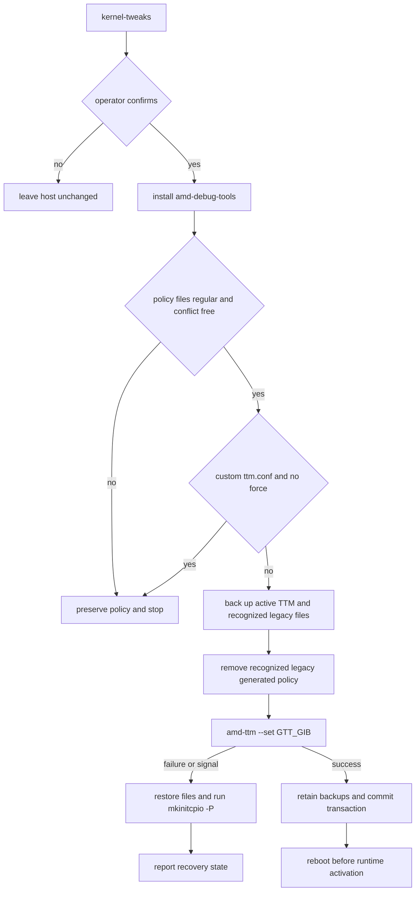
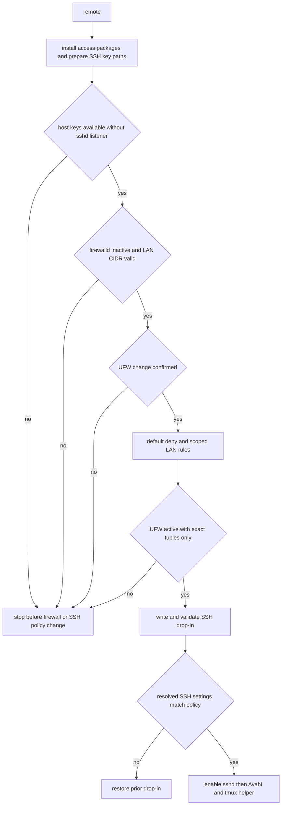

> **Scope and safety model.** `setup-qwen38-pi.sh` treats host tuning and remote access as optional, separately invoked operations—not part of the normal baseline. Both change system state only after explicit gates, preserve files they do not own, and fail rather than infer that an incomplete security or boot state is safe.

## Entry points and operating order

The supported target is a Framework Desktop with Ryzen AI Max+ 395/Strix Halo and 128 GiB of RAM running Arch Linux. `check` is the non-mutating readiness inspection: it identifies a Radeon 8060S/gfx1151-class iGPU when possible, reports RAM and kernel version, checks the CPU backend and RADV Vulkan availability, warns about missing `render`/`video` membership, and reports the live TTM `pages_limit` when the module is loaded. Warnings deliberately do not make a detected-but-different host impossible to use; the hard platform boundary for mutating system commands is Arch and a non-root invoking user.

Use this sequence rather than enabling every option at install time:

1. Run `./setup-qwen38-pi.sh check`, install/update the normal baseline, and reboot when the status/plan gate says the currently booted runtime is stale.
2. Measure with the stock GPU-addressable limit. The everyday and coder tiers are designed for it; the senior tier can auto-fit with mixed GPU/CPU placement.
3. Only if measurements show a need for more offload capacity, run `./setup-qwen38-pi.sh kernel-tweaks`, confirm its prompt, then reboot according to `amd-ttm` guidance.
4. After local inference and the selected agent work, optionally run `./setup-qwen38-pi.sh remote`; install and test a key from each client; only then run `./setup-qwen38-pi.sh ssh-harden`.

`./manage.sh` exposes the same operations as explicitly deferred menu actions: remote access, SSH hardening, and the GTT tweak are not part of the full baseline flow. The engine validates `GTT_GIB` as an integer in the 64–115 GiB range; its default is 115.

### Platform and memory assumptions

Keep the BIOS **iGPU Memory Allocation / UMA Frame Buffer Size** at the small/default 512 MiB setting. Model memory is dynamically mapped through GTT, so a large fixed framebuffer removes capacity from the OS instead of providing the desired model allocation. Keep IOMMU enabled; the tuning workflow neither writes `amd_iommu=off` nor recommends disabling the platform’s isolation and virtualization protection.

The project reports AMD’s current non-Ubuntu RDNA 3.5 baseline as kernel 6.18.4 or newer, and regards roughly 100 GiB+ RAM as consistent with its 128 GiB assumptions. These are readiness signals to investigate, not a substitute for the boot gate. `status --json` publishes `system.rebootRequired`; `plan`, service activation, and the `all` flow stop GPU/runtime activation while a reboot is pending. `ALLOW_PENDING_REBOOT=1` is a deliberately explicit environment-only bypass for an operator who has independently established that the running kernel/TTM state is intentional.

GTT is *GPU-addressable capacity*, not an eager allocation. A 115 GiB limit can nevertheless leave little worst-case headroom on a 128 GiB host. In particular, the senior weights are about 69.5 GiB and cannot fully offload inside the roughly 64 GiB stock limit; full offload also requires KV and runtime headroom. Performance comparisons include kernel release and TTM page limit in their identity, so changing the limit establishes a new baseline rather than a directly comparable result. See [Router Health and Performance](/openwiki/operations/router-health-and-performance.md) for the measurement contract and [Configuration, Artifacts, and Safety Invariants](/openwiki/concepts/configuration-artifacts-and-safety.md) for configuration precedence.

## Optional GTT transaction and reboot path

`kernel-tweaks` asks for confirmation before it installs or updates signed Arch `amd-debug-tools` and invokes `amd-ttm --set "$GTT_GIB"`. AMD’s helper owns the current persistent form, `options ttm pages_limit=...`; this workflow intentionally does not write deprecated `amdgpu.gttsize` or `page_pool_size` settings.

Before touching an active policy, the command rejects symlinked and non-regular `ttm.conf` or legacy policy paths, scans `/etc/modprobe.d` for conflicting GTT/TTM settings, and refuses a hand-maintained `ttm.conf` unless `KERNEL_TWEAKS_FORCE=1` makes the backup-and-replace decision explicit. It recognizes only the narrowly shaped older generated `99-strix-halo-llm.conf` as migratable; a custom legacy file must be manually merged or removed. This ownership rule avoids silently discarding a broader kernel policy.



*GTT tuning is a guarded persistence transaction: every compatibility check occurs before a policy removal, while failure or interruption restores the prior policy and rebuilds the initramfs.*

Once backups exist, EXIT, `HUP`, `INT`, and `TERM` handlers are armed. Failure of `amd-ttm`, interruption, or an uncommitted exit restores prior file contents and modes (or removes a file that was originally absent) and runs `mkinitcpio -P` so the next boot cannot select a partially applied policy. A successful helper run commits the file transaction but does **not** make the currently running kernel use the new boot-time policy; follow its reboot guidance. The standard reboot gate then protects later GPU initialization and service activation.

To undo a policy owned only by this workflow, use `sudo amd-ttm --clear`, decline its immediate reboot prompt, run `sudo mkinitcpio -P`, then reboot. Do not use `--clear` against a manually merged `ttm.conf`, because the helper removes that file.

## LAN-only remote workflow

`remote` is a bootstrap workflow for access from devices on the same network. It installs `openssh`, `mosh`, `tmux`, `avahi`, and `ufw`; creates `~/.ssh` with mode `0700` and `authorized_keys` with mode `0600`; generates SSH host keys without starting a listening daemon; and only enables `sshd` after firewall and configuration validation. It enables Avahi so the host is discoverable as `<hostname>.local`.

The remote perimeter is IPv4-LAN scoped. The command derives the address/prefix on the default route interface, or accepts `LAN_CIDR` as an explicit override. It accepts only appropriately narrow RFC1918 (`10/8`, `172.16/12`, `192.168/16`) or IPv4 link-local (`169.254/16`) prefixes, canonicalizes the network address, and rejects public or overbroad values before UFW changes. For example:

```bash
LAN_CIDR=192.168.1.0/24 ./setup-qwen38-pi.sh remote
```

The command fails closed if `firewalld` is active because it cannot prove a semantically equivalent policy there. It also requires the UFW confirmation prompt and audits active rules after applying them: any globally sourced inbound rule, a same-LAN catch-all, or a rule other than the exact expected service tuples prevents successful completion and is left for the operator to remove explicitly. IPv6 filtering is enabled in `/etc/default/ufw` when necessary so a globally routable SLAAC address cannot bypass the IPv4-only LAN selection. The workflow changes neither the existing outbound default nor the loopback-only llama.cpp listener.



*Remote access opens `sshd` only after host-key preparation, a verified default-deny UFW perimeter, and a validated effective SSH configuration.*

The resulting intended inbound policy is default-deny for incoming and routed traffic, with only these LAN-source exceptions:

| Protocol | Port | Rule |
|---|---:|---|
| SSH | TCP 22 | UFW `limit` rule, rate limiting new connections |
| mosh | UDP 60000–61000 | allow |
| mDNS | UDP 5353 | allow |

The UFW rate limit is defense in depth during password bootstrap. The workflow also attempts to install a managed fail2ban `sshd` jail: four failures in ten minutes result in a one-hour ban. Its jail configuration is staged, validated, and activation-checked; failure restores the prior jail/service state while retaining UFW rate limiting. A user-owned or symlinked generated-policy target is preserved rather than overwritten.

### SSH policy and the key-only transition

The generated drop-in is `/etc/ssh/sshd_config.d/20-local-ai-lan.conf`. It restricts access to the invoking user, disables root login, X11 and agent forwarding, enables public keys, caps attempts at three, and sets client liveness checks. `remote` preserves the *effective* pre-existing `PasswordAuthentication` and `KbdInteractiveAuthentication` modes. This is important: a host already hardened by another configuration does not become password-enabled merely because this workflow is rerun.

Drop-in installation is transactional. The engine refuses non-owned/symlinked files, writes a temporary candidate, preserves any prior generated drop-in with metadata, validates the full configuration using `sshd -t`, and queries resolved Match-aware configuration using `sshd -T -C`. The resolved values must match the intended password/keyboard modes plus public-key, root, `AllowUsers`, X11, agent-forwarding, and retry constraints. It additionally rejects a supposedly key-only policy whose `AuthenticationMethods` does not permit `publickey` alone. This detects OpenSSH first-match ordering problems before reload. If `sshd` was active, it reloads (or restarts) only after validation; a failed write, resolution check, reload, signal, or uncommitted exit restores the old drop-in and, where applicable, the old active daemon policy. An inactive daemon stays inactive during a standalone policy write.

Install client keys during the bootstrap window, then make the second connection test before closing the first:

```bash
ssh-copy-id user@hostname.local
ssh -t user@hostname.local ai-session ~/github/my-project
mosh user@hostname.local -- ai-session ~/github/my-project
./setup-qwen38-pi.sh ssh-harden
```

`ssh-harden` does not simply count a file named `authorized_keys`. It resolves `AuthorizedKeysFile`, expands supported `%h`, `%u`, and `%U` forms, and first proves that it includes `$HOME/.ssh/authorized_keys`; only then does it require at least one valid key as parsed by `ssh-keygen -lf`. It writes the same validated drop-in with both password and keyboard-interactive authentication set to `no`. If the daemon is active, confirm from a second session with `ssh ${USER:-$(id -un)}@localhost true`; if inactive, hardening merely stages the policy and does not open the port.

mDNS names are unauthenticated and can be spoofed. Compare the host-key fingerprints printed by `remote` with the fingerprint shown by the first client connection, especially before entering a bootstrap password. Do not port-forward TCP 22 or llama.cpp. For remote-away-from-home use, keep this firewall policy and use a carefully administered mesh VPN; access the loopback API through SSH forwarding rather than binding it to the LAN:

```bash
ssh -L 8080:127.0.0.1:8080 user@hostname.local
```

### Persistent agent sessions

`remote` writes `/usr/local/bin/ai-session` and keeps `pi-session` as a compatibility alias when it can do so without replacing a user-owned command. `ai-session <project-dir>` canonicalizes the directory and creates or attaches a tmux session named from its readable basename plus a short SHA-256 digest of the full path. The digest prevents same-named repositories from attaching to one another’s pane. It uses `AGENT` from the calling environment, then the saved setup configuration, then `omp`; it reads the protected local router key inside the new pane rather than putting the secret in tmux command-line arguments. With no argument it lists `ai-` sessions. Detach with `Ctrl-b`, then `d`; the agent continues running and multiple clients can mirror the session.

## Verification and safe changes

The portable test entry point is:

```bash
bash tests/run.sh offline
```

It runs shell syntax, unit, integration, and hermetic end-to-end suites without network, sudo, systemd, or model files. The focused runtime-safety test proves that an active `firewalld` instance fails before UFW mutation. Generated-configuration coverage exercises refusal to replace user-owned or symlinked SSH policies, resolved-configuration mismatch rollback, inactive-daemon behavior, and exact `AuthorizedKeysFile` handling. `system-transaction-test.sh` goes further with mocked system commands: it verifies signal and EXIT rollback of SSH policy state, host-key generation without opening inactive SSH, rejection of an ignored key path before key parsing, and restoration of both legacy and current TTM files plus initramfs rebuild after GTT interruption. It also verifies that symlinked kernel policy ownership is preserved and `amd-ttm` is never called in that case.

For operational changes, inspect `status --json` after package/kernel work, reboot when it reports `system.rebootRequired: true`, run `check` again to observe the new TTM page limit, and create a fresh performance baseline. Treat a refusal as an ownership, configuration-order, or perimeter condition to resolve manually—not a reason to force-delete configuration. `KERNEL_TWEAKS_FORCE=1` is narrowly an explicit authorization to back up and replace a custom `ttm.conf`; it does not override symlink, conflict, firewall, key, or SSH-effective-policy safeguards.
