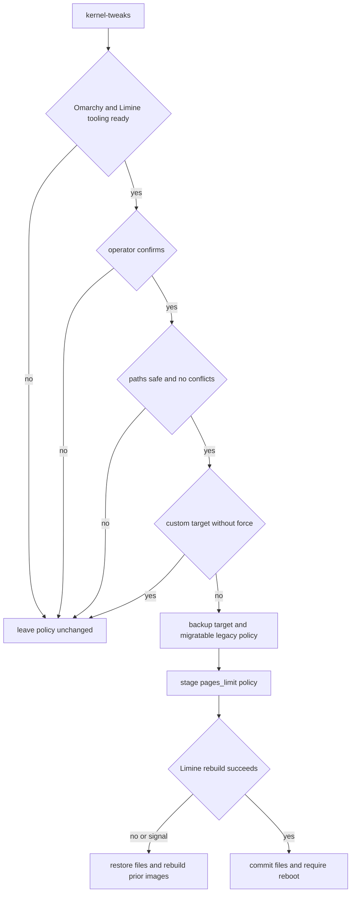
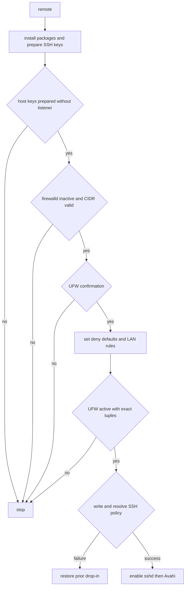

> **Scope.** `kernel-tweaks`, `remote`, and `ssh-harden` are separate, mutating operations. They are not part of the normal baseline. The engine protects them with its per-user operation lock, requires the supported host before system mutation, and preserves configuration it cannot establish ownership of.

## Boundaries, entry points, and safe order

The supported system is an x86_64 Framework Desktop running **Omarchy Linux** (Arch based), invoked by a normal desktop user; the engine uses `sudo` only for root-owned changes. Omarchy detection requires an Arch/Omarchy `os-release` identity, an Omarchy command or version file, and `pacman`. This is stronger than merely detecting Arch. Package installation also refuses a pending or uninspectable update state: use `omarchy update` and its requested reboot rather than a direct partial upgrade.

`./setup-qwen38-pi.sh check` is read-only, but it is still a target-platform gate: it requires Omarchy, then reports Limine boot-image tooling, possible Radeon 8060S/gfx1151 identification, RAM, kernel release, CPU backend, RADV, GPU group membership, and live TTM `pages_limit`. Hardware observations such as an unrecognized iGPU or less than 100 GiB RAM are warnings, but an unsupported platform is not. The interactive `./manage.sh` menu keeps remote access, SSH hardening, and the optional GTT action visibly separate from baseline installation.

A conservative operating sequence is:

1. Run `./setup-qwen38-pi.sh check`, complete `omarchy update` if necessary, and reboot when requested.
2. Establish the baseline and measure it before tuning memory or exposing remote access.
3. If measurements show a need for greater GPU-addressable capacity, run `./setup-qwen38-pi.sh kernel-tweaks`, answer its confirmation prompt, and reboot.
4. Once local use is satisfactory, run `./setup-qwen38-pi.sh remote`, install and test keys from each client, then run `./setup-qwen38-pi.sh ssh-harden`.

All mutating public commands, including these three, run through `locked_command`. It serializes concurrent work sharing a user’s configuration and service resources. On a signal, its child process group is terminated so command-local traps can restore state before the lock is released; orphaned workers are killed as a final guard.

### Reboot and memory gates

`GTT_GIB` defaults to `115` and must be a positive integer from 64 through 115. `kernel-tweaks` additionally requires that the requested capacity is below physical memory and that pages are 4096 bytes. It warns when the request exceeds 90% of RAM. Keep the Framework BIOS iGPU memory allocation at the small/default 512 MiB setting: the workload’s model capacity is dynamically GPU-addressable GTT, not a reason to reserve a large fixed framebuffer. The workflow leaves IOMMU enabled and explicitly describes it as a security, virtualization, and device-isolation feature.

A pending kernel/package/TTM reboot prevents normal runtime activation. `plan` reports the gate, `service` refuses before calling systemd, and `status --json` exposes it as `system.rebootRequired`. `ALLOW_PENDING_REBOOT=1` is an invocation-only acknowledgement—not persisted configuration—and permits an operator who has independently verified the currently running state to bypass the gate. It is not evidence that GPU state is safe.

## Optional TTM persistence transaction

`kernel-tweaks` is intentionally a confirmed, measured opt-in. It no longer installs `amd-debug-tools` or calls `amd-ttm`: after its preflight it writes the Omarchy-managed form directly, a generated `/etc/modprobe.d/ttm.conf` containing `options ttm pages_limit=<calculated pages>`, and calls `limine-mkinitcpio` to rebuild Omarchy’s Limine boot images. It does not write deprecated `amdgpu.gttsize` or `page_pool_size` settings.

Before any active policy is moved, it rejects symlinked and non-regular target or legacy paths and searches `/etc/modprobe.d` for conflicting GTT/TTM settings. It can migrate only the narrow legacy generated `99-strix-halo-llm.conf` shape. A richer hand-maintained `ttm.conf` is preserved unless `KERNEL_TWEAKS_FORCE=1` explicitly authorizes backup and replacement; that force flag does not override symlink, conflict, firewall, or SSH safeguards.



*The TTM decision path performs ownership checks before removal and restores bootable prior policy if staging or the Limine rebuild fails.*

Once backups exist, EXIT, HUP, INT, and TERM handling is armed. An uncommitted exit, interrupted removal, staging failure, or boot-image rebuild failure restores prior files and modes (or removes a target that was absent), then rebuilds Limine images from the restored policy. If that recovery is incomplete, retained backup locations are reported. A successful transaction still affects boot-time policy only, so reboot through Omarchy’s System menu before loading models and rerun `check` to observe the live limit.

## Local API and credential boundary

Remote SSH access does **not** expose inference on the LAN. The generated router launcher binds `llama-server` to `127.0.0.1:${PORT}` (default `8080`) and supplies `--api-key-file`; the managed user unit has a restrictive `UMask=0077`, `NoNewPrivileges=true`, and read-only home/system protections. Loopback is nevertheless an authentication boundary because browser content can reach localhost APIs.

Before service staging, the engine refuses a symlinked or non-regular `~/.config/local-ai/llama.key`. It generates a 32-byte hex key if missing, atomically installs it at mode `0600`, or restricts an existing regular file to that mode; the token must meet the safe 32-or-more-character format. Authenticated curl helpers read that file and put the bearer header in curl’s stdin configuration rather than command arguments. The `ai-session` helper also reads the key locally and points agents at loopback. For access from another trusted device, tunnel the loopback endpoint rather than bind or forward it publicly:

```bash
ssh -L 8080:127.0.0.1:8080 user@hostname.local
```

## LAN-only remote access

`remote` installs OpenSSH, mosh, tmux, Avahi, and UFW; creates `~/.ssh` mode `0700` and `authorized_keys` mode `0600`; and creates host keys with `sshdgenkeys.service` or `ssh-keygen -A` without starting a listener. It refuses to proceed to firewall or SSH policy changes if host-key preparation fails.

The command derives an IPv4 address/prefix from the default-route interface, unless `LAN_CIDR` explicitly supplies one. It accepts and canonicalizes only sufficiently narrow RFC1918 ranges—`10/8`, `172.16/12`, and `192.168/16`—or link-local `169.254/16`; public and overbroad prefixes fail before UFW changes. For example:

```bash
LAN_CIDR=192.168.1.0/24 ./setup-qwen38-pi.sh remote
```



*Remote setup does not enable `sshd` until host keys, the verified LAN perimeter, and the effective SSH policy all succeed.*

An active `firewalld` is a fail-closed condition because the workflow cannot prove an equivalent policy before UFW mutation. With confirmation, UFW sets default deny for incoming and routed traffic while preserving the existing outbound default. It enables IPv6 filtering (`IPV6=yes`) when needed so a routable IPv6 address cannot evade an IPv4 LAN restriction. It then permits only these exact source-scoped tuples and rejects completion if its audit finds any other inbound source/rule, including a same-LAN catch-all:

| Service | Protocol and port | UFW action |
|---|---|---|
| SSH | TCP 22 | `limit` from the selected LAN |
| mosh | UDP 60000–61000 | allow from the selected LAN |
| mDNS | UDP 5353 | allow from the selected LAN |

The SSH limit is rate limiting for new connections. As additional defense during a password bootstrap window, `remote` attempts a managed fail2ban `sshd` jail: four failures in ten minutes result in a one-hour ban. It validates the jail, enables/restarts fail2ban, and checks that the jail is live. A custom/symlinked jail is preserved; any validation or activation failure restores the previous jail and fail2ban service/enablement state, while the UFW rate limit remains in effect.

### SSH policy and hardening transition

The generated `/etc/ssh/sshd_config.d/20-local-ai-lan.conf` disables root login, X11 forwarding, and agent forwarding; allows only the invoking user; enables public keys; sets `MaxAuthTries 3`; and configures client liveness. `remote` first resolves existing effective settings and preserves the effective `PasswordAuthentication` and `KbdInteractiveAuthentication` values, so rerunning it cannot weaken a pre-existing key-only host.

Installation is transactional: only a marked, regular managed drop-in may be replaced; the prior file is backed up; a candidate is installed; `sshd -t` validates the complete configuration; and `sshd -T -C` verifies Match-aware effective values before an active daemon is reloaded. It rejects a key-only result if `AuthenticationMethods` does not permit `publickey` alone. Failure, signal, or uncommitted exit restores the prior file and reloads its prior active policy when necessary. A previously inactive daemon remains inactive during a standalone policy write; `remote` enables it only after success.

After keys are installed, `ssh-harden` independently resolves `AuthorizedKeysFile`, expanding supported `%h`, `%u`, and `%U` forms, and proves it includes `$HOME/.ssh/authorized_keys` *before* parsing keys. It requires at least one `ssh-keygen -lf`-valid key, then stages the same policy with both password and keyboard-interactive authentication set to `no`. Keep the first trusted session open and test a second key-based connection before closing it. mDNS is unauthenticated: compare the host-key fingerprint printed by `remote` on first connection, and never port-forward TCP 22.

## Persistent agent sessions

`remote` installs root-owned mode-`0755` `/usr/local/bin/ai-session`, migrating only a recognized legacy helper and preserving a user-owned target. It creates `/usr/local/bin/pi-session` only when absent or already its compatibility symlink. `ai-session <project-dir>` canonicalizes the path, forms an `ai-` tmux name from a readable basename and the first 12 SHA-256 characters of that canonical path, then creates or attaches to that persistent session. With no project it lists `ai-` sessions.

The helper chooses `AGENT` in this order: caller environment, saved `~/.config/local-ai/setup.env`, then `omp`; other values fail. It loads the protected key and router port for non-interactive SSH/mosh use, but the new pane reads the key file again rather than receiving it in tmux arguments. Multiple clients can mirror the same session; detach using the configured tmux prefix then `d`.

## Verification and operational response

Run the portable regression suite with:

```bash
bash tests/run.sh offline
```

The offline runner parses shell scripts and runs unit, integration, and end-to-end fixture groups without network, sudo, systemd, or model files. Focused coverage proves that active `firewalld` stops before UFW mutation; that SSH host-key preparation does not open an inactive daemon; that SSH file, resolved-policy, and authorized-key failures roll back or refuse safely; and that TERM/EXIT and Limine rebuild failure restore both TTM policy files and rebuild prior boot images. It also checks symlinked policy preservation, the reboot gate before systemd mutation, and stable process identity for the operation lock.

Treat a refusal as a condition to resolve deliberately—ownership, a conflicting policy, an unverifiable daemon, an incomplete firewall perimeter, or a reboot—not as an invitation to delete files or force through it. After package/kernel work, inspect `status --json`, reboot when `system.rebootRequired` is true, rerun `check`, and establish a new performance baseline when kernel or TTM state changed.
