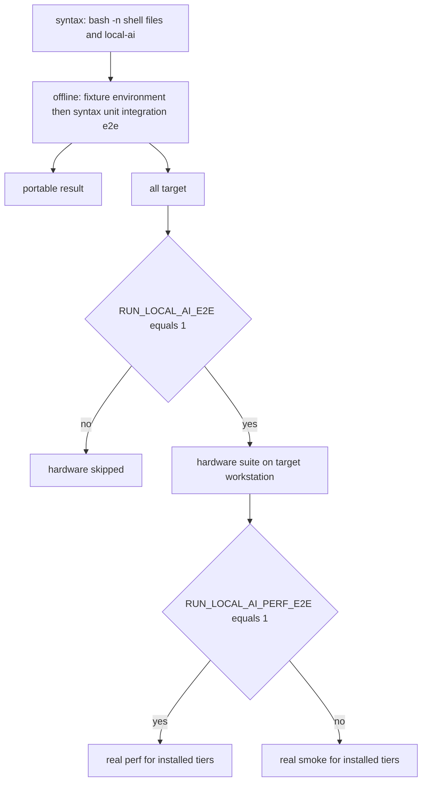
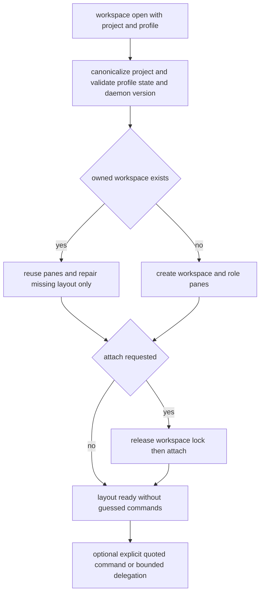
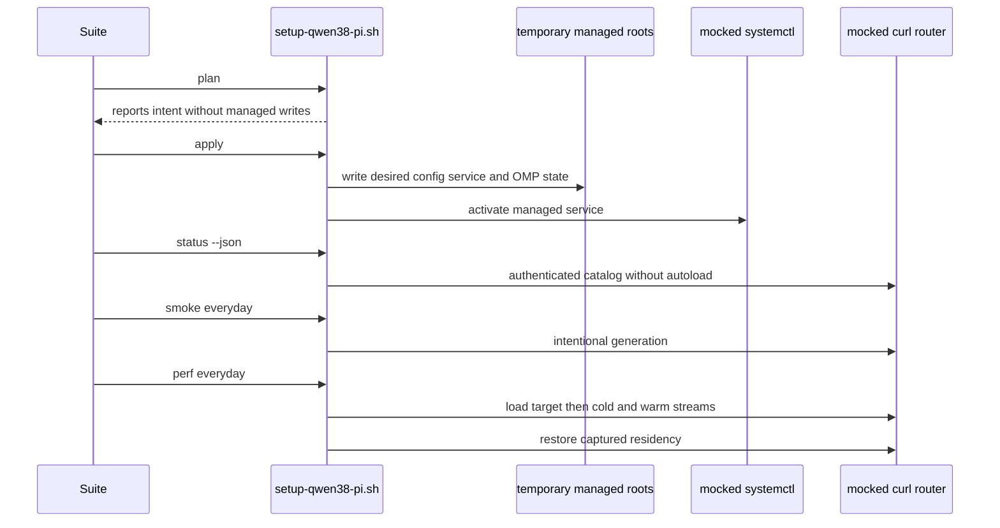

> **Testing policy.** The portable suite proves control flow, generated-state safety, and failure recovery without treating a developer machine as a test fixture. Real Strix Halo, systemd, Vulkan, and GGUF behavior is intentionally an explicit workstation operation.

## Entrypoints and execution boundary

`tests/run.sh` is the test dispatcher. `syntax` finds every repository `*.sh` file **and the `local-ai` executable**, excluding `.git`, and parses each with `bash -n`. `offline` (the default) sources the fixture environment, performs that syntax pass, then runs the `unit`, `integration`, and `e2e` groups in sorted filename order. `all` runs that offline target before considering `tests/hardware/*-test.sh`; hardware is skipped unless `RUN_LOCAL_AI_E2E=1`. The dispatcher states the portable contract directly: offline must not need network access, `sudo`, systemd, or model files.

```bash
bash tests/run.sh syntax
bash tests/run.sh offline
RUN_LOCAL_AI_E2E=1 bash tests/run.sh all
RUN_LOCAL_AI_E2E=1 RUN_LOCAL_AI_PERF_E2E=1 bash tests/run.sh all
```

`tests/self-test.sh` remains a compatibility entrypoint and execs the offline target. For a change, choose the narrowest affected test script first; run the full offline target before proposing a change that crosses test layers. Do not hide a genuine failure behind output redirection: quiet successful output is useful, but retain complete failure output for diagnosis.



*The dispatcher makes hermetic checks the baseline and requires explicit environment gates before a test can load a real model or collect production performance data.*

## What each layer is meant to prove

| Layer | Primary contract | Representative evidence and failure meaning |
|---|---|---|
| Shell syntax | Every repository shell program parses as Bash. | `bash -n` covers discovered `.sh` files and `local-ai`. It catches parse regressions, not runtime semantics. |
| ShellCheck | Shell constructs meet error-level static analysis under Bash semantics. | CI runs ShellCheck over the same `.sh`-plus-`local-ai` population with `--severity=error --shell=bash`; it complements parsing and is not a replacement for fixture-based behavior tests. |
| Unit | Pure or tightly bounded helpers reject unsafe input and preserve local ownership semantics. | Configuration enum/range and path validation; key/config and receipt helpers; removal/unload fail-closed truth tables; pinned-agent isolation; platform/bootstrap guards; manager ordering; user dotfile preservation. A failure identifies a local contract regression before a full command workflow is needed. |
| Integration | The engine composes helpers into generated files and guarded operations without touching the host. | Byte-sized artifact locks plus mocked `systemctl`, `curl`, `llama-server`, SSH, package, boot-image, filesystem, and Herdr interfaces exercise transactions, readiness, routing, downloads, desktop entries, workspace orchestration, and security policy. |
| Offline end to end | A realistic CLI lifecycle has the correct observable state transitions under a hermetic substitute runtime. | `plan` is non-mutating; `apply` creates desired/service/routing state; `status` stays observational; signal, bad-catalog, and performance failures restore state. The workspace suite separately drives a native-shaped Herdr substitute to check project layouts and recovery. |
| Hardware end to end | The configured Arch workstation can serve its actually installed models behind the authenticated router. | Real `plan`, status schema/authentication checks, and smoke generation run per installed tier. Optional real `perf` is intentionally disruptive. |

This division matters: a mock can establish that the code refuses unsafe transitions and sends the intended command/API shape; it cannot establish GPU offload placement, available memory headroom, model quality, or measured throughput on a particular driver and model artifact.

## Hermetic fixtures model interfaces, not the workstation

Offline tests create a `mktemp` root, set `HOME` and managed roots below it, and remove it through an EXIT trap. They replace external commands by putting a per-test `mock-bin` first in `PATH` and invoke the production `setup-qwen38-pi.sh` with controlled environment variables. The shared fixture environment supplies a fixture OS-release and makes `command -v` refuse host `pi`, `omp`, `omarchy`, and `omarchy-update` unless a test explicitly provides a fixture command; this prevents lazy host launchers from becoming an accidental dependency. The workflow suite also supplies a derived fixture `models.lock`: it retains production tiers, variants, IDs, shard relationships, and artifact kinds, but replaces each artifact with deterministic small content and its computed byte count and SHA-256.

The high-value mock surfaces are deliberately stateful:

- `systemctl` records calls and represents unit activity through a state file. Tests can make starts/restarts activate the unit, stops deactivate it, report `MainPID`, or signal the parent in the middle of a transaction.
- `curl` recognizes the router endpoints used by the engine. It models `/health`, protected chat probes, `/v1/models?autoload=0`, `/models/load`, `/models/unload`, streaming chat timing, malformed catalogs, and a deliberately failed warm request. Router residency and request counts are stored in files, so restoration is observable.
- Mock `llama-server --help`, `omp --version`, `llama-bench --help`, `sshd`, `sudo`, `amd-ttm`, and related commands let tests verify feature guards, command construction, effective SSH policy, and rollback without installing packages or writing `/etc`.
- Targeted function tests sometimes shell-source the engine with `LOCAL_AI_SETUP_LIB_ONLY=1` and shadow one dependency, such as `curl()` or `systemctl()`. This is appropriate when asserting a narrow pre-mutation guard, for example that a corrupt `.part` does not lead to a network attempt.

Fixtures should preserve the production interface that matters rather than merely returning success. For example, the workflow mock returns a router-shaped catalog with known IDs and statuses, changes residency only on modeled load/unload calls, and emits an empty role event before the content event so event-based TTFT logic is actually exercised. A new integration fixture should similarly expose the failure or state transition that the safety contract depends on.

## Safety contracts with focused regression homes

### Configuration, artifacts, and generated ownership

The configuration unit suite is the quick boundary check for accepted profiles, tier/load/cache values, context and output-headroom limits, one-model residency, bounded download concurrency, controlled health-check disabling, and systemd-significant path rejection. `common-test.sh` separately exercises exact config lookup, safe API-key/file handling, identity changes on same-size overwrites, boundary-aware option matching, and confirms that the bearer token is passed to curl through standard input rather than argv. `user-config-preservation-test.sh` covers the complementary promise that starter Pi/tmux files are private on first creation but existing custom files and symlinks are not overwritten.

The generated-configuration integration suite is the broad regression home for artifacts and generated state. It tests lock shape; partial catalog reporting; resumable and verified `.part` promotion; refusal to append corrupt, oversized, or symlinked partials; and the distinction between receipt fast paths and `model-verify` full hashing. It also exercises validation-before-persistence, managed shell-export replacement without deleting user lines, generated launcher argument quoting, service trio ownership, OMP pair ownership and rollback, tier fallback routing, and status/smoke authentication behavior.

Use this suite when changing the ownership predicate, artifact verification, generated `models.ini`/unit/launcher content, OMP routing, credential transport, or status schema. Pair it with `config-test.sh` or `common-test.sh` if the change introduces a new local validator or parser.

Other focused unit/integration homes protect boundaries that are easy to accidentally bypass. `runtime-safety-test.sh` makes removal and unload checks fail closed for transitional, unknown, or unverifiable runtime states; verifies performance prompt headroom and a locale-stable operation-lock identity; and blocks a UFW change behind an active firewalld state. `agent-isolation-test.sh` ensures pinned private Pi/OMP installs and generated launchers never execute or fall back to mutable Omarchy stubs. `desktop-test.sh` protects repeatable, credential-free desktop-entry generation while refusing to overwrite user files or symlinks and forwarding only literal, validated terminal arguments. `bootstrap-test.sh` and `platform-test.sh` assert that host/reboot checks precede persistence or runtime work and that supported-platform package/boot-image paths preserve failure output.

### Operations and transactions

`operations-test.sh` models failures that occur across external command boundaries: service readiness must include the authenticated router catalog and startup-tier state; `STARTUP_TIER=none` still validates router identity without warming a model; a conflicting insecure listener remains visible even when the managed unit is inactive; disk reserve blocks curl before partial creation; and concurrent mutations are denied by the lifecycle lock.

### Interruption cleanup and immediate retry

The focused regression for interrupted parallel downloads belongs in `operations-test.sh`, not the workflow or hardware layer. Its fixture starts a `model coder` download with two mock `curl` workers that continuously append to separate `.part` files, records their PIDs, and sends `TERM` to the operation-lock owner. It then requires exit status `130`, no live worker (a zombie is tolerated where the OS reaper owns it), unchanged partial-file byte totals after interruption, and removal of the lock directory.

The test immediately invokes the same download against those partials with a finite, stateful download mock and requires all four coder `.gguf` shards to be installed. This is an ordering contract: cleanup must stop writers **before** releasing the lock, so a retry can exclusively own and complete the partials rather than race a surviving writer. The fixture deliberately supplies an inherited `XDG_RUNTIME_DIR` different from its explicit private test runtime directory, exercising lock-runtime selection without a real user service, network request, or model artifact.

Run the narrow regression directly when changing `locked_command`, signal handling, download worker management, lock ownership, or partial-download recovery:

```bash
bash tests/integration/operations-test.sh
```

Leave its diagnostics visible on failure. A passing test proves cleanup, lock handoff, and retry control flow under deterministic process and filesystem substitutes; it does not prove that a real workstation's network, storage, or GPU has recovered.

Its destructive-operation cases also make the ordering observable: removal requires a stopped router, preflights every candidate before the first rename, preserves user files/symlink targets, restores staged shards after a signal, and keeps a changed artifact namespace stopped if post-maintenance apply fails. The same suite covers managed raw-benchmark stop/start restoration and the pending-reboot gate before service mutation.

`system-transaction-test.sh` is the focused root-operation simulator. Its mocked privileged commands verify SSH drop-in rollback on TERM and EXIT, host-key preparation without opening an inactive daemon, and effective `AuthorizedKeysFile` validation before key parsing. It also verifies that interrupted or failed kernel tuning restores both current and legacy TTM policy files and their modes, then rebuilds the prior Limine UKIs; symlinked policy paths are rejected before boot-image work. Keep root-level safeguards here rather than requiring a contributor's actual SSH or kernel policy.

### CLI and interactive contracts

`command-contract-test.sh` asserts that help forms expose the public command surface and that `plan`, `status`, parser/arity failures, and an absent runtime do not create managed state. `manager-test.sh` asserts the ordering delegated by the interactive manager: prospective quant download before persistence/apply, launcher regeneration after agent persistence, safe startup-tier migration before deletion, and one engine-owned transaction for maintenance or managed raw benchmarks.

`tty-prompt-test.sh` is an integration test because it creates a real pseudoterminal with Python. It proves that a mutating command reads its confirmation from the controlling TTY. It also exercises the foreground-job race for normal and delayed completion, preserving explicit child exits `0`, `1`, and `127`, and preserves `130` when the foreground process group is interrupted. Keep prompt/job-control regressions there, not in a plain stdin fixture.

### Herdr installation and persistent workspaces

The two Herdr integration suites divide responsibility at the runtime/orchestration boundary. `herdr-install-test.sh` sources the installation library with an isolated home and substitutes a pinned-download payload. It verifies the private release by size, SHA-256, and `--version`; makes a failed receipt promotion roll back the runtime/receipt pair; and refuses an ordinary install when an upgrade is required. It also verifies that the scoped launcher clears inherited router credentials while preserving literal arguments and its dedicated configuration root. Custom runtime, launcher, configuration, skill, and lifecycle-hook files—including symlinked paths and parents—are preservation boundaries, not installer-owned files.

`herdr-workspace-test.sh` instead black-boxes `scripts/local-ai-workspace.py` against `tests/fixtures/herdr-mock.py`, a native-shaped stateful substitute. It establishes that project identity is the hash of the canonical checkout path, so aliases reuse a workspace while same-basename projects do not collide. Read-only `list` and `status` neither start nor mutate a stopped daemon. Before any create, split, or prompt mutation, invalid projects/profiles, an incompatible daemon, malformed user registry, and symlinked state boundary fail. Explicit `run` argv is quoted and anchored to the canonical project, terminal controls are rejected, and occupied or exec-replaced shell panes are not sent typed commands.



*The fixture-backed workspace lifecycle distinguishes safe layout reuse and repair from command execution: opening a project never guesses or replays work.*

Recovery cases are as important as first creation: a retry after a failed pane split retains already-created panes and adds only what is missing; stale registry IDs are validated against live workspace ownership before reuse; and a daemon restart that loses metadata tokens recovers its restored panes without duplication or command replay. Delegation preserves prompt-file bytes, converts a bounded timeout to the native millisecond argument, and treats unknown, blocked, and timed-out outcomes as failures rather than completion. These are the regression homes for changes to `local-ai workspace`, Herdr installation, workspace registry ownership, profiles, pane safety, or delegation semantics.

## Workflow-level behavior and rollback

`tests/e2e/workflow-test.sh` is the portable lifecycle test, not a real inference test. It drives the actual CLI against the fixture router through the sequence below.



*The offline workflow checks the same CLI ordering as a deployment while all managed paths, unit state, catalog state, artifacts, and timing events remain under the fixture's control.*

The suite asserts non-mutating `plan`; `apply` materialization of saved, service, and OMP state; current routing after a tier disappears; and full rollback of direct `service` and `apply` updates interrupted during restart. It verifies that status does not mutate managed files and refuses a listener whose JSON is not the expected authenticated router catalog. Its performance cases distinguish event TTFT from header timing, require active desired preset identity, reject a sleeping pre-state that cannot be restored, enforce comparison keys, honor `--keep` only after success, restore prior residency on failure, avoid partial history, and clean scratch files.

These cases define expected recovery behavior. When a new operation changes more than one active artifact or live state, add an injected failure or signal assertion that checks the entire coherent set—not just the file that happened to fail last.

## Real hardware and model assertions

`tests/hardware/strix-halo-test.sh` is deliberately small and opt-in. It requires `RUN_LOCAL_AI_E2E=1` and `jq`, starts by running the engine's real `check` and `plan`, and requires `status --json` to report schema version 1, an active unit, `service.api == "authenticated"`, `authEnforced == true`, no reboot requirement, and at least one installed tier. It runs `smoke` for each installed tier, then rechecks authenticated status. With `RUN_LOCAL_AI_PERF_E2E=1`, it additionally invokes real `perf` for each installed tier.

Run it only as an announced maintenance action on a host that passes `check`. Smoke can load/swap a real model; performance deliberately changes residency and can take a long time. The hardware suite is the correct place to assert actual router reachability and generation with installed artifacts. Detailed Vulkan placement, GTT/memory headroom, MTP acceptance-rate interpretation, model response quality, and performance thresholds remain operator benchmark work: they are environment- and workload-dependent measurements, not portable pass/fail constants.

## CI and change-selection guidance

GitHub Actions triggers on pushes, pull requests, and manual dispatch. Its single Ubuntu 24.04 job has a ten-minute timeout and read-only repository permission; concurrency is scoped to workflow and ref and cancels an in-progress run for the same scope. It runs error-severity Bash ShellCheck over repository `.sh` files and `local-ai`, then runs `bash tests/run.sh offline`. Thus CI enforces the hermetic baseline and never selects the opt-in hardware path.

A practical selection guide:

1. **Syntax-only shell edit:** run `bash tests/run.sh syntax`; CI will additionally apply ShellCheck.
2. **Validator/helper/config parsing edit:** run the specific unit test, then `bash tests/run.sh offline` if it affects engine behavior.
3. **Generated service/OMP/artifact/SSH/operation transaction edit:** run the named integration script that models the affected boundary; preserve failure logs and then run offline.
4. **Herdr install, workspace identity, pane safety, registry, or delegation edit:** run `bash tests/integration/herdr-install-test.sh` and/or `bash tests/integration/herdr-workspace-test.sh` according to the boundary changed, then offline.
5. **Lifecycle, status, smoke, perf, or restoration edit:** run `bash tests/e2e/workflow-test.sh` as well as the relevant integration test, then offline.
6. **Host-specific behavior or real GGUF/router compatibility:** first pass offline; only then, with an explicit maintenance window, run the opt-in hardware command. Add production perf only when its residency disruption is intended.

A green portable suite demonstrates deterministic safety and control-flow contracts, while a green hardware run demonstrates the currently configured workstation can meet its real service/generation contract. Neither result substitutes for the other.

## Related pages

- [Configuration, Artifacts, and Safety Invariants](/openwiki/concepts/configuration-artifacts-and-safety.md)
- [Router Health and Performance](/openwiki/operations/router-health-and-performance.md)
- [Host Tuning and LAN Access Security](/openwiki/operations/system-and-lan-security.md)
- [Model and Desired-State Lifecycle](/openwiki/workflows/model-and-desired-state-lifecycle.md)
