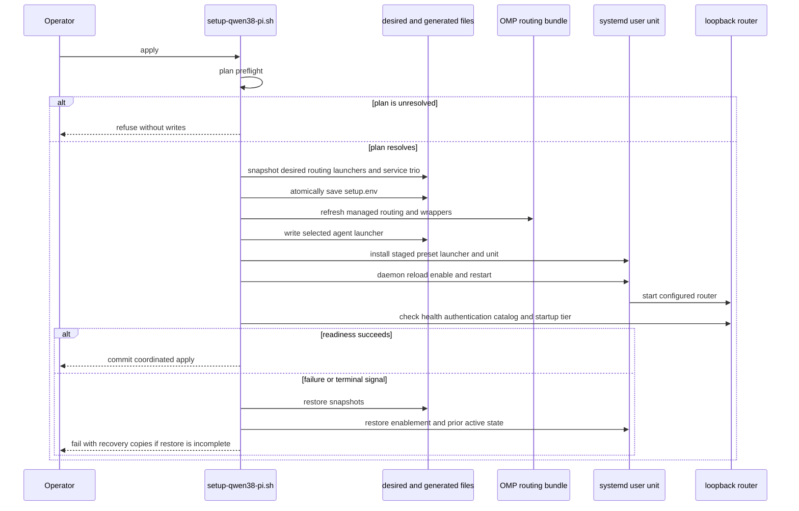
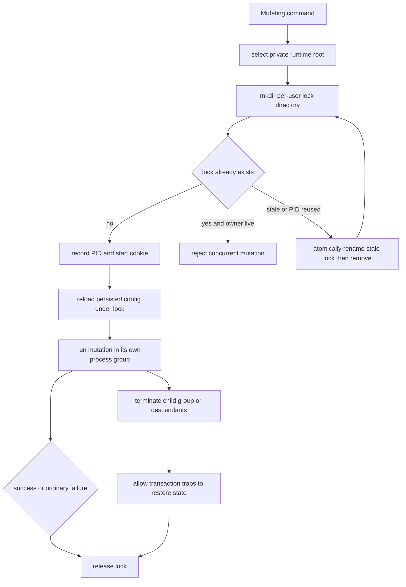
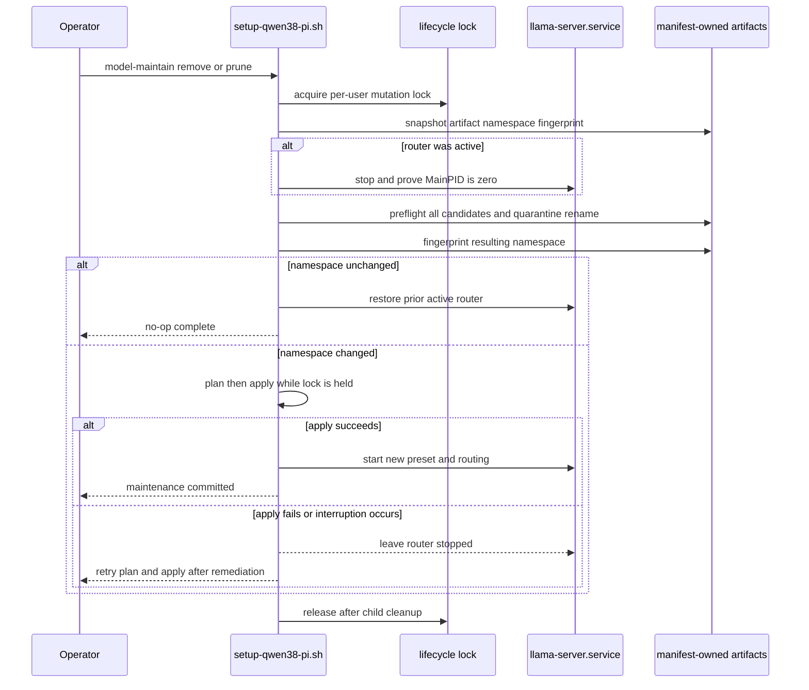

The setup engine, `./setup-qwen38-pi.sh`, separates **artifacts on disk**, **desired configuration**, and the **active generated runtime**. That separation makes downloads and saved edits safe to prepare without silently changing a running router. `apply` is the controlled convergence point: it checks the whole prospective state, then coordinates persisted desired state, OMP routing/launchers, and a restarted `llama-server.service`.

`manage.sh` is an interactive front end, not a second lifecycle engine. Its Plan/Apply and maintenance actions delegate to the same script, preserving the scriptable command contract for automation.

## State owners and lifecycle boundaries

| State | Owner / location | How it changes | Important boundary |
|---|---|---|---|
| Locked artifact intent | repository `models.lock` | repository update | Specifies tier, variant, immutable revision, path, bytes, digest, and kind. |
| Artifact bytes and verification receipts | `MODELS_DIR` and private verification state | `model`, `model-verify` | A complete tier must be regular, non-symlinked, size-correct, and integrity-verified before service exposure. |
| Desired settings | `SETUP_ENV` (normally `~/.config/local-ai/setup.env`) | `save-config`, successful `apply` | Environment values override saved values; saving alone does not restart the router. |
| Generated active state | preset, server launcher, user unit, OMP pair, and managed wrappers | `service`, `routing`, `agent`, coordinated `apply` | Generated groups have managed-file ownership checks and transactional replacement. |
| Live service and residency | `llama-server.service` and router catalog | service activation and explicit runtime operations | An active unit does not by itself prove the listener is the authenticated, expected router. |

Configuration resolution is **explicit environment > saved `setup.env` > built-in default**. A mutating entrypoint acquires its lock and re-merges the saved file before it acts, while retaining explicitly supplied environment values; this prevents a command that waited behind another mutation from overwriting a completed save with its stale initial view. `save-config` validates the allowlisted tunables, stages a mode-`0600` temporary file in the private configuration directory, and atomically replaces `setup.env`—but still does not activate it.

The engine constrains the router to one resident model. This makes routing profile changes and explicit smoke/performance operations meaningful live-state decisions, while model availability remains a separate disk-state predicate. See [Configuration, Artifacts, and Safety Invariants](/openwiki/concepts/configuration-artifacts-and-safety.md) for the artifact and ownership contracts and [Router Health and Performance](/openwiki/operations/router-health-and-performance.md) for status, smoke, and residency operations.

## Entrypoints and operational classification

Use `plan` before `apply` whenever desired settings or available tiers have changed.

| Command | Classification | Lifecycle effect |
|---|---|---|
| `plan` | **Read-only** | Resolves artifacts, routing roles, startup tier, ownership, tool/version, and reboot gates. It changes neither files nor services. |
| `status [--json]`, `model-catalog`, `show-config`, `perf-history` | **Read-only** | Observe effective/configured or runtime state; `status` uses the catalog query with `autoload=0`. |
| `model-verify` | Verification operation | Fully validates selected installed artifacts and may refresh verification receipts; it does not start/restart the service. |
| `save-config K=V` | Desired-state write | Validates and atomically persists desired settings, but does not make them live. |
| `model [tier|all]` | Artifact acquisition write | Downloads locked artifacts into resumable `.part` files, verifies them, then promotes them; the running router retains its prior generated configuration until apply. |
| `apply` | **Writes generated state and restarts service** | Re-runs plan, persists desired state, refreshes routing/launchers as applicable, and transactionally invokes service generation and restart. |
| `service` | **Writes generated state and restarts service** | Regenerates and activates the service preset/launcher/unit transaction, subject to readiness. |
| `routing [--force]`, `agent` | Generated-integration write | Updates the managed OMP routing pair/wrappers or selected-agent launcher; `routing --force` is the explicit takeover path for a custom OMP pair. |
| `model-remove`, `model-prune` | **Destructive** | Remove only exact manifest-owned files after a fully stopped router is proven. They do not automatically apply the new model namespace. |
| `model-maintain remove ...` / `model-maintain prune` | **Destructive coordinated transaction** | Holds the lifecycle lock across stop, removal/pruning, plan, and apply; it is the preferred active-router maintenance path. |

`smoke`, `perf`, and `bench --manage-service` are not read-only plan tools: they intentionally load/swap residency or stop service, respectively. Schedule them as operational work rather than validation substitutes.

## Acquisition: from a locked row to an available tier

`model` selects the configured variant plus `ALL` rows for a tier, checks aggregate remaining download bytes plus disk reserve *before* network mutation, then constructs immutable Hugging Face URLs from the locked repository revision and remote path. Split artifacts can download in parallel, bounded by `DOWNLOAD_JOBS`; the parent waits for all workers and fails if any fails.

Each artifact has a conservative progression:

1. Refuse symlinked destination or `.part` paths and non-regular destination objects.
2. Reuse an existing final file only when its locked byte count and SHA-256 match.
3. Promote a complete verified `.part` locally—this recovers an interruption between final bytes and rename.
4. Resume only a short regular `.part`, over HTTPS with HTTPS-only redirects and TLS 1.2 minimum.
5. Verify byte count and SHA-256 before renaming `.part` to its final name and recording verification state.

A corrupt or oversized `.part` is retained and blocks retry rather than being appended to or overwritten. Likewise, a failed downloaded digest leaves the evidence for inspection. A downloaded tier is therefore eligible for the next plan, but it is not automatically added to the active preset or OMP providers.

## Read-only plan as the apply gate

`plan` is deliberately unlocked and non-mutating. It reports the resolved agent, routing profile, model limit, context/load settings, each tier's `installed`/`partial`/`absent` state, resolved OMP role targets, and effective startup tier. It returns failure for an unresolved condition, including:

- no complete tier;
- existing everyday artifacts that do not satisfy the selected `QUANT` set;
- a non-`none` `STARTUP_TIER` whose complete artifacts are absent;
- custom, symlinked, mixed, or non-regular generated service trio;
- an OMP pair that must be refreshed but is custom;
- missing/incompatible `llama-server`, or required OMP when OMP routing is needed; and
- a pending reboot unless the environment-only `ALLOW_PENDING_REBOOT=1` override is explicitly set.

The role resolver chooses base from the first complete tier in everyday → coder → senior order. Coder becomes specialist when present and senior becomes architect when present; the `sticky`, `balanced`, and `quality` profile determines whether task and review roles use those promotions. The plan is consequently the right place to see how a new or removed tier would affect routing without committing it. See [Coding Agents and Model Role Routing](/openwiki/integrations/coding-agents-and-role-routing.md) for the generated provider and role mapping.

## Coordinated apply and rollback

`apply` invokes `cmd_plan` again under the per-user mutation lock; a previously displayed successful plan is not a commit authorization if artifacts, files, or configuration changed meanwhile. After preflight, it snapshots all coherent state it may affect: `setup.env`, OMP `models.yml` and `config.yml`, selected and tier-specific launchers, and the service preset/launcher/unit. It first saves desired configuration, then refreshes OMP routing when `AGENT=omp` or managed OMP routing already exists, writes the selected-agent launcher, and finally delegates to `service`.

*Apply commits only after service activation/readiness; a failed routing, launcher, service, readiness, or signal path restores the coordinated snapshot.*

Service generation has its own nested transaction. It rejects a reboot gate and incompatible server before generation; verifies all complete tiers against the lock; refuses unavailable startup state; checks managed service-file ownership; and captures a stable unit state before it can alter a credential. It stages and syntax-checks the preset and launcher, optionally verifies the staged unit, snapshots the existing trio and unit enablement/activity, then installs the staged files one at a time under an armed rollback before reloading, enabling, and explicitly restarting the unit. The individual renames are not a single filesystem rename; the transaction restores the complete prior trio if any later install or activation step fails.

With the normal `SERVICE_HEALTHCHECK=1` operational setting, readiness is the commit point and is stricter than an HTTP listener: the managed unit must be active with a live MainPID (and on Linux own the listener socket), the keyless request must be rejected, the key-authenticated request and router-shaped catalog must succeed, and installed aliases must match the catalog. With a startup tier, its status must become `loaded` or `sleeping` within `SERVICE_READY_TIMEOUT`; with `STARTUP_TIER=none`, the control plane and identity are checked without warming a model. Any activation, catalog, authentication, ownership, timeout, failed-model, or signal failure rolls the prior service state back. `SERVICE_HEALTHCHECK=0` is accepted only as a controlled-test setting, so those API readiness probes are skipped in that mode.

## One lifecycle lock for every mutation

All mutating public commands dispatch through `locked_command`; read-only commands such as `plan` and `status` do not. The lock is intentionally per user rather than per model directory because distinct configurable model roots still share desired configuration, launchers, systemd service, and other lifecycle resources.

*The model-maintenance and apply lifecycle is serialized across all mutable roots; signal handling stops writers before the lock becomes available to a retry.*

The lock directory is accepted only in a private, user-owned, non-symlink runtime location. The engine prefers a safe `XDG_RUNTIME_DIR`, then a safe `TMPDIR`, otherwise creates `LOCAL_AI_CONFIG_DIR/runtime` at mode `0700`. The lock records PID plus process-start cookie, so a reused PID can be recognized; stale-lock recovery atomically renames the old directory before removal, preventing competing reclaimers from deleting a fresh lock. After acquiring it, persisted configuration is reloaded so a waiter does not overwrite a completed concurrent save.

The locked mutation runs in a separate process group where possible. On `HUP`, `INT`, or `TERM`, the parent terminates the group, waits for transaction traps, kills remaining members, and only then releases the lock. The fallback freezes and enumerates descendants before killing them. This ordering prevents a lingering download worker from continuing to write a `.part` after another invocation has acquired the same lifecycle lock.

## Destructive maintenance and safe restart policy

Direct `model-remove <tier> [--yes]` and `model-prune [--yes]` require explicit confirmation unless `--yes`/`YES=1` is supplied. They first prove the router is fully stopped: a loaded unit must be `inactive` or `failed` **and** have `MainPID=0`; an active, transitioning, unknown, or unverifiable unit fails closed. Removing the configured startup tier is refused until an operator saves and applies another installed startup tier or `none`.

Removal considers only manifest-derived paths (including their `.part` paths); pruning considers `.part` files and unselected variant artifacts. Both preflight **every** candidate's expected file-like shape, writable parent, and unused quarantine name before the first rename. They then atomically rename the complete candidate set to a private `local-ai-remove` namespace and unlink only after all moves succeed. A rename failure or terminal signal restores the staged prefix. This protects multi-shard tiers from partial deletion and avoids touching arbitrary sibling files or a symlink target.

For a running router, prefer the composite maintenance commands. `model-maintain` captures whether the unit was active and fingerprints the managed artifact namespace, stops it, performs the guarded remove/prune, then fingerprints again.

*Model maintenance never restarts a router against a stale preset: unchanged artifacts may restore the prior service, but a changed namespace must successfully reach plan/apply first.*

An operator cancellation is a no-op: if the fingerprint is unchanged, a formerly active router is restored and apply is skipped. If artifact state changed, the old preset may name removed files, so failure of the following plan/apply deliberately leaves the router stopped. This is a safe recovery state: correct the unresolved plan gate or restore/download artifacts, review `plan`, then run `apply`.

The manager makes this visible. Before removing a configured startup tier it selects the first other installed tier (or `none`), saves it, plans, and applies that transition before touching artifacts. Its maintenance prompt warns when it must stop an active router and delegates to `model-maintain`, keeping stop → operation → apply under the engine lock.

## Recovery playbook and test evidence

1. **A plan fails:** read its gate messages; no active or desired managed state was changed by `plan`. Install/verify missing artifacts, resolve custom generated-file ownership explicitly, repair versions, or reboot as indicated.
2. **An apply/service interruption or readiness failure occurs:** the engine attempts to restore the entire saved group and the prior unit active/enabled state. If it reports incomplete rollback, preserve the transaction directory/copies, inspect unit logs and generated paths, then remediate rather than rerunning blindly.
3. **A download is interrupted:** retain its regular short `.part` and rerun `model`; it resumes. Do not delete a corrupt/oversized `.part` unless its contents have been inspected and its removal is intentional.
4. **Maintenance changed artifacts but apply failed:** the router remaining stopped is expected. Run `plan` to find the unresolved desired/routing/service condition and use `apply` only after it resolves.
5. **A concurrent command is rejected:** wait for the owning mutation. A stale lock is reclaimed only after its owner identity is no longer live or has a mismatched start cookie.

Focused hermetic coverage validates these behaviors instead of relying only on happy paths. `tests/e2e/workflow-test.sh` asserts that plan makes no managed writes; apply creates desired, service, and OMP state; and signals during direct service or coordinated apply restore files and active service. `tests/integration/operations-test.sh` injects concurrent mutations, signal-terminated download descendants, stopped-router guards, full-set removal preflight/rollback, and maintenance apply failures that must keep the router stopped after changed artifacts. `tests/integration/generated-config-test.sh` covers locked/resumable artifact promotion, corrupt-part retention, ownership gates, and generated routing/service behavior. See [Verification Strategy](/openwiki/testing/verification-strategy.md) for fixture and test-layer boundaries.

## Related pages

- [Configuration, Artifacts, and Safety Invariants](/openwiki/concepts/configuration-artifacts-and-safety.md)
- [Coding Agents and Model Role Routing](/openwiki/integrations/coding-agents-and-role-routing.md)
- [Router Health and Performance](/openwiki/operations/router-health-and-performance.md)
- [Verification Strategy](/openwiki/testing/verification-strategy.md)
