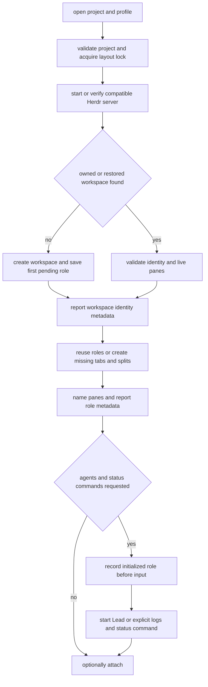
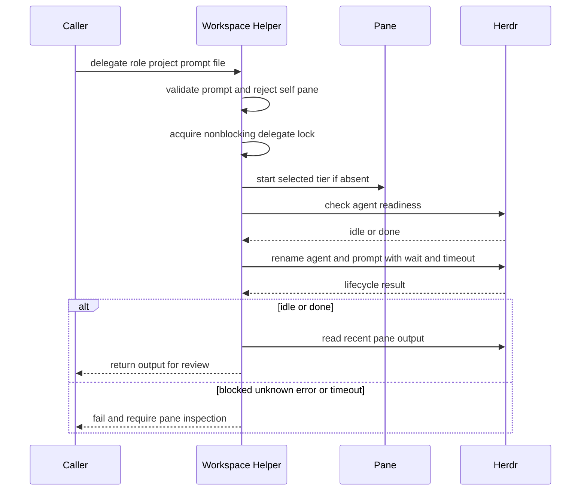

Herdr supplies the persistent terminal server and saved layouts. `local-ai-workspace` is the deliberately smaller project orchestration layer: it assigns named panes to a canonical checkout, records enough local state to repair an interrupted layout, and does **not** implicitly run project scripts, start the inference service, or close pre-existing terminals. Use it rather than raw `herdr`, `omp`, or `pi` for normal work because its generated wrappers select the private runtime, the `local-ai` session, and the intended configuration boundary.

## Installation and configuration boundary

Run `local-ai herdr` to install the runtime and its workspace integration; `local-ai herdr-upgrade` is the explicit replacement path. The runtime is not taken from `PATH`: it is installed at `${XDG_DATA_HOME:-$HOME/.local/share}/local-ai/herdr/bin/herdr` (defaulting to `~/.local/share`) and its Linux x86_64 release URL, byte count, and SHA-256 come from `herdr.lock`. Installation verifies the staged download's size, digest, executable version, and protects the executable (`0700`) plus receipt (`0600`) before atomically promoting both. A normal install will not silently change an already managed version; an upgrade is required.

The installer fails closed for a missing or malformed lock, an unsupported platform, unsafe path components, modified managed runtime, or user-owned/symlinked target. Its transaction restores the prior runtime and receipt if promotion fails. This makes a refusal preferable to overwriting an operator's binary or writing through a link. See [Configuration, Artifacts, and Managed-File Safety](/openwiki/concepts/configuration-artifacts-and-safety.md) for the wider ownership model.

`local-ai herdr-config` writes managed configuration beneath `${HERDR_CONFIG_DIR:-$LOCAL_AI_CONFIG_DIR/herdr}` (normally `~/.config/local-ai/herdr`) and generates these private, executable front doors:

| Command | Responsibility |
|---|---|
| `local-ai-herdr` | Invokes only the pinned binary with `--session local-ai`. |
| `local-ai-workspace` | Runs `scripts/local-ai-workspace.py` with the same config roots. |
| `local-ai-pi` | The authenticated pi launcher used when a workspace role requests tier `pi`. |

The wrappers unset inherited `LLAMA_API_KEY`, `LLAMA_BASE_URL`, and `LLAMA_CPP_BASE_URL`; persistent terminal/server processes must not retain router credentials. Agent launchers obtain current credentials when they actually start an agent. A moved checkout makes the workspace launcher fail with a reconfiguration instruction rather than guessing another script path. The top-level `local-ai workspace` prefers a recognized generated helper—important for desktop terminals with no inherited setup environment—and otherwise runs the repository helper directly after checking for Python.

The generated `config.toml` uses the terminal palette, provides a 160×50 headless PTY, disables Herdr version/manifest update checks, and deliberately sets `resume_agents_on_restore = false` and `pane_history = false`. Thus layout persistence does not mean terminal transcript persistence, nor does a restored layout revive an old authenticated agent request. A custom configuration, launcher, skill, or lifecycle hook is preserved rather than replaced; a generated configuration can be emitted as `config.toml.local-ai-setup.example` when the normal path is custom.

## Project identity, profiles, and role registry

A workspace identity is the resolved absolute project directory plus a profile, not the directory basename. The helper derives a SHA-256 project token, a config-directory-derived owner token, and a profile token; it writes them as Herdr workspace metadata. The human label also includes a short owner-derived digest. Those tokens prevent same-named checkouts from colliding and prevent a stale local registry entry from adopting a reused native workspace ID.

`workspaces.json` is a private local recovery registry under the Herdr configuration directory. It has schema version 1 and records the project path, profile, workspace ID, role-to-pane mapping, initialized roles, and temporarily pending roles. It complements rather than replaces Herdr state: Herdr owns terminals and session persistence, while the registry makes layout construction restartable. Reads and writes reject symlinked, non-directory, non-regular, control-character-containing state paths; registry writes use a flushed temporary file followed by `os.replace`.

Profiles can coexist for the same checkout because profile participates in the identity:

| Profile | Tabs and roles |
|---|---|
| `coding` | `Code`: `lead`, `shell`; `Workbench`: `tests`, `build`; `Observe`: `logs`, `status` |
| `golf` | All `coding` roles plus `Simulation`: `physics`, `course`; and `Presentation`: `rendering`, `audio` |
| `ops` | `Observe`: `logs`, `status`; `Shell`: `shell`; no lead agent |

The extra golf role names are available destinations, not an instruction to launch all of them. Roles are selected by token. Only while recovering a native restored layout whose metadata tokens have disappeared may the helper recognize a matching role label and project cwd; it does not rewrite metadata during read-only discovery.

## Opening and recovering a workspace

Start by checking existing state, then create only if necessary:

```bash
local-ai-workspace status "$PWD"
local-ai-workspace open "$PWD" --no-attach
```

`open` validates the resolved existing directory and profile before mutation, takes the layout lock, starts Herdr only when needed, and rejects a running daemon whose version is incompatible with the configured pinned version. It finds an owned workspace by metadata, or cautiously recognizes a restored layout by its expected label and a pane rooted in the project. A non-unique match requires `--profile`; it is never selected arbitrarily.



*Workspace opening persists progress before commands are sent, so a retry repairs a partial layout rather than duplicating panes or replaying terminal input.*

Each create/split is recorded immediately as pending, then renamed and marked with `local_ai_role`; missing roles are added without destroying live panes. Reopen therefore reuses the workspace and can repair a crash during layout creation. Initial setup is opt-out via `--no-agent`: otherwise it starts the selected-tier Lead where present and submits only the known `logs` and `status` commands. The initialized marker is saved **before** each submission, an intentional at-most-once bias: interruption may leave a command absent, but retry must not type it twice. `--no-agent` also suppresses those journal/status inputs. `--no-attach` prepares the layout without entering the UI; attach focuses the workspace and `exec`s the Herdr client only after locks have been released.

After a reboot or server restart, open restores panes/layout but does not resume agents, builds, tests, or other terminal processes. Inspect the restored roles and explicitly restart the desired activity, for example:

```bash
local-ai-workspace agent lead "$PWD" --tier selected
local-ai-workspace run tests "$PWD" -- npm test
```

## Role-scoped inspection and commands

The commands are `open`, `list`, `status`, `attach`, `read`, `run`, `agent`, and `delegate`. `list` and `status` are observational: if the server is stopped they return status and an empty workspace list without starting it or writing registry/native state. Commands that target a role require an unambiguous managed pane in an already-running workspace; a missing or ambiguous role directs the operator to reopen and repair the layout.

`read ROLE PROJECT --lines N` reads recent pane output. `run ROLE PROJECT -- argv...` accepts only explicit arguments after `--`, rejects terminal control characters, shell-quotes the argv, and prefixes it with a quoted `cd -- <canonical-project> &&`. It does not interpret substitutions in the orchestrator, and it corrects a pane whose cwd drifted. Before sending typed input it verifies that the foreground process group is exactly a known interactive shell (`bash`, `zsh`, `sh`, `dash`, or `ksh`) owned by the pane's shell PID. An occupied pane, approval UI, exec-replaced shell, or unknown readiness fails instead of receiving input.

`agent ROLE PROJECT --tier TIER` supports `selected`, `everyday`, `coder`, `senior`, and `pi`. It resolves the corresponding installed launcher, refuses a pane that already hosts a different or unmanaged agent, starts only into a ready shell, records the selected tier as pane metadata, and waits briefly for the agent to become `idle` or `done`. It never joins a working turn or approves a blocked interaction. Launcher availability and routing tier meaning are described in [Coding Agents and Role Routing](/openwiki/integrations/coding-agents-and-role-routing.md).

## Serialized delegation

Delegation is a synchronous, bounded hand-off to an existing role pane. The prompt must come from a regular, non-symlinked UTF-8 file no larger than 128 KiB, contain nonempty text, and contain no terminal controls. This separates potentially private task text from shell argv and preserves it verbatim.



*The delegate lock serializes helper-managed delegated prompts across projects; completion is accepted only for an `idle` or `done` lifecycle result.*

A nonblocking `delegate.lock` prevents concurrent `local-ai-workspace delegate` calls. It is intentionally not a global semaphore: it neither changes the llama.cpp one-request capacity nor serializes manually started agents and unrelated API clients. The helper also forbids delegating to the caller's own `HERDR_PANE_ID`. Under the lock it starts/validates the target agent, waits up to 30 seconds (or the smaller delegation timeout) for readiness, gives the Herdr agent a unique local name, then calls `agent prompt --wait --timeout` with seconds converted to milliseconds.

A failed native prompt call is treated as potentially submitted and is never automatically retried. A returned state other than `idle` or `done`—including `blocked`, `unknown`, `error`, or timeout—is failure, not completion. In either case the operator should read and inspect the pane before retrying. Even a successful wait prints recent output only as a result to review; it does not establish that edits or tests are correct.

## Lifecycle hooks and pane state

Configuration installs managed state-reporting extensions separately into the OMP and pi agent roots. They activate only inside a Herdr pane when `HERDR_ENV=1`, `HERDR_SOCKET_PATH`, and `HERDR_PANE_ID` are available, then send newline-delimited JSON RPC over the local socket. Both attach the pane ID, source, agent kind, monotonic sequence number, and, when available, the native agent session file path or session ID. A send queue coalesces state updates while retaining serialized delivery; each request gets a 500 ms attempt and a 1.5 s retry rather than blocking agent work indefinitely.

The pi hook is TUI-only to avoid reporting headless RPC/JSON/print sessions that have no displayable PTY. It reports a session at start and each agent start, transitions to `working` for an active agent, to `blocked` for nested `herdr:blocked` notifications, and back to `idle` only after `agent_settled` confirms pi is idle. The OMP-targeted hook similarly gates on a UI root session and additionally maps tool approval and `ask` interactions to reference-counted blocked state. It debounces idle for 250 ms, preserves working through continuations, and holds a retryable provider failure as working for 2.5 seconds before reporting it blocked; this avoids falsely showing idle during automatic retry. Hook files are managed artifacts: updates replace only receipt-verified prior bytes, preserving modified or symlinked extensions so custom hooks can live alongside them.

## Operational failure posture and focused verification

Do not treat persistence as execution recovery. Detaching preserves currently running terminals, but restarting Herdr cannot safely infer which prompts, builds, or approvals should resume. Inspect first, then explicitly use `agent` or `run`. Similarly, do not submit a delegation prompt again merely because a wait ended—input might already have reached the pane.

The workspace integration test uses a stateful native-shaped Herdr fixture to check the behavior that protects this boundary: canonical path identity and profile isolation, no mutations from stopped-server `list`/`status`, compatible-daemon checks before mutation, exact quoting and project anchoring, and refusal to type into busy or exec-replaced shells. It also verifies partial-layout repair without pane destruction or command replay, recovery after native metadata loss, bounded delegation waits, no completion report for blocked/unknown/timed-out agents, and preservation of malformed or symlinked state boundaries. The installation test covers the separate trust chain: pinned HTTPS runtime validation and rollback, explicit upgrade only, credential-free wrappers, restoration settings, and preservation of custom/symlinked managed targets.
